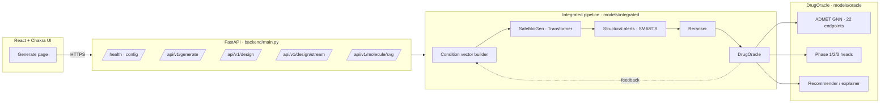

<div align="center">

# SafeMolGen

**Closed-loop molecular design with an ADMET-aware DrugOracle and an RL-finetuned SMILES generator.**

A research-grade, end-to-end system that *proposes*, *evaluates*, and *iteratively refines* drug-like molecules — exposed through a FastAPI service and a React control surface.

[](https://github.com/D-SreeVardhan/SafeMolGen/actions/workflows/ci.yml)
[](https://www.python.org/)
[](https://pytorch.org/)
[](https://www.rdkit.org/)
[](https://fastapi.tiangolo.com/)
[](https://react.dev/)
[](LICENSE)

</div>

---

## Table of contents

- [What it does](#what-it-does)
- [Why it matters](#why-it-matters)
- [Architecture](#architecture)
- [Repository layout](#repository-layout)
- [Quickstart](#quickstart)
- [Training the full stack](#training-the-full-stack)
- [HTTP API](#http-api)
- [Design modes](#design-modes)
- [Testing](#testing)
- [Project documentation](#project-documentation)
- [Roadmap](#roadmap)
- [License and citation](#license-and-citation)

---

## What it does

SafeMolGen is a **generator → evaluator → refine** loop for small molecules. It treats the classic *"propose a structure, then predict whether it will survive ADMET and clinical phases"* problem as a controllable optimization task.

1. **Generate.** A causal Transformer over SMILES (`models/generator/`) proposes candidate molecules, optionally conditioned on target property / phase vectors.
2. **Evaluate.** `DrugOracle` combines
   - a graph neural network (`models/admet/`) trained on the TDC ADMET Benchmark Group for 22 regression / classification endpoints,
   - Phase 1 / 2 / 3 clinical success heads (`models/oracle/`),
   - a structural-alerts filter (PAINS, skin sensitizers, Hamburg SMARTS),
   - a learned **reranker** (`models/reranker/`) that scores candidates against the oracle signal.
3. **Refine.** The integrated pipeline (`models/integrated/pipeline.py`) uses the oracle feedback to re-condition the generator, prune unsafe structures, preserve diversity (Tanimoto novelty), and iterate until the target objective is achieved or the budget is exhausted.

The loop is exposed as a FastAPI service and streamed live to the UI over Server-Sent Events.

## Why it matters

- **ADMET-aware from the start.** Most SMILES generators optimize a single surrogate. SafeMolGen bakes 22 ADMET endpoints, safety filters, and phase success into the objective.
- **Multi-strategy design.** `ensure_target` cascades *single → restarts → diversity restarts* until the objective is met or ruled infeasible.
- **Production-shaped.** Deterministic model loading, CORS-correct FastAPI, centralized logging (loguru), typed API schema, Git LFS for weights, full CI (ruff + pytest + frontend build).
- **Reproducible.** Every config lives in `config/`, every training run is scripted under `scripts/`, every architectural decision is written up in `docs/architecture/` and `docs/reports/`.

## Architecture



Deeper reading:

- [`docs/architecture/SYSTEM_OVERVIEW.md`](docs/architecture/SYSTEM_OVERVIEW.md)
- [`docs/architecture/GENERATOR_ARCHITECTURE.md`](docs/architecture/GENERATOR_ARCHITECTURE.md)
- [`docs/architecture/ORACLE_ARCHITECTURE.md`](docs/architecture/ORACLE_ARCHITECTURE.md)
- [`docs/architecture/ADMET_ARCHITECTURE.md`](docs/architecture/ADMET_ARCHITECTURE.md)

## Repository layout

```
.
├── backend/                 FastAPI app, pipeline loader, SVG renderer
├── frontend/                React + Chakra UI (Vite, TS strict)
├── models/
│   ├── admet/               GNN encoder, multi-task ADMET head, trainer
│   ├── oracle/              DrugOracle, phase predictors, structural alerts
│   ├── generator/           SafeMolGen Transformer, tokenizer, RL + best-of-N trainers
│   ├── reranker/            Pairwise reranker model + dataset
│   └── integrated/          Closed-loop pipeline (single / restarts / evolutionary)
├── scripts/                 Training, data prep, generation, demo entrypoints
├── utils/                   Chemistry, metrics, condition vectors, logging config
├── config/                  YAML configs (pipeline, endpoints, production)
├── tests/                   pytest suite for every subsystem
├── docs/                    Architecture, API reference, reports, deep-dive guides
├── pyproject.toml           Project metadata, Ruff, pytest config
├── requirements.txt         Runtime + training dependencies
└── requirements-e2e.txt     Optional: Playwright for browser e2e tests
```

## Quickstart

### 1. Enter the project

Trained model checkpoints ship inside `checkpoints/` — no download or Git LFS needed.

```bash
cd prj_demo
```

### 2. Python environment

```bash
python3 -m venv .venv
source .venv/bin/activate            # Windows: .venv\Scripts\activate
pip install -r requirements.txt
```

### 3. Frontend dependencies

```bash
cd frontend && npm install && cd ..
```

### 4. Run the full app (backend + UI)

```bash
./run
```

- Backend API → <http://127.0.0.1:8000>
- Web UI → <http://localhost:5173>

Or run headless:

```bash
./run --cli            # 20 samples
./run --cli --n 50 --valid-only
```

Override the checkpoint directory:

```bash
GENERATOR_CHECKPOINT=/abs/path/to/ckpt ./run
```

## Training the full stack

End-to-end pipeline (each step writes into `checkpoints/`):

```bash
# 1. Prepare TDC ADMET splits and molecular graphs
python scripts/download_data.py

# 2. Train ADMET predictor (22 endpoints, GNN + attention pooling)
python scripts/train_admet.py

# 3. Train clinical-phase predictor (DrugOracle heads)
python scripts/train_oracle.py

# 4. Pretrain SMILES generator on ChEMBL-like corpus
python scripts/train_generator.py --stage pretrain --epochs 30

# 5. Reinforcement-learning finetune against the oracle
python scripts/train_generator.py --stage rl --epochs 10 \
    --w-validity 0.75 --w-diversity 0.1

# 6. Train the reranker on oracle-labelled candidates
python scripts/train_reranker.py
```

Training docs: [`docs/PRODUCTION_TRAINING.md`](docs/PRODUCTION_TRAINING.md), [`docs/PIPELINE_MONITORING.md`](docs/PIPELINE_MONITORING.md).

## HTTP API

| Method | Path                       | Purpose                                              |
| ------ | -------------------------- | ---------------------------------------------------- |
| `GET`  | `/api/v1/health`           | Liveness; reports which models are loaded            |
| `GET`  | `/api/v1/config`           | UI-facing configuration (modes, defaults, ranges)    |
| `GET`  | `/api/v1/metrics`          | In-process counters + latency histograms             |
| `POST` | `/api/v1/generate`         | Batch-generate SMILES with optional property filters |
| `POST` | `/api/v1/design`           | Synchronous closed-loop design                       |
| `POST` | `/api/v1/design/stream`    | Server-Sent Events stream of iterations              |
| `GET`  | `/api/v1/molecule/svg`     | Render any SMILES to SVG                             |

Full schema: [`docs/api/API_REFERENCE.md`](docs/api/API_REFERENCE.md).

## Design modes

`POST /api/v1/design` accepts a `design_mode` plus `ensure_target`:

- **`single`** — one trajectory; fastest. Best when the objective is near the data distribution.
- **`restarts`** — *N* independent trajectories; returns the best by overall probability.
- **`evolutionary`** — population-based search with mutation + selection; maximizes diversity.
- **`ensure_target: true`** — cascades `single → restarts → diversity-restarts`, returning the first run that hits the target (or the strongest fallback).

Selection modes inside each run: `overall`, `pareto`, `diversity`, `phase_weighted`, `bottleneck`.

## Testing

```bash
PYTHONPATH=. pytest tests/ -v
(cd frontend && npm run build)        # TypeScript strict + Vite bundle check
ruff check . && ruff format --check .  # Optional: lint gate
```

## Project documentation

| Area           | Where                                                                 |
| -------------- | --------------------------------------------------------------------- |
| System design  | [`docs/architecture/`](docs/architecture/)                            |
| API reference  | [`docs/api/API_REFERENCE.md`](docs/api/API_REFERENCE.md)              |
| Decision log   | [`docs/reports/DECISIONS.md`](docs/reports/DECISIONS.md)              |
| Methodology    | [`docs/reports/METHODOLOGY_WORKFLOW.md`](docs/reports/METHODOLOGY_WORKFLOW.md) |
| ADMET+Oracle eval | [`docs/reports/ADMET_ORACLE_EVAL.md`](docs/reports/ADMET_ORACLE_EVAL.md) |
| Oracle+RL eval | [`docs/reports/ORACLE_AND_RL_EVAL.md`](docs/reports/ORACLE_AND_RL_EVAL.md) |
| Visual flowchart | [`docs/reports/flowchart.html`](docs/reports/flowchart.html)        |
| Deep-dive      | [`docs/guides/PROJECT_DEEP_DIVE.md`](docs/guides/PROJECT_DEEP_DIVE.md)|
| Learning notes | [`docs/guides/LEARNING_GUIDE.md`](docs/guides/LEARNING_GUIDE.md)      |

## Roadmap

- [x] Multi-task ADMET GNN (22 TDC endpoints)
- [x] Clinical-phase DrugOracle heads + structural alerts
- [x] Conditional SMILES Transformer (phase / ADMET conditioning)
- [x] Reinforcement-learning finetune with validity + diversity rewards
- [x] Pairwise reranker and `ensure_target` cascade
- [x] FastAPI + SSE streaming + React control surface
- [ ] 3D-aware generator conditioning (docking scores)
- [ ] Retrosynthetic feasibility scoring in the loop
- [ ] Uncertainty-calibrated oracle (deep ensembles)

## License and citation

Released under the [MIT License](LICENSE).

If this project supports your work, please cite it via the [`CITATION.cff`](CITATION.cff) metadata or:

```
D. SreeVardhan. SafeMolGen: Closed-loop Molecular Design with ADMET-aware Oracle. 2026.
https://github.com/D-SreeVardhan/SafeMolGen
```
