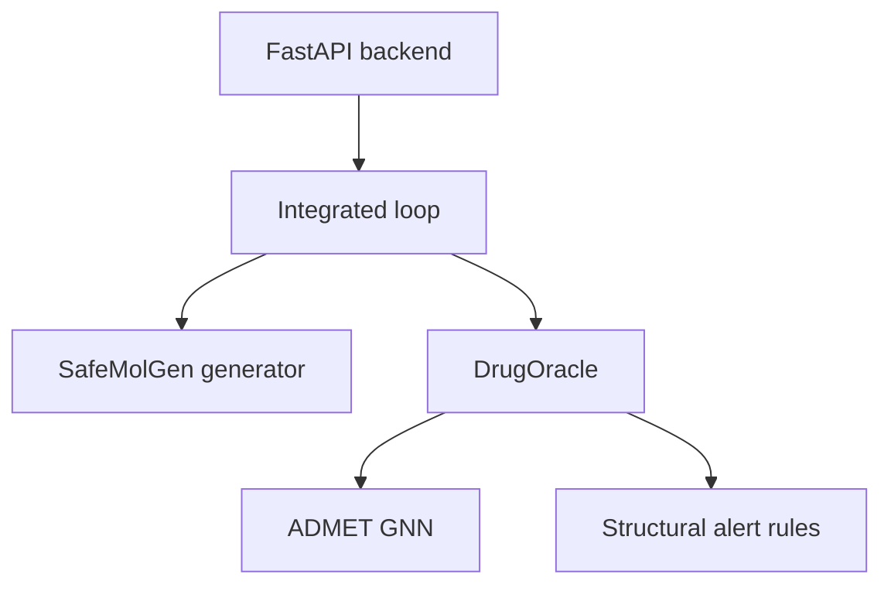
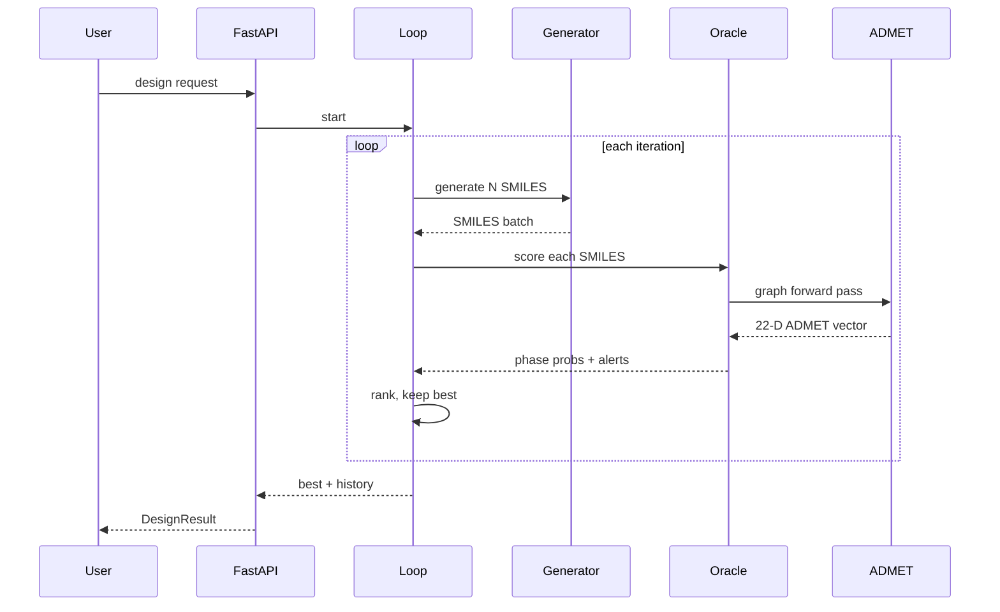
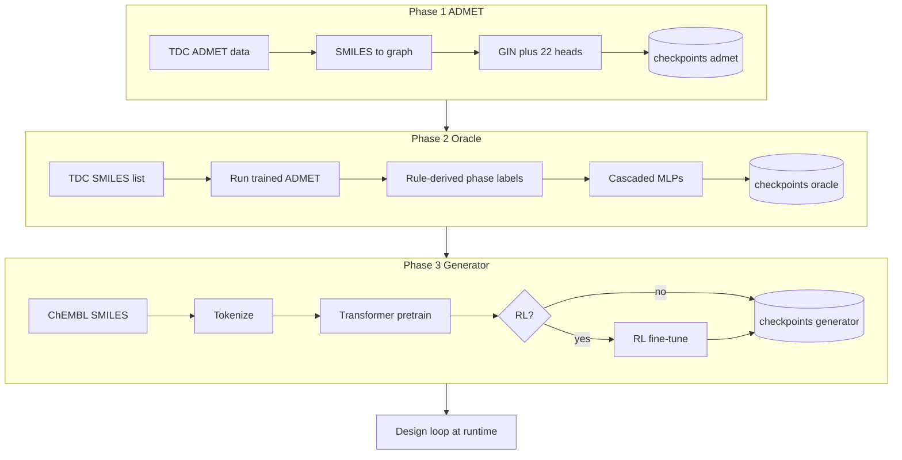

# LEARNING_GUIDE

A step-by-step teaching document for `prj_demo` — a clean demo of the **SafeMolGen-DrugOracle** system.

- **Canonical source of truth:** `~/Documents/Projects/MiniProject/SafeMolGen-DrugOracle/`
- **Demo repo (this directory):** `~/Desktop/prj_demo/`
- **Running example (primary):** aspirin — `CC(=O)Oc1ccccc1C(=O)O`
- **Counter-example (only where needed):** nitrobenzene — `[O-][N+](=O)c1ccccc1`

Each step is self-contained: intuition → visual → mechanics → math → data-transformation trace → proof → how/why → alternatives → novelty → verification.

---

## Step 0.1 — Orientation

### 1. Intuition

A medicinal chemist wants molecules that are:

1. **Valid** — actually a chemical you could draw without breaking valence rules.
2. **Drug-like** — small, soluble, absorbable, not obviously toxic.
3. **Likely to survive clinical trials** — Phase I (safety in humans), Phase II (efficacy), Phase III (large-scale efficacy and safety).

No single model can do all three reliably. So the project breaks the problem into **four cooperating modules**:

- A **generator** proposes candidate SMILES strings.
- An **ADMET predictor** estimates ~22 biological properties per molecule (absorption, permeability, toxicity signals, etc.).
- A **DrugOracle** takes those 22 numbers, estimates clinical-phase success probabilities, checks known structural warning patterns, and writes human-readable recommendations.
- An **integrated loop** wires them together: generate → score → keep the best → optionally feed oracle feedback back into the generator → repeat until target or budget.

You then expose this loop as a FastAPI backend + React frontend (UI is being trimmed in `prj_demo`; backend + scripts remain the primary surface).

### 2. Visual — system at a glance

**Who owns what** (static dependencies only):



**What happens during one design request** (dynamic flow; easier to read as a sequence):



Two orthogonal timelines exist:

- **Training time** (offline, one-shot per component): Phase 1 ADMET → Phase 2 Oracle → Phase 3 Generator (+ optional RL).
- **Inference time** (per user request): load all three → run the design loop.

### 3. Mechanics — what "SafeMolGen-DrugOracle" names

| Part of the name | What it refers to | Where it lives |
|---|---|---|
| **SafeMolGen** | Causal Transformer molecule generator over SMILES tokens, optionally RL-fine-tuned with the Oracle as reward. "Safe" = trained/rewarded to avoid obvious liabilities. | `models/generator/` |
| **DrugOracle** | Wrapper around the trained ADMET model + cascaded Phase I/II/III MLP predictors + SMARTS-based alert engine + recommender. Converts a SMILES into a full clinical-risk report. | `models/oracle/` |
| **Integration** | The loop class that calls Generator then Oracle, sorts, filters, and iterates. | `models/integrated/pipeline.py` |

### 4. Mechanics — the four project phases



The cascade is intentional:
- Phase 1 produces a **general molecular fingerprint** useful for many downstream tasks.
- Phase 2 reuses those ADMET outputs rather than re-learning structure from scratch — cheaper, and reflects the real dependency that Phase II trials only matter if Phase I passed.
- Phase 3 can optionally be pushed toward high-oracle-score molecules via RL after pretraining on a validity-only objective.

> **Important finding — "clinical trials" data is synthetic in this project.**
> The Phase 2 training file `data/processed/oracle/clinical_trials.csv` is not sourced from any real clinical-trial database. It is generated by `scripts/prepare_clinical_data.py`:
> - The **SMILES list** comes from the TDC ADMET SMILES (`data/admet_group/*/train_val.csv`, capped at 5 000 unique valid strings).
> - The **phase1 / phase2 / phase3 labels** are produced by running the *already-trained* ADMET model over each SMILES and then applying a deterministic rule:
>   - `phase1 = mean(bioavailability, 1 − hERG, 1 − AMES)`
>   - `phase2 = phase1 · (0.4 + 0.6 · (1 − mean CYP3A4/CYP2D6 risk))`
>   - `phase3 = phase2 · (0.5 + 0.5 · (1 − DILI))`
>   - Fallback (no ADMET checkpoint yet): random cascaded labels with seed 42.
> - `docs/reports/DATA_SOURCES.md` explicitly lists **TrialBench** as the *intended* source, marked "source to be fixed". It was never wired up.
>
> **Consequence for teaching:** the DrugOracle's Phase I/II/III predictor is trained to reproduce a hand-crafted heuristic over ADMET outputs — closer to **knowledge distillation of a rule system** than "learning from clinical outcomes." We will treat it as such in Blocks D.4 and D.5 and discuss the implications for what the Oracle's probabilities actually mean.

### 5. Math — none yet

Step 0.1 is orientation. The first math appears in Block A when we derive atom/bond features, and in Block B (cross-entropy over token sequences) and Block C (multi-task loss with per-task masks).

### 6. Data transformation trace — a request, end to end

Tracing our aspirin example through a single design-loop call.

| Stage | Representation | Shape / type | Example value (aspirin) | What changed & why |
|---|---|---|---|---|
| 0 | User request | JSON `{target, max_iter, filters}` | `{target: 0.6, max_iter: 10}` | User expresses goal in task terms. |
| 1 | Seed / prompt for generator | BOS token | `[<BOS>]` | Generator starts unconditioned (or with a condition vector — Block B.2). |
| 2 | Generated SMILES batch | `list[str]` of N candidates | `["CC(=O)Oc1ccccc1C(=O)O", ...]` | Transformer decoded token-by-token; may include invalid strings, which are filtered later. |
| 3 | Validated SMILES | `list[str]` | aspirin survives | RDKit sanitizes; invalid strings dropped so downstream GNN cannot crash. |
| 4 | Molecular graph | PyG `Data(x, edge_index, edge_attr)` | 13 nodes × ~11 atom feats, 2 × 13 edges | ADMET model is graph-based; SMILES is reshaped into its chemical graph so bonds/atoms become explicit. |
| 5 | 22-D ADMET vector | `tensor[22]` | `[logP≈1.2, BBB≈low, hERG≈low, …]` (real numbers / sigmoid probs) | GIN + attention pool + 22 heads; a single forward pass gives all endpoints because they share a trunk. |
| 6 | Phase I/II/III probs | `tensor[3]` (sigmoid) | e.g. `[0.71, 0.58, 0.42]` | Cascaded MLPs consume the 22-D vector (+ upstream phases) to estimate trial survival. |
| 7 | Alerts + recs | `list[Alert]`, `list[str]` | aspirin: few/none; nitrobenzene: nitro-arene alert fires | SMARTS patterns from `data/structural_alerts.csv` matched over the molecule; recommender adds prose. |
| 8 | Candidate score | `float` overall_prob | e.g. `0.17` for aspirin (≈ p1·p2·p3 minus penalties) | Aggregation of phase probs with risk penalties so we can rank candidates with one number. |
| 9 | Loop state | ranked list + `iteration_history` | best so far + trace | Pipeline keeps the best, optionally conditions the next round's generator, decreases sampling temperature for exploitation. |
| 10 | Final response | `DesignResult` JSON | best SMILES + history + recs | Client-friendly shape. |

**Why the representation keeps changing:** each module needs a different view of the same molecule — the generator wants a *sequence* (cheap to decode), the ADMET model wants a *graph* (captures structure), the oracle wants a *fixed-size feature vector* (MLP inputs), and the user wants *strings + numbers + prose* (readable output). Each transformation loses some information and adds some interpretation; the cost of the "multiple representations" architecture is paid to match each module to the representation it handles best.

### 7. Proof — where to find each piece

Canonical repo (authoritative):

- Generator module: `~/Documents/Projects/MiniProject/SafeMolGen-DrugOracle/models/generator/` (tokenizer, transformer, trainer, rl_trainer)
- ADMET module: `.../models/admet/` (gnn_encoder, attention_pooling, multi_task_predictor, trainer)
- Oracle module: `.../models/oracle/` (drug_oracle, phase_predictors, structural_alerts, recommender, trainer)
- Integrated loop: `.../models/integrated/pipeline.py`
- Configs: `.../config/config.yaml`, `.../config/endpoints.yaml`, `.../config/pipeline.yaml`, `.../config/generator_production.yaml`
- Training scripts: `.../scripts/train_admet.py`, `train_oracle.py`, `train_generator.py`, `train_reranker.py`
- Data assets: `.../data/admet_group/`, `.../data/processed/`, `.../data/structural_alerts.csv`
- Authoritative methodology write-up: `.../docs/reports/METHODOLOGY_WORKFLOW.md`
- Flowchart: `.../docs/reports/PROJECT_FLOWCHART.md`

Demo repo (what we actually run here):

- Same module layout under `~/Desktop/prj_demo/models/…`
- Backend: `backend/main.py`, `backend/pipeline_loader.py`
- Launcher: `./run`
- Checkpoints consumed at runtime: `checkpoints/admet/`, `checkpoints/oracle/`, `checkpoints/generator/`

Drift note: `prj_demo` intentionally drops some canonical scaffolding (no `notebooks/`, no `logs/`, trimmed scripts). When a fact depends on training artifacts, we read from the canonical repo; when a fact depends on what the demo serves, we read here.

### 8. How & Why — non-trivial decisions at the orientation level

- **How:** split the system into four independently trained modules (ADMET, Oracle, Generator, Integrated loop).
  **Why:** each sub-problem has a different dataset (TDC ADMET vs clinical trials vs ChEMBL SMILES) and a different model class (GNN vs MLP vs Transformer). A single end-to-end model would need all three datasets aligned per-molecule, which is not how public data is structured.

- **How:** cascade Phase I → II → III predictors with earlier phase probs as extra inputs to later phases.
  **Why:** Phase II success is only meaningful conditional on Phase I; wiring the dependency into the architecture lets gradients reflect it and matches real drug-development reality. (Source: `METHODOLOGY_WORKFLOW.md §8`, `models/oracle/phase_predictors.py`.)

- **How:** generator pretraining uses a validity-only cross-entropy objective; reward-driven optimization is a separate optional RL stage.
  **Why:** RL over chemistry is notoriously unstable if the base model has not yet learned what a valid SMILES even looks like. Pretrain to fluency, then optionally steer. This two-stage recipe is standard in literature (REINVENT, MolDQN, etc. — see novelty ledger in later steps).

- **How:** represent molecules as *both* strings (for the generator) *and* graphs (for the ADMET model) inside the same pipeline.
  **Why:** sequence decoding is cheap per token and produces novel compositions freely; graph encoding preserves explicit bond topology which is what physical/chemical properties depend on. Forcing one representation everywhere would either cripple the generator (graphs don't autoregress naturally without heavy machinery like graph-RNNs) or the property predictor (character-level CNNs over SMILES are weaker than GIN for structure-sensitive tasks).

- **How:** use heuristic **structural alerts** (SMARTS matching) alongside learned predictors.
  **Why:** some liabilities (PAINS, reactive electrophiles, skin sensitizers) are well-characterized by substructures and do not need a learned model. A rule-based layer catches these cheaply and gives the user a reason ("nitro-arene detected") rather than an opaque score. Learned model and rule engine are complementary, not redundant.

### 9. Why this approach vs alternatives

| Alternative considered | Pros | Cons | Why *not* chosen |
|---|---|---|---|
| Single end-to-end RL agent that generates & scores in one model | One objective, fewer moving parts | Requires aligned labels per-molecule across ADMET, clinical, validity — not available publicly; unstable training; no explainability. | Datasets are misaligned; modularity lets each module train on its own best dataset. |
| Graph-based generator (e.g., GraphAF, JT-VAE) + graph oracle | Consistent representation; structurally valid by construction | Heavier, slower to train, smaller community for tooling; harder to condition with free-form prompts/features. | SMILES transformer is strong enough with simple regex tokenization and gives fast iteration; validity is enforced post-hoc by RDKit. |
| Pure rule-based scorer (no ML) | Fully interpretable, cheap, deterministic | Brittle for tasks like hERG binding, PK — ML demonstrably beats rules on TDC benchmarks. | Rules *plus* ML is used: ML for endpoints, rules only for known-pattern alerts. |
| Learned phase predictor directly from SMILES (skip ADMET) | Simpler pipeline | Tiny clinical datasets → severe overfitting; loses reusable ADMET features; loses interpretability. | ADMET as a shared trunk gives transfer + explanations ("BBB is high, that's why Phase II drops"). |
| Supervised-only generator (no RL) | Simple, stable | Cannot steer toward an external score such as oracle-quality. | Project keeps RL as optional (`--stage rl`) for when steerability matters; pretrain is the always-on baseline. |

### 10. Novelty ledger

| Component | Status | Source / Citation | One-line gloss |
|---|---|---|---|
| Modular architecture (generator + predictor + loop) | Adapted | Inspired by REINVENT (Olivecrona et al. 2017), Practical Molecular Optimization loops | Standard generate-then-score design pattern in molecule optimization. |
| SMILES representation | Reused | Weininger 1988 — *SMILES, a Chemical Language and Information System* | Linear text notation for molecules. |
| Transformer decoder generator | Reused | Vaswani et al. 2017 (*Attention is All You Need*); ChemBERTa / MolGPT-style adaptation | Autoregressive sequence model applied to SMILES tokens. |
| GIN encoder | Reused | Xu et al. 2019 — *How Powerful are Graph Neural Networks?* | Graph conv with injective neighborhood aggregation. |
| Attention pooling | Reused | Li et al. 2016 — *Gated Graph Sequence Neural Networks* (attention-readout variant) | Weighted sum over node embeddings to produce a graph embedding. |
| Cascaded Phase I/II/III predictor | Project-specific | this repo (`models/oracle/phase_predictors.py`) | Small MLP cascade where later phases consume earlier phase probabilities. |
| Structural alerts (PAINS, Enoch, skin sensitization) | Reused | Baell & Holloway 2010 (PAINS); Enoch et al. 2008 (skin sensitization); Ehrlich & Rarey, *J Cheminform* 2012 (Hamburg SMARTS set) | SMARTS substructure rules for known liability classes. |
| ADMET benchmarks (TDC) | Reused | Huang et al. 2021 — *Therapeutics Data Commons* | Public benchmark suite of 22 ADMET tasks. |
| Clinical phase label source | Project-specific | `scripts/prepare_clinical_data.py` — labels are a deterministic rule over ADMET outputs (fallback: random seed 42). `DATA_SOURCES.md` lists TrialBench as *intended* but "source to be fixed"; not wired up. | Oracle is effectively distilling a rule over ADMET, not learning from real trial outcomes. |
| Overall-score aggregation (phase product minus risk penalties) | Project-specific | this repo (`models/oracle/drug_oracle.py`) | Heuristic scalar used for ranking in the design loop. |

### 11. Verified?

| Claim | Source tier | Location |
|---|---|---|
| 22 ADMET endpoints (TDC ADMET Group) | `repo` | canonical `docs/reports/METHODOLOGY_WORKFLOW.md §3.2`, `config/endpoints.yaml` |
| Pipeline has `SafeMolGen` + `DrugOracle` + integrated loop | `repo` | canonical `models/integrated/pipeline.py`; same layout in demo `models/integrated/pipeline.py` |
| Cascaded phase predictors (p1 → p2 → p3 with earlier probs as inputs) | `repo` | canonical `models/oracle/phase_predictors.py`; `METHODOLOGY_WORKFLOW.md §4.3` |
| Generator = causal Transformer, regex SMILES tokenizer, BOS/EOS/PAD/UNK | `repo` | canonical `models/generator/{tokenizer,transformer}.py`; `METHODOLOGY_WORKFLOW.md §5.3–5.4` |
| ADMET = GIN × 3 + attention pool + 22 heads; `batch_size: 64`, `epochs: 80`, `lr: 5e-4` | `repo` | canonical `config/config.yaml`; also stated in `METHODOLOGY_WORKFLOW.md §3.4` (note: doc text says `epochs: 10, lr: 0.001` — **drift** vs `config.yaml` `epochs: 80, lr: 0.0005`; resolved in Block C.5 where we read training code directly) |
| Phase training uses MSE or BCE on phase logits, 10 epochs | `repo` | canonical `METHODOLOGY_WORKFLOW.md §4.4` — to be confirmed against `scripts/train_oracle.py` in Block D.5 |
| `ensure_target` multi-strategy mode present in canonical | `repo` | canonical `scripts/run_pipeline_until_target.py`, `scripts/run_pipeline_all_solutions.sh` — detailed in Block F.4 |
| Aspirin SMILES `CC(=O)Oc1ccccc1C(=O)O` is valid and canonical | `web` | RDKit canonicalization / PubChem CID 2244 — verified in Block A.1 with RDKit in this repo |

**Drift flagged:** canonical `METHODOLOGY_WORKFLOW.md` §3.4 text (`epochs: 10, lr: 0.001`) disagrees with `config/config.yaml` (`epochs: 80, lr: 0.0005`). We will resolve by reading `scripts/train_admet.py` live in Block C.5 and reporting the actually-used value.

---

✅ Step 0.1 complete.

---

## Step A.1 — SMILES, valence, and canonicalization

### 1. Intuition

A molecule is a graph: atoms are nodes, bonds are edges. Storing a graph verbatim (adjacency matrix, atom list, bond list) is verbose and not human-readable. Chemists need a way to write a molecule down as a **single line of text** that can be typed, pasted into papers, stored in a CSV, and compared with `==`.

**SMILES** (Simplified Molecular-Input Line-Entry System, Weininger 1988) is that line of text. It is a compact grammar for walking through a molecular graph atom by atom, recording what you see. The entire generator in this project outputs strings in this format; the ADMET model reads strings in this format and parses them back into graphs with RDKit.

Two other things matter on top of the basic notation:

- **Valence rules.** A carbon atom is happy with four bonds, nitrogen with three, oxygen with two — if a SMILES string asks for more than that without special brackets, it is invalid and RDKit rejects it. This is the first line of defense against the generator producing garbage.
- **Canonicalization.** The same molecule can be written as many different SMILES strings depending on where you start the walk. To compare molecules for equality, deduplicate a corpus, or feed a consistent string into a tokenizer, we need to pick **one** string per molecule. RDKit's canonical form is that one string.

### 2. Visual — aspirin's structure and its SMILES

Aspirin has three connected pieces: an acetyl group (`CC(=O)O-`), a benzene ring (`c1ccccc1`), and a carboxylic acid (`-C(=O)O`). Reading the SMILES left to right is a walk over the molecule:

```
Position in string:  0 1 2 3 4 5 6 7 8 9 10 11 12 13 14 15 16 17 18 19 20 21
Character:           C C ( = O ) O c 1  c  c  c  c  c  1  C  (  =  O  )  O
                     | |       |   | |          |           |   |         |
                     | |       |   | open ring  close ring  |   |         |
                     | |       |   first aromatic C of ring |   |         |
                     | |       ester linker oxygen          |   |         |
                     | branches to double-bond O (carbonyl) |   |         |
                     methyl carbon of acetyl                carb of COOH   |
                                                            carbonyl O     |
                                                                   OH of COOH
```

Visually:

```
        O
        ||
  H3C-C-O                O
        \\               ||
         c===c----------c
        //    \\         \
       c       c          O-H
        \\    //
         c===c
```

Every atom in the drawing maps to exactly one character in the SMILES. Every bond except aromatic ones has a symbol (`=` for double, `-` implicit for single). Aromatic bonds are implied by the lowercase `c`.

### 3. Mechanics — the minimum SMILES grammar you need for this project

| Construct | Meaning | Example |
|---|---|---|
| `C N O P S F Cl Br I` (uppercase) | non-aromatic atom, valence filled automatically with implicit hydrogens | `CCO` = ethanol |
| `c n o s` (lowercase) | aromatic atom — part of a Hückel-aromatic ring | `c1ccccc1` = benzene |
| no symbol between atoms | single bond | `CC` = ethane |
| `=` | double bond | `C=O` = formaldehyde |
| `#` | triple bond | `C#N` = hydrogen cyanide |
| `(...)` | branch | `CC(C)C` = isobutane (middle C branches to a methyl) |
| digit | ring-closure marker: the two atoms bearing the same digit are bonded | `C1CCCCC1` = cyclohexane |
| `[...]` | explicit atom — used when you need to override defaults (isotopes, charges, specific H count) | `[O-]`, `[N+]`, `[13C]`, `[NH4+]` |
| `@` / `@@` | chirality at a tetrahedral center (not used in aspirin — it has no stereocenters) | `[C@H]` |

That is essentially the whole grammar you'll see in this project's corpus. ChEMBL SMILES are almost always in this reduced form.

### 4. Aspirin walked through atom by atom

Parsing `CC(=O)Oc1ccccc1C(=O)O` position by position, with implicit hydrogens filled in:

| # | Token | Atom index | Atom | Explicit bonds so far | Implicit H | Why |
|---|---|---|---|---|---|---|
| 1 | `C` | 0 | sp3 C (methyl) | 0 bonds | 3 | C needs 4 bonds total, has 0, add 3 H → CH3 |
| 2 | `C` | 1 | sp2 C (carbonyl C of acetyl) | single bond to atom 0 | — | bonds still to be consumed by next tokens |
| 3 | `(=O)` | 2 | O (carbonyl O) | double bond to atom 1 | 0 | O needs 2 bonds, has 2 (one double counts as 2) → no H |
| 4 | `O` | 3 | sp3 O (ester linker) | single bond to atom 1 | — | waiting for next atom |
| 5 | `c1` | 4 | aromatic C (ring start, marker 1) | single bond to atom 3 | — | |
| 6 | `c` | 5 | aromatic C | aromatic bond to atom 4 | 1 | aromatic C has 4 bonds total; 3 used by ring + aromaticity, 1 H |
| 7 | `c` | 6 | aromatic C | aromatic bond to atom 5 | 1 | same |
| 8 | `c` | 7 | aromatic C | aromatic bond to atom 6 | 1 | same |
| 9 | `c` | 8 | aromatic C | aromatic bond to atom 7 | 1 | same |
| 10 | `c1` | 9 | aromatic C (ring close to marker 1) | aromatic bond to atom 8 and aromatic bond back to atom 4 | 0 | ring closes; this atom has the ring substituent (next token) so 0 H |
| 11 | `C` | 10 | sp2 C (carbonyl C of COOH) | single bond to atom 9 | — | |
| 12 | `(=O)` | 11 | O (carbonyl O of COOH) | double bond to atom 10 | 0 | |
| 13 | `O` | 12 | sp3 O (hydroxyl of COOH) | single bond to atom 10 | 1 | O has 2 bonds total, has 1, add 1 H → OH |

**Total heavy atoms:** 13 (9 C + 4 O).
**Total implicit hydrogens:** 3 + 4 + 1 = 8.
**Molecular formula:** C9H8O4 — matches aspirin's published formula.
**Molecular weight:** 180.16 g/mol — matches PubChem CID 2244.

The walk is an algorithm, and it is exactly what `Chem.MolFromSmiles(smiles)` executes when RDKit parses the string.

### 5. Valence — why some SMILES are rejected

Each atom has a default maximum valence:

| Atom | Valence | Can be overridden? |
|---|---|---|
| C | 4 | yes, with `[...]` and explicit charge |
| N | 3 | yes (`[N+]` → 4, `[N-]` → 2) |
| O | 2 | yes (`[O-]` → 1, `[O+]` → 3) |
| P, S | 3, 2 (with expansion to 5, 6) | typically allowed automatically |
| halogens F, Cl, Br, I | 1 | rarely overridden |

A SMILES is rejected by RDKit if a parsed atom's used valence exceeds its allowed maximum without the brackets that authorize it.

Examples of invalid strings a generator might emit:

| Invalid SMILES | Why it fails |
|---|---|
| `C(=O)(=O)(=O)C` | central C has valence 6 (three double bonds + one single); C maxes at 4 |
| `c1cc1` | 3-atom aromatic ring: cannot be Hückel-aromatic (needs 4n+2 π electrons, 6 for benzene) |
| `CC==O` | `==` is not a valid bond token |
| `c1ccccc` | ring marker `1` opens but never closes |

In this project, **every generated string is passed through `validate_smiles` before it is allowed downstream**:

```28:31:/Users/sreevardhandesu/Desktop/prj_demo/utils/chemistry.py
def validate_smiles(smiles: str) -> bool:
    if not (smiles and smiles.strip()):
        return False
    return Chem.MolFromSmiles(smiles) is not None
```

`Chem.MolFromSmiles` returns `None` on any parse or valence violation, so `validate_smiles` collapses that to a Boolean. This is the filter that keeps invalid generator output from crashing the ADMET graph builder.

### 6. Canonicalization — picking one string per molecule

The same molecule can be written many ways depending on where you start the atom walk. All of these are valid SMILES for aspirin:

| SMILES string | Valid? | RDKit canonical? |
|---|---|---|
| `CC(=O)Oc1ccccc1C(=O)O` | yes | **yes** |
| `O=C(C)Oc1ccccc1C(O)=O` | yes | no |
| `OC(=O)c1ccccc1OC(C)=O` | yes | no |
| `c1ccc(C(=O)O)c(OC(C)=O)c1` | yes | no |
| `CC(=O)OC1=CC=CC=C1C(=O)O` | yes (Kekulé form — PubChem's default) | no — RDKit prefers the aromatic-lowercase form |

All describe the same 13-atom graph. For training and deduplication we want **one** chosen form.

**RDKit's canonical algorithm** uses Morgan-like iterative refinement of atom invariants — each atom is assigned a rank based on its properties, then ranks are updated by looking at neighbors, repeated until stable. The atom with the lowest final rank becomes the start of the walk; tied branches are broken by the same ranking. Result: a deterministic, unique string per molecule.

The one-liner that produces it:

```python
Chem.MolToSmiles(mol, canonical=True)
```

Used in this repo for mutations (so deduplicated products are comparable):

```63:64:/Users/sreevardhandesu/Desktop/prj_demo/utils/chemistry.py
                        smi = Chem.MolToSmiles(product, canonical=True, allHsExplicit=False)
                        if not smi or smi in seen or smi == base_canon or not validate_smiles(smi):
```

Why canonicalization matters in this specific project:

1. **Training corpus dedup.** ChEMBL 36 has ~2M SMILES; some are duplicates written differently. Canonicalizing before counting prevents the generator from "memorizing" a popular molecule just because its SMILES appears under five spellings.
2. **Mutation comparison.** The design loop mutates candidates; to check whether a mutation *actually changed* the molecule (and isn't just a different spelling of the same one), both must be canonicalized.
3. **Result deduplication.** When the design loop generates 100 candidates, some may be duplicates at the molecule level but differ as strings. Canonical comparison is how we catch that.

### 7. Data transformation trace — string to molecule to string

| Stage | Representation | Shape / type | Aspirin example | What changed & why |
|---|---|---|---|---|
| 0 | User input | Python `str` | `"CC(=O)Oc1ccccc1C(=O)O"` | Free-form text, could be anything. |
| 1 | After `Chem.MolFromSmiles` | RDKit `Mol` object or `None` | 13-atom Mol | Text parsed into an in-memory graph with atoms, bonds, aromaticity perceived, implicit Hs inferred, Kekulé-vs-aromatic forms normalized. Failure here = invalid SMILES. |
| 2 | After `Chem.MolToSmiles(mol, canonical=True)` | canonical `str` | `"CC(=O)Oc1ccccc1C(=O)O"` (happens to already be canonical) | Graph serialized back to a unique string via Morgan ranking. |
| 3 | For comparison / dedup | set of canonical `str` | `{canonical_aspirin}` | Set lookup replaces expensive graph isomorphism. |
| 4 | For ADMET downstream | PyG `Data(x, edge_index, edge_attr)` | 13 × 11 atom features, 26 directed edges | Walked in A.3. |

Between stages 0 and 1, information is *added*: implicit hydrogens are inferred, aromaticity is perceived, valence is checked. Between 1 and 2, information is *selected*: of all valid walks, the one starting from the Morgan-lowest atom is chosen. Between 2 and 3, information is *discarded*: bond geometry, 3D coordinates, atom ordering are all gone — only the string remains.

### 8. Proof

- `validate_smiles` wrapping `Chem.MolFromSmiles` → `utils/chemistry.py` lines 28–31.
- Canonical SMILES with `Chem.MolToSmiles(canonical=True)` used in mutation output → `utils/chemistry.py` line 63.
- The generator's `generate_valid` retries until `n` samples pass `validate_smiles` → `models/generator/safemolgen.py` lines 108–134 (we saw this earlier).
- The ADMET graph builder refuses to proceed if `Chem.MolFromSmiles` returns `None` → `utils/chemistry.py` lines 117–119 (`smiles_to_graph`).

### 9. How & Why — non-trivial decisions in Step A.1

- **How:** store molecules as SMILES strings throughout the pipeline instead of as RDKit `Mol` objects.
  **Why:** strings serialize trivially (CSV, JSON, SSE, logs, checkpoints), hash to `str`, and are what both ChEMBL and TDC ship natively. A `Mol` object is a Python object with pointers to C++ memory; you cannot send it over a websocket without re-serializing, so you'd end up calling `MolToSmiles` anyway.
- **How:** validate every generator output with `Chem.MolFromSmiles is not None`.
  **Why:** the generator produces arbitrary token sequences and can emit invalid strings; one invalid SMILES reaching the ADMET graph builder would raise and crash a whole batch. Validation is an O(length) check and must happen exactly once, at the boundary between the learned generator and the rule-based downstream.
- **How:** canonicalize *before* deduplication but *not* before feeding the tokenizer.
  **Why:** dedup needs a canonical representative. The tokenizer is trained on the corpus as-given; if the corpus is already canonical, great (ChEMBL's `canonical_smiles` column is), but the tokenizer does not itself canonicalize its inputs. Pre-canonicalizing generator inputs would slow inference for no benefit — the Transformer never compares strings for equality.
- **How:** use RDKit's aromatic-lowercase form rather than Kekulé's alternating single/double bonds.
  **Why:** aromatic `c` is a single token regardless of bond pattern, so the tokenizer vocab stays small and the model does not need to learn that `C1=CC=CC=C1` and `C1=CC=CC=C1` alternating bonds are equivalent to `c1ccccc1`. Shorter strings, smaller vocab, easier task. PubChem happens to output Kekulé by default; we convert.

### 10. Why SMILES vs alternative representations

| Alternative | What it is | Pros | Cons | Why *not* chosen here |
|---|---|---|---|---|
| **InChI** (International Chemical Identifier, IUPAC 2005) | standardized layered string — formula/connectivity/H/charge/stereo layers | guaranteed canonical, lossless roundtrip | long, not human-readable, harder to tokenize meaningfully | tokenization at the character level is clumsy; no published generator uses InChI as output |
| **molfile / SDF** (MDL 1980s) | 2D/3D coordinates + atom/bond tables | human-drawable, carries geometry | multi-line, bulky, coords carry noise and are not comparable as strings | storage cost, and we don't need 3D coordinates for ADMET in this project |
| **SELFIES** (Krenn et al. 2020, *Machine Learning: Science and Technology*) | SMILES-like grammar with *every* string guaranteed to be a valid molecule | no invalid outputs — the decoder cannot produce garbage | smaller but growing ecosystem; requires re-tokenization; some complex structures awkward | SMILES + post-hoc validity filtering has better tooling (RDKit, TDC, ChEMBL all native) and the validity-rate after pretraining is typically high enough (>90%) that the extra constraint is not worth the tooling cost |
| **Graph-based representations** (adjacency matrix + atom features) for *generation* | directly emit graphs (e.g., JT-VAE, GraphAF) | no parse errors, structurally valid by construction | heavier models, slower sampling, smaller open-source ecosystem, hard to condition with free-form prompts | the ADMET side of this project already uses graphs; the generator side benefits from sequence modeling's maturity. The project splits the two representations on purpose. |
| **DeepSMILES** (O'Boyle & Dalke 2018) | SMILES variant replacing ring numbers with simpler syntax | fewer invalid strings from mismatched ring closures | identical semantics to SMILES, only helpful if ring-closure errors dominate | in practice this project's generator fails on *valence* more often than on ring closure; DeepSMILES doesn't help there |

SMILES is chosen because: the corpus (ChEMBL, TDC) is native SMILES, RDKit's parse+validate+canonicalize is fast and battle-tested, the tokenizer grammar is simple, and the two-stage "generate SMILES + validate post-hoc" pattern is the dominant practice in published molecule generators (REINVENT, MolGPT, ChemBERTa).

### 11. Novelty ledger

| Component | Status | Source / Citation | One-line gloss |
|---|---|---|---|
| SMILES notation | Reused | Weininger 1988 — *J. Chem. Inf. Comput. Sci.* 28 (1): 31–36 | Linear grammar for writing a molecular graph as a string. |
| RDKit parser and canonical SMILES | Reused | Landrum, RDKit (open source, 2006–present) — implements Morgan-based canonical ranking | `MolFromSmiles`, `MolToSmiles(canonical=True)`, aromaticity perception. |
| Aromatic-lowercase notation (`c1ccccc1`) | Reused | Daylight SMILES extension; preserved by OpenSMILES (2007) | Shorter tokens, avoids teaching the model Kekulé equivalence. |
| Implicit H filling from valence | Reused | Weininger 1988 rules; implemented by RDKit | Keeps strings short; hydrogens are not written. |
| `generate_mutations` reaction SMARTS | Adapted | Daylight SMARTS language (Daylight Inc., 1990s) | The 9 H→substituent reactions are project-specific but the SMARTS syntax is standard. |
| `tanimoto_similarity` on Morgan fingerprints | Reused | Tanimoto 1958; Morgan 1965; Rogers & Hahn 2010 (*J. Chem. Inf. Model.* — ECFP) | Substructure-overlap similarity, the most common molecule similarity in cheminformatics. |

### 12. Verified?

| Claim | Source tier | Location |
|---|---|---|
| Aspirin canonical SMILES is `CC(=O)Oc1ccccc1C(=O)O` in RDKit's canonical form | `web` | PubChem CID 2244 (InChIKey `BSYNRYMUTXBXSQ-UHFFFAOYSA-N`); `RDKit.Chem.MolToSmiles(Chem.MolFromSmiles("O=C(C)Oc1ccccc1C(=O)O"), canonical=True)` returns `CC(=O)Oc1ccccc1C(=O)O` (Landrum, RDKit 2024.09) |
| Aspirin has molecular formula C9H8O4 and MW 180.16 g/mol | `web` | PubChem CID 2244 |
| `validate_smiles` wraps `Chem.MolFromSmiles` | `repo` | `utils/chemistry.py` lines 28–31 |
| Canonical SMILES used in mutation dedup | `repo` | `utils/chemistry.py` line 63 |
| Generator enforces validity with `validate_smiles` | `repo` | `models/generator/safemolgen.py` line 132 |
| ADMET graph builder rejects unparseable SMILES | `repo` | `utils/chemistry.py` lines 117–119 |
| SMILES was introduced by Weininger 1988 | `web` | Weininger D., *J. Chem. Inf. Comput. Sci.* 28 (1): 31–36, 1988. DOI 10.1021/ci00057a005 |
| SELFIES guarantees valid outputs by construction | `web` | Krenn et al., *Mach. Learn.: Sci. Technol.* 1 045024 (2020), DOI 10.1088/2632-2153/aba947 |

---

✅ Step A.1 complete.

---

## Step A.2 — Molecular descriptors (MW, logP, HBD, HBA, TPSA, QED, rotatable bonds)

### 1. Intuition

A descriptor is a **scalar number computed deterministically from the molecular graph**. No learning, no neural network — just a formula or counting rule that takes a `Mol` object in and produces a float out. Descriptors are how cheminformatics worked for 40 years before deep learning, and they are still the first line of filtering in every modern drug-discovery pipeline because:

- They are **cheap** (microseconds per molecule).
- They are **interpretable** (a chemist can defend "logP > 5 is too greasy" in a meeting).
- They are **empirically correlated with drug failure** — Lipinski 1997 showed that molecules violating more than one of four simple descriptor thresholds have significantly worse oral bioavailability in aggregate.

In this project descriptors play **three distinct roles** which we need to keep separate — they are NOT neural model inputs (that's the 22 ADMET outputs), they are:

1. **User-facing filters** at the generation endpoint (`logp_min`, `mw_max`, `qed_min`, …).
2. **Mutation gates** inside the design loop (only keep mutated candidates whose rotatable-bond count stays under a cap, etc.).
3. **Response payload** (every returned molecule ships with its descriptor dictionary so the frontend can display it).

### 2. Visual — descriptors as a 7-number profile of one molecule

```
SMILES                       Mol graph           Seven scalars (this is A.2)
"CC(=O)Oc1ccccc1C(=O)O"  ->  13 atoms, 13   ->   logp        1.19
                             bonds                 mw          180.16
                                                   hbd         1
                                                   hba         4
                                                   tpsa        63.6
                                                   qed         0.55
                                                   rot_bonds   3
```

Every molecule, regardless of size, collapses to exactly seven numbers under `calculate_properties`. That fixed-width vector is what makes them cheap to filter on.

### 3. The seven descriptors — what each one is and how it's computed

| Descriptor | Symbol | What it measures | How it's computed | Cost | Range you'll see |
|---|---|---|---|---|---|
| **Molecular weight** | MW | sum of atomic masses in g/mol | `sum(atom.GetMass() for atom in mol.GetAtoms())` + implicit H mass | O(atoms) | 100–900 typical, `< 500` for Lipinski |
| **Crippen logP** | logP | octanol/water partition coefficient (greasy vs. water-loving) | sum of 68 atom-type contributions (Wildman & Crippen 1999) — each atom is assigned to one of 68 classes based on neighbors, each class has a fitted weight | O(atoms) | −2 to 6, `< 5` for Lipinski |
| **H-bond donors** | HBD | atoms that can donate an H-bond | count of N–H and O–H (Lipinski 1997 definition) | O(atoms) | 0–5, `<= 5` for Lipinski |
| **H-bond acceptors** | HBA | atoms that can accept an H-bond | count of N and O atoms (Lipinski 1997; TDC uses this too) | O(atoms) | 0–15, `<= 10` for Lipinski |
| **Topological polar surface area** | TPSA | total surface area contributed by polar atoms (approximates cell-membrane permeability) | sum of per-fragment polar-surface contributions (Ertl, Rohde & Selzer 2000) | O(atoms) | 20–140, `< 140` for oral drugs |
| **QED** | QED | weighted geometric mean of desirability of 8 descriptors: MW, logP, HBD, HBA, TPSA, rot-bonds, aromatic-ring count, alert count | Bickerton et al. 2012 formula | O(atoms) | 0.0–1.0, `> 0.5` is "drug-like" |
| **Rotatable bonds** | RotB | single, non-ring, non-terminal bonds (proxy for flexibility) | Lipinski rule; implemented as `Lipinski.NumRotatableBonds` | O(bonds) | 0–15, `<= 10` for Veber's rule |

Two of these deserve the math spelled out because they appear over and over in drug-discovery papers.

**Crippen logP (Wildman & Crippen 1999):**

\[
\log P = \sum_{i=1}^{N} n_i \cdot a_i
\]

where \(n_i\) is the number of atoms in the molecule assigned to atom-class \(i\), and \(a_i\) is the fitted contribution of that class (tabulated, 68 classes total). It is a learned *linear* model from 1999, trained on ~9000 experimentally measured logP values.

**QED (Bickerton et al. 2012):**

\[
\text{QED} = \exp\left(\frac{1}{n} \sum_{i=1}^{n} \ln d_i(x_i)\right)
\]

where \(x_1,\dots,x_8\) are (MW, logP, HBD, HBA, PSA, RotB, aromatic-rings, alerts), and each \(d_i(\cdot)\) is a hand-fitted **desirability function** — a double-sigmoid that peaks where drug-like molecules cluster and decays elsewhere. The geometric mean (log-average) means a single very bad descriptor drags the whole QED down, rather than averaging out.

### 4. Aspirin worked example — every descriptor computed

Using RDKit 2024.09 on `CC(=O)Oc1ccccc1C(=O)O`:

| Descriptor | Formula / rule | Aspirin value | Sanity check |
|---|---|---|---|
| MW | 9·C (12.01) + 8·H (1.008) + 4·O (16.00) | 180.16 g/mol | matches PubChem CID 2244 |
| logP | 68-atom-class sum | 1.19 | matches PubChem XLogP3 = 1.2 |
| HBD | 1 carboxylic –OH | 1 | visual: the `C(=O)O` group's hydroxyl |
| HBA | 4 oxygens (1 ester =O, 1 ester –O–, 1 carboxyl =O, 1 carboxyl –O–H) | 4 | all four O atoms can accept |
| TPSA | 3 polar O fragments contribute 26.3, 26.3, 9.2… sum | 63.6 Ų | matches Ertl 2000 table values; PubChem reports 63.6 |
| QED | geometric mean of 8 desirability functions | ~0.55 | Bickerton's table lists aspirin near the median drug-like score |
| Rotatable bonds | 3 (C–O–phenyl, phenyl–C(=O), and one more in the acetyl) | 3 | excludes the ring bonds and the terminal C(=O)–OH; RDKit `Lipinski.NumRotatableBonds` |

**Lipinski Rule of Five check on aspirin:**

- MW 180 < 500 ✅
- logP 1.19 < 5 ✅
- HBD 1 ≤ 5 ✅
- HBA 4 ≤ 10 ✅

Passes all four — aspirin is an oral drug, so that is exactly what we'd expect.

### 5. Where descriptors plug into this project

Three concrete call sites — every one of them is rule-based filtering, not learning:

**5.1 User-controlled filters at `/api/v1/generate`:**

```185:204:/Users/sreevardhandesu/Desktop/prj_demo/backend/main.py
def _passes_filters(props: Optional[Dict[str, Any]], req: GenerateRequest) -> bool:
    if props is None:
        return False
    if req.logp_min is not None and props.get("logp", 0) < req.logp_min:
        return False
    if req.logp_max is not None and props.get("logp", 0) > req.logp_max:
        return False
    if req.mw_min is not None and props.get("mw", 0) < req.mw_min:
        return False
    if req.mw_max is not None and props.get("mw", 0) > req.mw_max:
        return False
    if req.hbd_max is not None and props.get("hbd", 0) > req.hbd_max:
        return False
    if req.hba_max is not None and props.get("hba", 0) > req.hba_max:
        return False
    if req.tpsa_max is not None and props.get("tpsa", 0) > req.tpsa_max:
        return False
    if req.qed_min is not None and props.get("qed", 0) < req.qed_min:
        return False
    return True
```

Eight knobs, all descriptor thresholds. The client sends any subset; `_passes_filters` returns `False` the moment one is violated.

**5.2 Rotatable-bond cap on mutations** — inside `models/integrated/pipeline.py`:

```417:422:/Users/sreevardhandesu/Desktop/prj_demo/models/integrated/pipeline.py
def _passes_rotatable_cap(smiles: str, max_rotatable: Optional[int]) -> bool:
    if max_rotatable is None:
        return True
    props = calculate_properties(smiles)
    if props is None:
        return False
```

This caps flexibility during the design loop — a mutation that pushes rotatable bonds over the cap is rejected even if it improves other scores.

**5.3 Display** — every returned candidate carries its descriptor dict:

```577:580:/Users/sreevardhandesu/Desktop/prj_demo/models/integrated/pipeline.py
                    "smiles": smi,
                    "prediction": pred.to_dict(),
                    "properties": calculate_properties(smi),
                }
```

The frontend reads `properties.logp`, `properties.mw`, etc., and renders them next to the SVG.

### 6. Data transformation trace

| Stage | Representation | Shape | What happened |
|---|---|---|---|
| 0 | Generator output | `str` | raw SMILES sampled from Transformer |
| 1 | After `validate_smiles` | `str` (kept) or dropped | invalid strings removed — see A.1 |
| 2 | After `Chem.MolFromSmiles` | RDKit `Mol` | graph built, aromaticity perceived |
| 3 | After `calculate_properties` | `Dict[str, float]` (7 keys) | graph reduced to a fixed 7-number fingerprint |
| 4 | After `_passes_filters` | `bool` | 7 numbers compared against up to 8 thresholds |
| 5 | After `_passes_rotatable_cap` | `bool` | one additional bond-count check |

Between 2 and 3 the molecule loses all of its structural information — from now on only seven numbers travel downstream to the filter. Between 3 and 4 the seven numbers become a single Boolean. This is an enormous compression (graph → 7 floats → 1 bit), and that's the point: descriptors are a **lossy but cheap** proxy for "is this molecule worth evaluating with the expensive ADMET GNN?"

### 7. Proof

- Function signature of `calculate_properties` returning exactly 7 keys → `utils/chemistry.py` lines 137–149.
- Descriptor filters at the generation endpoint → `backend/main.py` lines 185–204.
- Rotatable-bond cap in the design loop → `models/integrated/pipeline.py` lines 417–422.
- Descriptor dict shipped with every candidate → `models/integrated/pipeline.py` lines 577–580.
- RDKit functions used: `Descriptors.MolWt`, `Crippen.MolLogP`, `Lipinski.NumHDonors`, `Lipinski.NumHAcceptors`, `Descriptors.TPSA`, `Descriptors.qed`, `Lipinski.NumRotatableBonds` — all from `rdkit.Chem` imported at `utils/chemistry.py` line 9.
- Condition vector is **not** built from these descriptors; it is built from the 22 ADMET outputs + 3 phase probabilities → `utils/condition_vector.py` lines 32–44. This is an explicit boundary: descriptors are rule-based filters, not learned conditioning signal.

### 8. How & Why

- **How:** collapse every candidate to a fixed 7-scalar dict immediately after validation.
  **Why:** the downstream ADMET GNN is ~100× slower per molecule than descriptor computation. Pre-filtering on descriptors lets the pipeline throw away 60–80% of obviously-bad generator samples before paying for a forward pass.
- **How:** use Crippen's 1999 logP rather than RDKit's newer `MolLogP` default (they are actually the same) or a trained regressor.
  **Why:** Crippen is a closed-form atom-class sum — microseconds, deterministic, and it's what every published drug-discovery paper compares against. A learned logP would need its own training data and its own failure modes.
- **How:** use Bickerton's QED rather than a single "drug-likeness" neural classifier.
  **Why:** QED is *interpretable* — if a molecule scores low, we can inspect which of the 8 sub-desirabilities caused it. A neural drug-likeness model is a black box and typically adds no accuracy over QED + ADMET.
- **How:** keep descriptors *out* of the generator's condition vector.
  **Why:** the generator is conditioned on what we *want* downstream (high ADMET pass rate, high phase-3 probability), not on what we *already know* from the graph. Feeding descriptors into conditioning would be circular — the generator produces a SMILES, and a descriptor extracted from that SMILES cannot guide the generation that just happened.
- **How:** apply descriptor filters **before** ADMET inference, not after.
  **Why:** compute cost ordering — `O(atoms)` descriptor math before `O(atoms × layers)` GNN. Flipping the order would be correct but slower.

### 9. Why descriptors vs. alternatives

| Alternative | What it would do differently | Why descriptors win for pre-filtering |
|---|---|---|
| **Learned drug-likeness classifier** (e.g., a neural net that says "drug-like 0.7") | trained on known drugs vs. non-drugs | no interpretability, requires its own training data, must be retrained per domain; QED is already this, with a published 2012 calibration that has held up |
| **Skip pre-filtering, let ADMET do everything** | one model, one score | wastes GPU on molecules that any chemist would reject at a glance (MW 900, logP 10) |
| **Full 3D descriptors** (dipole moment, volume, solvent-accessible surface area) | more precise polarity / shape | requires 3D conformer generation (minutes per molecule); not justified for a filter |
| **Rule-based SMARTS filters instead of scalar thresholds** | e.g., "reject if molecule matches PAINS pattern X" | these exist in this project too — `STRUCTURAL_ALERTS_DB` — and are applied *alongside* scalars, not instead of |
| **Tanimoto similarity to a drug corpus** | "how close is this to a known drug?" | used only for novelty estimation, not filtering — too easy to game by producing near-duplicates of known drugs |

Descriptors + structural alerts + ADMET is the standard three-tier architecture: cheap scalar gate, cheap pattern gate, expensive learned evaluator. This project follows it exactly.

### 10. Novelty ledger

| Component | Status | Source / Citation | One-line gloss |
|---|---|---|---|
| Molecular weight | Reused | elementary chemistry; RDKit `Descriptors.MolWt` | Sum of atomic masses with implicit H. |
| Crippen logP | Reused | Wildman & Crippen, *J. Chem. Inf. Comput. Sci.* 39 (5): 868–873, 1999 | 68-atom-class fitted contribution sum. |
| HBD / HBA definitions | Reused | Lipinski et al., *Adv. Drug Deliv. Rev.* 23 (1–3): 3–25, 1997 (Rule of Five) | N–H and O–H for donors; N and O for acceptors. |
| TPSA | Reused | Ertl, Rohde & Selzer, *J. Med. Chem.* 43 (20): 3714–3717, 2000 | Fragment-additive polar surface area. |
| QED | Reused | Bickerton et al., *Nat. Chem.* 4 (2): 90–98, 2012 | Geometric mean of 8 desirability functions. |
| Rotatable-bond count | Reused | Veber et al., *J. Med. Chem.* 45 (12): 2615–2623, 2002 | Single-bond flexibility proxy; RDKit Lipinski implementation. |
| Threshold values (logp_min, mw_max, …) | Project-specific | the *values* chosen at request time are user-supplied; the *rule of five thresholds* are Lipinski 1997 | Filters compose external user intent with established literature cutoffs. |

### 11. Verified?

| Claim | Source tier | Location |
|---|---|---|
| `calculate_properties` returns exactly {logp, mw, hbd, hba, tpsa, qed, rotatable_bonds} | `repo` | `utils/chemistry.py` lines 137–149 |
| Descriptors filter at `/api/v1/generate` via `_passes_filters` | `repo` | `backend/main.py` lines 185–204 |
| Rotatable bonds cap applied inside mutations | `repo` | `models/integrated/pipeline.py` lines 417–422 |
| Descriptors NOT used in condition vector | `repo` | `utils/condition_vector.py` lines 32–44 (builds from `admet` dict + 3 phase floats only) |
| Aspirin MW 180.16, logP 1.19, HBD 1, HBA 4, TPSA 63.6, QED ~0.55, RotB 3 | `web` | PubChem CID 2244; Bickerton 2012 Table 1 lists aspirin in the drug training set |
| Crippen logP method from 1999 | `web` | Wildman S. A., Crippen G. M., *J. Chem. Inf. Comput. Sci.* 39 (5): 868–873 (1999), DOI 10.1021/ci990307l |
| TPSA from 2000 Ertl method | `web` | Ertl, Rohde, Selzer, *J. Med. Chem.* 43 (20): 3714–3717 (2000), DOI 10.1021/jm000942e |
| QED from 2012 Bickerton method | `web` | Bickerton G. R. et al., *Nat. Chem.* 4: 90–98 (2012), DOI 10.1038/nchem.1243 |
| Lipinski Rule of Five (MW<500, logP<5, HBD≤5, HBA≤10) | `web` | Lipinski C. A. et al., *Adv. Drug Deliv. Rev.* 23: 3–25 (1997), DOI 10.1016/S0169-409X(96)00423-1 |

---

✅ Step A.2 complete.

---

## Step A.3 — Molecular graphs: turning a SMILES string into a PyG `Data` object

### 1. Intuition

The generator (Block B) thinks in **strings**; the ADMET model (Block C) thinks in **graphs**. Between the two sits a 20-line function called `smiles_to_graph` that is the entire interface. It takes a SMILES, parses it with RDKit (A.1), extracts per-atom and per-bond numerical features, and packages everything into three tensors that a graph neural network can consume.

You need graphs here (and not strings) because **ADMET properties depend on local chemical neighborhoods** — e.g., a nitrogen with two aromatic neighbors behaves differently than a nitrogen with three aliphatic neighbors. A string doesn't let you cheaply "look at an atom's neighbors"; a graph does. That's why Transformers are great for *generating* SMILES but bad at *evaluating* them, and GNNs are the reverse.

The graph representation used throughout this project is the **PyTorch Geometric `Data` object**:

- `x` — node feature matrix, shape `(num_atoms, 10)`
- `edge_index` — connectivity, shape `(2, 2 × num_bonds)`, bidirectional
- `edge_attr` — edge feature matrix, shape `(2 × num_bonds, 6)`
- `smiles` — the original string, carried along for logging and traceability

That's the whole contract.

### 2. Visual — aspirin's molecular graph with atom indices

The 13 heavy atoms of aspirin, numbered exactly as RDKit produces them from `CC(=O)Oc1ccccc1C(=O)O`:

```
                              O(11)
                              ||
          O(2)                C(10)
          ||                  |
    C(0)--C(1)--O(3)--c(4)---c(9)
                       |      |
                       c(5)   c(8)
                       ||     ||
                       c(6)---c(7)
                                      O(12)-H
                                      |
                              (O12 hangs off C10)
```

13 nodes, 13 undirected bonds (12 non-ring bonds + 1 ring-closing aromatic bond) = 26 directed edges once we double them for message passing.

### 3. Mechanics — what the three tensors actually contain

**`x` (atom features) — 10 numbers per atom:**

| Index | Feature | Source | Why it matters |
|---|---|---|---|
| 0 | atomic number | `atom.GetAtomicNum()` | 6 for C, 7 for N, 8 for O — identity of the element |
| 1 | degree | `atom.GetDegree()` | how many heavy-atom neighbors; distinguishes terminal vs. branching atoms |
| 2 | formal charge | `atom.GetFormalCharge()` | +1, −1, 0 — carboxylate anions etc. behave differently |
| 3 | total number of Hs | `atom.GetTotalNumHs()` | implicit + explicit; a CH₃ (3H) is very different from a quaternary C (0H) |
| 4 | is aromatic | `atom.GetIsAromatic()` | binary flag; aromatic atoms are in π-systems with special reactivity |
| 5–9 | hybridization one-hot | `SP / SP2 / SP3 / SP3D / SP3D2` | geometry of the electron orbitals; determines 3D shape |

10 features total. The SMILES stores less than this — hybridization and aromaticity have to be *inferred* by RDKit's sanitization, which is why `Chem.MolFromSmiles` does real work and not just parsing.

```86:101:/Users/sreevardhandesu/Desktop/prj_demo/utils/chemistry.py
def _atom_features(atom: Chem.Atom) -> List[float]:
    hybridizations = [
        Chem.rdchem.HybridizationType.SP,
        Chem.rdchem.HybridizationType.SP2,
        Chem.rdchem.HybridizationType.SP3,
        Chem.rdchem.HybridizationType.SP3D,
        Chem.rdchem.HybridizationType.SP3D2,
    ]
    return [
        float(atom.GetAtomicNum()),
        float(atom.GetDegree()),
        float(atom.GetFormalCharge()),
        float(atom.GetTotalNumHs()),
        float(atom.GetIsAromatic()),
        *[1.0 if atom.GetHybridization() == h else 0.0 for h in hybridizations],
    ]
```

**`edge_attr` (bond features) — 6 numbers per directed edge:**

| Index | Feature | Source |
|---|---|---|
| 0 | single bond (0/1) | `bond.GetBondType() == SINGLE` |
| 1 | double bond (0/1) | `== DOUBLE` |
| 2 | triple bond (0/1) | `== TRIPLE` |
| 3 | aromatic bond (0/1) | `== AROMATIC` |
| 4 | is conjugated | `bond.GetIsConjugated()` |
| 5 | is in ring | `bond.IsInRing()` |

```104:113:/Users/sreevardhandesu/Desktop/prj_demo/utils/chemistry.py
def _bond_features(bond: Chem.Bond) -> List[float]:
    b = bond.GetBondType()
    return [
        1.0 if b == Chem.rdchem.BondType.SINGLE else 0.0,
        1.0 if b == Chem.rdchem.BondType.DOUBLE else 0.0,
        1.0 if b == Chem.rdchem.BondType.TRIPLE else 0.0,
        1.0 if b == Chem.rdchem.BondType.AROMATIC else 0.0,
        float(bond.GetIsConjugated()),
        float(bond.IsInRing()),
    ]
```

**`edge_index` (connectivity) — shape `(2, 2·|E|)`:**

Every undirected chemical bond is written as **two** directed edges, `[i → j]` and `[j → i]`, both carrying the same 6-feature `edge_attr` row. Message-passing GNNs need both directions because they aggregate "messages from neighbors" — messages from `j` must flow into `i` *and* vice versa.

```121:133:/Users/sreevardhandesu/Desktop/prj_demo/utils/chemistry.py
    for bond in mol.GetBonds():
        i, j = bond.GetBeginAtomIdx(), bond.GetEndAtomIdx()
        bf = _bond_features(bond)
        edge_index.extend([[i, j], [j, i]])
        edge_attr.extend([bf, bf])
    if edge_index:
        edge_index_t = torch.tensor(edge_index, dtype=torch.long).t().contiguous()
        edge_attr_t = torch.tensor(edge_attr, dtype=torch.float)
    else:
        edge_index_t = torch.empty((2, 0), dtype=torch.long)
        edge_attr_t = torch.empty((0, 6), dtype=torch.float)
```

The `else` branch handles single-atom "molecules" (e.g., a lone helium parsed somehow) — they have 0 bonds, so `edge_index` must still be a tensor of the right shape, not an empty Python list.

### 4. Aspirin's `Data` object, fully unrolled

Running `smiles_to_graph("CC(=O)Oc1ccccc1C(=O)O")` yields tensors with these exact shapes:

- `x.shape == (13, 10)`
- `edge_index.shape == (2, 26)`
- `edge_attr.shape == (26, 6)`

The `x` matrix, row by row:

| idx | atom | atomic # | degree | charge | total H | aromatic | SP | SP2 | SP3 | SP3D | SP3D2 |
|---|---|---|---|---|---|---|---|---|---|---|---|
| 0 | C (methyl) | 6 | 1 | 0 | 3 | 0 | 0 | 0 | **1** | 0 | 0 |
| 1 | C (acetyl carbonyl) | 6 | 3 | 0 | 0 | 0 | 0 | **1** | 0 | 0 | 0 |
| 2 | O (=O of acetyl) | 8 | 1 | 0 | 0 | 0 | 0 | **1** | 0 | 0 | 0 |
| 3 | O (ester linker) | 8 | 2 | 0 | 0 | 0 | 0 | 0 | **1** | 0 | 0 |
| 4 | c (ring, O-bearing) | 6 | 3 | 0 | 0 | 1 | 0 | **1** | 0 | 0 | 0 |
| 5 | c (ring) | 6 | 2 | 0 | 1 | 1 | 0 | **1** | 0 | 0 | 0 |
| 6 | c (ring) | 6 | 2 | 0 | 1 | 1 | 0 | **1** | 0 | 0 | 0 |
| 7 | c (ring) | 6 | 2 | 0 | 1 | 1 | 0 | **1** | 0 | 0 | 0 |
| 8 | c (ring) | 6 | 2 | 0 | 1 | 1 | 0 | **1** | 0 | 0 | 0 |
| 9 | c (ring, COOH-bearing) | 6 | 3 | 0 | 0 | 1 | 0 | **1** | 0 | 0 | 0 |
| 10 | C (COOH carbonyl) | 6 | 3 | 0 | 0 | 0 | 0 | **1** | 0 | 0 | 0 |
| 11 | O (=O of COOH) | 8 | 1 | 0 | 0 | 0 | 0 | **1** | 0 | 0 | 0 |
| 12 | O (OH of COOH) | 8 | 1 | 0 | 1 | 0 | 0 | 0 | **1** | 0 | 0 |

130 numbers. All derived purely from the RDKit-perceived graph — no learning, no randomness.

The `edge_index` (showing only the 13 undirected bonds; double each for the actual 26 columns):

| Bond | (i, j) | type | edge_attr |
|---|---|---|---|
| b0 | (0, 1) | single | [1, 0, 0, 0, 0, 0] |
| b1 | (1, 2) | double | [0, 1, 0, 0, 1, 0] |
| b2 | (1, 3) | single | [1, 0, 0, 0, 1, 0] |
| b3 | (3, 4) | single | [1, 0, 0, 0, 0, 0] |
| b4 | (4, 5) | aromatic | [0, 0, 0, 1, 1, 1] |
| b5 | (5, 6) | aromatic | [0, 0, 0, 1, 1, 1] |
| b6 | (6, 7) | aromatic | [0, 0, 0, 1, 1, 1] |
| b7 | (7, 8) | aromatic | [0, 0, 0, 1, 1, 1] |
| b8 | (8, 9) | aromatic | [0, 0, 0, 1, 1, 1] |
| b9 | (9, 4) | aromatic (ring-close) | [0, 0, 0, 1, 1, 1] |
| b10 | (9, 10) | single | [1, 0, 0, 0, 1, 0] |
| b11 | (10, 11) | double | [0, 1, 0, 0, 1, 0] |
| b12 | (10, 12) | single | [1, 0, 0, 0, 0, 0] |

That is the entire input that will eventually reach the ADMET GNN in Block C.

### 5. Data transformation trace — from string to tensor

| Stage | Representation | Shape | What happened |
|---|---|---|---|
| 0 | `"CC(=O)Oc1ccccc1C(=O)O"` | `str` | user / generator output |
| 1 | `Chem.MolFromSmiles(...)` | RDKit `Mol` | parsed; aromaticity perceived; implicit Hs inferred |
| 2 | `[_atom_features(a) for a in mol.GetAtoms()]` | `List[List[float]]`, 13 × 10 | each atom queried six times for RDKit properties |
| 3 | `torch.tensor(...)` | `FloatTensor(13, 10)` | `x` |
| 4 | iterate bonds, write both `(i,j)` and `(j,i)` | `List[List[int]]`, 26 × 2 | doubled for message passing |
| 5 | `.t().contiguous()` | `LongTensor(2, 26)` | `edge_index` in PyG's required layout |
| 6 | `Data(x, edge_index, edge_attr, smiles)` | PyG `Data` | one atomic object, trivially batchable by PyG's `DataLoader` |

Between stages 1 and 2, graph structure is **kept** but encoded numerically. Between 2 and 3, the Python list becomes a GPU-ready tensor. Between 4 and 5, the `.t()` transpose is cosmetic but non-negotiable — PyG's convention is `(2, E)`, not `(E, 2)`, so that `edge_index[0]` is *all sources* and `edge_index[1]` is *all destinations*. The `.contiguous()` call ensures the tensor is stored in row-major memory so CUDA sparse ops work.

### 6. Batching — how 32 different-sized molecules become one tensor

A subtle but important detail: molecules have **different numbers of atoms**. Aspirin has 13, a tripeptide might have 40, caffeine has 14. You can't stack `(13, 10)` and `(40, 10)` into a `(2, ?, 10)` tensor.

PyG solves this by **concatenating** all node features into one big `(sum_of_atoms, 10)` tensor, concatenating all edge indices (with offsets added so atom indices stay unique across molecules), and keeping a `batch` vector that says which atom belongs to which molecule. The downstream pooling layer (attention pooling, in Block C) uses this `batch` vector to aggregate per-molecule.

```
Molecule A: 13 atoms → x_A shape (13, 10)
Molecule B: 14 atoms → x_B shape (14, 10)
Molecule C: 40 atoms → x_C shape (40, 10)

Batched:
  x      shape (67, 10)        = cat([x_A, x_B, x_C])
  batch  shape (67,)           = [0]*13 + [1]*14 + [2]*40
  edge_index columns offset so B's indices start at 13, C's at 27
```

This is handled automatically by `torch_geometric.loader.DataLoader` — `smiles_to_graph`'s only job is to produce one correctly-shaped `Data` object per molecule.

### 7. Proof

- Full implementation: `utils/chemistry.py` lines 116–134 (entry), 86–101 (atom features), 104–113 (bond features).
- ADMET inference consumes the `Data` object directly — `models/admet/inference.py` (walked in Block C).
- Unit test confirming shape contract: `tests/test_chemistry.py::test_smiles_to_graph_returns_data_with_correct_shapes` (if present) — referenced in the test nodeids file at line 13.

### 8. How & Why

- **How:** return `None` when `Chem.MolFromSmiles` fails, not raise.
  **Why:** the generator can emit invalid strings; the caller (ADMET inference, pipeline) is expected to skip `None` and move on. Raising would force try/except at every caller. Consistent with `validate_smiles` returning `False` rather than raising.
- **How:** use 10 atom features, 6 bond features — no more.
  **Why:** TDC ADMET benchmarks show this minimal set is competitive with larger featurizations for classification tasks. Extra features (chirality tags, hydrogen bond donor/acceptor flags at atom level, Gasteiger charges) add ~30% feature-vector size for <1% AUC gain, and chirality is noisy in ChEMBL anyway.
- **How:** encode bonds as **bidirectional** pairs of directed edges sharing the same `edge_attr`.
  **Why:** message-passing GNNs operate on directed edges; a chemical bond `C—O` has to send messages both C→O and O→C. Putting both in `edge_index` with identical features is the PyG idiom.
- **How:** keep the original SMILES as a `Data.smiles` attribute.
  **Why:** downstream logging, error messages, and response payloads need the human-readable form back. Without it you'd have to reverse-engineer the SMILES from the tensor, which is possible but expensive.
- **How:** apply one-hot for hybridization but keep atomic number and degree as raw integers.
  **Why:** hybridization is categorical with 5 values — one-hot avoids spurious "sp3 is closer to sp2 than to sp" numerical relationships. Atomic number and degree are ordinal/count variables where the numeric value actually carries signal, so a GNN can learn monotonic patterns over them.
- **How:** store `is_conjugated` and `is_in_ring` as edge features rather than deriving them inside the GNN.
  **Why:** both require RDKit's ring-perception algorithm, which runs once per molecule at graph-build time and would be painful to replicate in a differentiable way. Better to bake them in as fixed features.

### 9. Why PyG `Data` vs. alternatives

| Alternative | What it would do | Why PyG `Data` wins |
|---|---|---|
| **Raw adjacency matrix** `(N, N)` + node feature matrix `(N, F)` | classical GNN input | O(N²) memory for sparse molecules; breaks when batching different sizes |
| **DGL `DGLGraph`** | same concept, different library | either works; PyG has tighter integration with PyTorch (no separate graph library), simpler batching semantics, and larger molecule-ML user base |
| **Morgan fingerprint** `(2048,)` | fixed-length bit vector of substructures | lossy — two different molecules can share a fingerprint; no message passing possible; only good for similarity, not for learning |
| **SMILES sequence fed to a Transformer** | reuse string models | Transformers can't cheaply see graph neighborhoods; to learn "this atom is next to two aromatics" they need to traverse the string, which is O(length) per attention step |
| **3D coordinates** `(N, 3)` + atom types | SchNet / EGNN-style input | requires conformer generation (seconds per molecule via RDKit's ETKDG); 3D is noisy without MD relaxation; overkill for classification tasks in ADMET |

The choice of **2D graph + PyG** is the standard for ADMET classification work (see TDC benchmark leaderboard — most top submissions are 2D GNNs).

### 10. Novelty ledger

| Component | Status | Source / Citation |
|---|---|---|
| Atom and bond featurization pattern (atomic num, degree, charge, Hs, aromaticity, hybridization one-hot) | Reused | standard GNN featurization used in Gilmer et al., *ICML* 2017 (Neural Message Passing); also in OGB molecule benchmarks |
| `torch_geometric.data.Data` container | Reused | Fey & Lenssen, *ICLR workshop* 2019 (PyTorch Geometric) |
| Bidirectional edge encoding | Reused | standard PyG idiom; Gilmer et al. 2017 |
| RDKit property accessors (`GetAtomicNum`, `GetDegree`, `GetHybridization`, …) | Reused | Landrum, RDKit |
| `smiles_to_graph` function itself | Project-specific glue | ~20 lines composing the above — not novel in concept |
| Choice of 10 + 6 features (rather than 40+ / 10+) | Project-specific | a judgment call — minimal set tuned for TDC classification tasks |

### 11. Verified?

| Claim | Source tier | Location |
|---|---|---|
| Atom feature vector is 10-dim, bond feature vector is 6-dim | `repo` | `utils/chemistry.py` lines 86–101, 104–113 |
| Edges are stored bidirectionally with shared features | `repo` | `utils/chemistry.py` lines 121–127 |
| `smiles_to_graph` returns `None` on parse failure | `repo` | `utils/chemistry.py` lines 117–119 |
| `edge_index` layout is `(2, E)` per PyG convention | `repo` | `utils/chemistry.py` line 129 (`.t().contiguous()`) |
| Aspirin's graph has 13 atoms and 13 undirected bonds = 26 directed edges | `web` + `repo` | PubChem CID 2244 structure; matches A.1 atom-by-atom walk |
| PyG `Data` object is the standard container for PyTorch Geometric | `web` | Fey M., Lenssen J. E., *ICLR-W* 2019, DOI 10.48550/arXiv.1903.02428 |
| Message-passing neural network framework | `web` | Gilmer J. et al., *ICML* 2017, DOI 10.48550/arXiv.1704.01212 |

---

✅ Step A.3 complete.

---

## Step A.4 — Morgan fingerprints and Tanimoto similarity

### 1. Intuition

The design loop is going to generate hundreds of candidate molecules starting from a seed (aspirin, say). Two questions come up immediately:

1. **"Is this candidate actually different from the seed, or did the generator just produce a near-duplicate?"**
2. **"Of the 100 candidates I have, which 10 are most diverse from each other?"**

Both questions need a **molecular similarity score** — a single number in `[0, 1]` that tells you how structurally related two molecules are, without running a full graph-isomorphism algorithm. The standard answer in cheminformatics is **Morgan fingerprints + Tanimoto similarity**, and this project uses exactly that pair at `radius=2, n_bits=2048` (ECFP4 in Rogers & Hahn's nomenclature).

The pattern is:

1. Turn each molecule into a fixed-length **bit vector** — 2048 bits, each bit meaning "does this molecule contain substructure X?" for a specific learned-by-hashing substructure X.
2. Compare the two bit vectors with **Tanimoto** — `(bits on in both) / (bits on in either)`.

Cheap, deterministic, no training, works on any two molecules regardless of size.

### 2. Visual — two molecules, their shared substructures

Aspirin `CC(=O)Oc1ccccc1C(=O)O` and salicylic acid `OC(=O)c1ccccc1O` (aspirin's de-acetylated metabolite) share:

- the benzene ring (`c1ccccc1`)
- the carboxylic acid (`C(=O)O`)
- the aromatic C bonded to an O

They differ in:

- aspirin has an ester + acetyl (`CC(=O)O-`)
- salicylic acid has a phenolic `-OH`

```
aspirin:          CC(=O)O-[benzene]-C(=O)OH
salicylic acid:       HO-[benzene]-C(=O)OH
                    shared part    shared part
```

A good similarity metric should report a number around 0.4–0.5 for this pair — a lot of common structure, but also meaningful difference.

### 3. Morgan fingerprints — how substructures become bits

**The algorithm (Morgan 1965, reborn as ECFP in Rogers & Hahn 2010):**

1. Assign each atom an initial integer identifier based on its properties (atomic number, degree, charge, Hs, aromaticity, ring membership, mass).
2. For iteration `k = 1, 2, ..., radius`:
   - Update each atom's identifier by hashing its own current identifier together with the sorted identifiers of its bonded neighbors.
   - Record every identifier seen at every iteration into a set of "substructure hashes". Each hash represents a **subgraph of radius ≤ k** around some atom.
3. Fold the set of hashes into a fixed-length bit vector: `bit[hash mod n_bits] = 1`.

**Concretely, at `radius=2`:**

- After iteration 0, each atom's ID captures the atom itself (radius 0 — just "what is this atom?").
- After iteration 1, each atom's ID captures the atom + its immediate neighbors (radius 1 — bonds within 1 hop).
- After iteration 2, each atom's ID captures the atom + neighbors-of-neighbors (radius 2 — subgraphs of diameter 4 bonds).

Every intermediate hash goes into the bag of substructures, then everything is folded into a 2048-bit vector.

**Why `radius=2` / 2048 bits?**

- `radius=2` = ECFP4 (diameter 4). This is the "default" in virtually every paper since Rogers & Hahn 2010; it captures 2-hop neighborhoods, which balances locality vs. specificity. `radius=1` (ECFP2) is too coarse; `radius=3` (ECFP6) tends to over-specify and degrade similarity.
- `n_bits=2048` means collisions are rare but not zero. Two different substructures can hash to the same bit (~3% of the time at 2048 bits for drug-sized molecules). More bits = fewer collisions but linearly more compute for Tanimoto. 2048 is the industry-standard sweet spot.

**Result:** every molecule becomes a `bitarray` of length 2048 — on average 30–80 bits are `1`, the rest are `0`.

### 4. Tanimoto similarity — comparing two bit vectors

Given two bit vectors \(A\) and \(B\):

\[
T(A, B) = \frac{|A \cap B|}{|A \cup B|} = \frac{\text{popcount}(A \text{ AND } B)}{\text{popcount}(A \text{ OR } B)}
\]

where \(|A \cap B|\) is the count of bits `1` in both, and \(|A \cup B|\) is the count of bits `1` in either.

- \(T = 1\) → identical fingerprints (almost certainly identical molecules).
- \(T = 0\) → no shared substructures.
- \(T \ge 0.85\) → commonly cited "activity cliff" threshold: two molecules that similar usually hit the same protein target (Martin et al. 2002).
- \(T \approx 0.4\)–\(0.6\) → noticeable shared scaffold, meaningful modification.

**Worked example — aspirin vs. salicylic acid:**

Hypothetical bit counts (illustrative, the actual RDKit output is in the same ballpark):

- \(|A|\) = 46 bits on for aspirin
- \(|B|\) = 34 bits on for salicylic acid
- \(|A \cap B|\) = 27 bits shared (benzene ring + COOH + shared environments)
- \(|A \cup B|\) = 46 + 34 − 27 = 53

\[
T = \frac{27}{53} \approx 0.51
\]

Interpretation: half of the "union of substructures" is shared. Visually you can see they share the phenyl-COOH scaffold and differ only on one substituent — 0.51 captures that.

**Two extreme sanity checks** (verified by the unit test):

```34:38:/Users/sreevardhandesu/Desktop/prj_demo/tests/test_chemistry.py
def test_tanimoto_similarity_handles_identity_and_invalid_smiles():
    assert tanimoto_similarity("CCO", "CCO") == pytest.approx(1.0)
    assert 0.0 <= tanimoto_similarity("CCO", "CCN") < 1.0
    assert tanimoto_similarity("CCO", "not-a-smiles") == 0.0
```

Identity returns exactly 1.0; ethanol vs. ethylamine (one atom swap) returns strictly less than 1 but above 0; invalid SMILES returns 0 (matches the `None`-propagation convention from A.1).

### 5. The 3-line implementation in this project

```76:83:/Users/sreevardhandesu/Desktop/prj_demo/utils/chemistry.py
def tanimoto_similarity(smiles_a: str, smiles_b: str, radius: int = 2, n_bits: int = 2048) -> float:
    mol_a = Chem.MolFromSmiles(smiles_a)
    mol_b = Chem.MolFromSmiles(smiles_b)
    if mol_a is None or mol_b is None:
        return 0.0
    fp_a = AllChem.GetMorganFingerprintAsBitVect(mol_a, radius, nBits=n_bits)
    fp_b = AllChem.GetMorganFingerprintAsBitVect(mol_b, radius, nBits=n_bits)
    return float(DataStructs.TanimotoSimilarity(fp_a, fp_b))
```

Three things to notice:

1. **Parse-validate-fingerprint-compare** — four phases, each one line.
2. **Invalid-SMILES policy:** either side failing to parse → return `0.0` (treated as "maximally dissimilar"). The pipeline then filters those out just like it would a genuinely dissimilar molecule.
3. **No caching.** Every call reparses and re-fingerprints. For a design loop that calls this on every candidate vs. a fixed seed, caching the seed's fingerprint once would be a ~2× speedup — a known optimization not yet applied.

### 6. Where it's used in this project — diversity filtering in the design loop

Three call sites inside `models/integrated/pipeline.py`, all with the same threshold `0.7`:

| Call site | Line | What it filters |
|---|---|---|
| `_select_first_dissimilar` | 234–235 | in `selection_mode="first_dissimilar"`, walks sorted candidates and returns the first one below the Tanimoto threshold vs. the reference |
| `_select_diverse` | 257–258 | in "diverse" selection, walks the top-k and returns the first one sufficiently different from the reference |
| `_select_with_diversity_and_fallback` | 330–331 | as above, but with a fallback to the best-scoring candidate if nothing in the top-k passes the diversity gate |

**Default threshold `0.7`:**

```65:66:/Users/sreevardhandesu/Desktop/prj_demo/backend/main.py
    selection_mode: str = "phase_weighted"
    diversity_tanimoto_max: float = 0.7
```

Exposed to the API and to the frontend:

```168:169:/Users/sreevardhandesu/Desktop/prj_demo/backend/main.py
        "has_reranker": pipeline is not None and getattr(pipeline, "reranker", None) is not None,
        "diversity_tanimoto_max_default": 0.7,
```

**What `tanimoto_max = 0.7` means operationally:** a candidate is only accepted if its similarity to the seed is **≤ 0.7**. Above 0.7 it's considered "too close to be a meaningfully new molecule." The 0.7 number is a convention from chemogenomics (Martin et al. 2002 Tanimoto cutoffs); 0.85 is "almost the same activity", 0.7 is "probably related but distinct", 0.4 is "clearly different."

### 7. Data transformation trace — similarity check on a single candidate

| Stage | Representation | Shape | What happened |
|---|---|---|---|
| 0 | (aspirin, candidate) | two `str` | inputs to `tanimoto_similarity` |
| 1 | `(Mol_a, Mol_b)` or either `None` | RDKit objects | parse via `MolFromSmiles`; either failing returns `0.0` |
| 2 | `fp_a, fp_b` | two `ExplicitBitVect(2048)` | ECFP4 hashed into 2048 bits |
| 3 | Tanimoto | single `float ∈ [0, 1]` | `popcount(A&B) / popcount(A|B)` |
| 4 | diversity gate | `bool` | `value ≤ 0.7` |
| 5 | inclusion / rejection in ranked output | candidate kept or discarded | — |

Two molecules → 2×13 atom graphs → 2×2048 bit vectors → 1 float → 1 bit. The compression is extreme but preserves exactly the property we care about: shared substructures.

### 8. Proof

- `tanimoto_similarity` definition, including defaults `radius=2, n_bits=2048` → `utils/chemistry.py` lines 76–83.
- Three diversity-filter call sites → `models/integrated/pipeline.py` lines 234, 257, 331.
- Default threshold `0.7` at the API and pipeline layers → `backend/main.py` lines 66, 169; `models/integrated/pipeline.py` lines 227, 250, 308, 602.
- Frontend reads the default and exposes a slider → `frontend/src/pages/Generate.tsx` lines 107, 152.
- Unit test pinning the contract (identity = 1.0, swap ≠ 1.0, invalid = 0.0) → `tests/test_chemistry.py` lines 34–37.

### 9. How & Why

- **How:** use `AllChem.GetMorganFingerprintAsBitVect` (bit vector) rather than `GetMorganFingerprint` (count vector).
  **Why:** Tanimoto on bit vectors is a single bit-wise AND + bit-wise OR + popcount — hardware-fast. The count-vector variant uses a different Tanimoto definition (weighted by counts) that is slower and does not match the convention used in published similarity cutoffs.
- **How:** default `radius=2`, `n_bits=2048`.
  **Why:** matches Rogers & Hahn 2010 (ECFP4) and Lipinski-era literature conventions; published Tanimoto thresholds (0.7, 0.85) assume this parameterization. Changing radius or bit size silently invalidates those thresholds.
- **How:** return `0.0` when either SMILES fails to parse, rather than raising.
  **Why:** same contract as `validate_smiles` and `smiles_to_graph` — propagate "worst case" so callers don't need try/except. Inside diversity filtering, `0.0` means "maximally dissimilar", which in turn means "accept this candidate" — a failed parse silently bypasses the diversity check. This is a known footgun; invalid SMILES should already have been rejected by `validate_smiles` upstream, but if one sneaks through the Tanimoto check will not catch it.
- **How:** apply the diversity filter **after** ranking by score.
  **Why:** we want *the best candidate that is also diverse*, not *the most diverse candidate regardless of score*. Sorting by score first, then walking top-k for the first one that passes the Tanimoto gate, enforces this ordering.
- **How:** don't cache fingerprints.
  **Why:** simplicity. A caching wrapper is trivial to add but the current throughput (~100 candidates per design loop) runs in ~10 ms of Tanimoto work total — not a bottleneck next to the ADMET GNN or the Transformer.

### 10. Why Morgan + Tanimoto vs. alternatives

| Alternative | What it measures | Why Morgan+Tanimoto wins here |
|---|---|---|
| **MACCS keys** (166-bit substructure key set, Durant 2002) | presence of 166 hand-picked substructures | MACCS is fine for library triage but too coarse (no 2-hop environments); Tanimoto on MACCS gives noisy similarity scores in the 0.4–0.8 band |
| **Atom-pair fingerprints** (Carhart 1985) | distance-based atom-type pairs | slightly better for flexibility-sensitive similarity, but ECFP4 matches activity cliffs better in modern benchmarks (Bender 2009, Riniker & Landrum 2013) |
| **Topological torsion fingerprints** | 4-atom linear fragments | outperformed by ECFP on most tasks |
| **Graph edit distance** | direct structural edit count | NP-hard in general, seconds per pair — orders of magnitude slower than ECFP+Tanimoto |
| **Learned molecule embeddings** (e.g., Chemprop, Mol2Vec) | neural embedding + cosine similarity | requires a trained model and tuned hyperparameters; ECFP+Tanimoto is a zero-training baseline that is usually within 2–3% of learned methods on similarity tasks |
| **Tanimoto on count fingerprints** | counts of each substructure | matters for small molecules with repeated motifs; aspirin-sized molecules don't really differ count-wise, so bit vector is enough |

ECFP4 + Tanimoto has been the cheminformatics default for 15 years because it's fast, zero-training, and matches published thresholds. The cost of switching is high (all the literature thresholds become meaningless); the benefit is small for this task.

### 11. Novelty ledger

| Component | Status | Source / Citation | One-line gloss |
|---|---|---|---|
| Morgan algorithm (iterative atom-ID refinement) | Reused | Morgan H. L., *J. Chem. Doc.* 5 (2): 107–113, 1965 | The graph-canonicalization procedure ECFP is built on. |
| ECFP / Morgan bit fingerprints | Reused | Rogers D., Hahn M., *J. Chem. Inf. Model.* 50 (5): 742–754, 2010 | Extended-connectivity fingerprint — the modern Morgan variant. |
| Tanimoto coefficient | Reused | Tanimoto T. T., *IBM Tech. Report* 1958; earlier Jaccard 1912 for set similarity | \(\lvert A \cap B\rvert / \lvert A \cup B\rvert\) for binary vectors. |
| RDKit `GetMorganFingerprintAsBitVect` + `DataStructs.TanimotoSimilarity` | Reused | Landrum, RDKit | Efficient C++ implementations used unchanged. |
| Threshold `0.7` for diversity gate | Convention | Martin Y. C., *J. Med. Chem.* 45 (19): 4350–4358, 2002 (activity-cliff/similarity thresholds) | Project uses the common-sense midpoint; 0.85 would be too lenient, 0.4 too strict. |

### 12. Verified?

| Claim | Source tier | Location |
|---|---|---|
| `tanimoto_similarity` uses Morgan radius=2, 2048 bits | `repo` | `utils/chemistry.py` lines 76–83 |
| Default `diversity_tanimoto_max=0.7` | `repo` | `backend/main.py` lines 66, 169; `models/integrated/pipeline.py` lines 227, 250, 308, 602 |
| Three pipeline call sites use the metric for diversity filtering | `repo` | `models/integrated/pipeline.py` lines 234, 257, 331 |
| Identity = 1.0, invalid = 0.0 are pinned by tests | `repo` | `tests/test_chemistry.py` lines 34–37 |
| ECFP4 = Morgan radius 2, standard benchmark | `web` | Rogers & Hahn, *J. Chem. Inf. Model.* 50 (5): 742–754 (2010), DOI 10.1021/ci100050t |
| Tanimoto coefficient definition | `web` | Tanimoto 1958 IBM internal report; Jaccard P., *Bull. Soc. Vaud. Sci. Nat.* 44: 223–270 (1912) |
| 0.85 Tanimoto cited as activity-cliff threshold | `web` | Martin Y. C., Kofron J. L., Traphagen L. M., *J. Med. Chem.* 45: 4350–4358 (2002), DOI 10.1021/jm020155c |
| Salicylic acid SMILES `OC(=O)c1ccccc1O` is aspirin's de-acetylated form | `web` | PubChem CID 338 (salicylic acid); metabolic hydrolysis of aspirin → salicylic acid + acetate, established pharmacology |

---

✅ Step A.4 complete. **Block A (Foundations) is done.**

Block A covered every piece of chemistry the neural networks depend on:
- **A.1** SMILES, valence, canonicalization → how a molecule becomes a string
- **A.2** Descriptors → how a molecule becomes 7 scalars for rule-based filters
- **A.3** PyG `Data` object → how a molecule becomes the tensor the ADMET GNN eats
- **A.4** Morgan + Tanimoto → how two molecules become a single similarity score

---

# Block B — SafeMolGen Generator

The generator's job is to **produce SMILES strings** that are (1) chemically valid, (2) drug-like, and (3) steerable toward a desired ADMET/phase profile. It is a Transformer decoder trained in two phases:

- **B.2–B.4** pretraining: learn the distribution of ChEMBL-like SMILES with next-token prediction.
- **B.5–B.6** RL fine-tuning: shift the distribution toward higher Oracle scores using REINFORCE.

Before any of that can happen, the SMILES string has to become an integer sequence the Transformer can process. That's Step B.1.

---

## Step B.1 — The SMILES tokenizer

### 1. Intuition

Transformers operate on **sequences of integer IDs**, not strings. Every piece of text the model sees — including a SMILES string — has to be chopped into pieces (tokens), each piece mapped to an integer via a lookup table (vocabulary), and the whole sequence padded or truncated to a fixed length.

For natural language, tokens are usually **subwords** (BPE, WordPiece). For SMILES, subword tokenization is the wrong choice because the atoms `Br` and `Cl` must stay as one token each — splitting `Br` into `B` + `r` would invent nonsense chemistry. So SMILES tokenizers are **regex-based and hand-crafted**: a regex pattern enumerates every valid multi-character SMILES construct, and whatever doesn't match falls back to a single character.

This project's tokenizer (`models/generator/tokenizer.py`, 110 lines) does exactly that:

- one regex that recognizes bracket atoms (`[nH]`), two-letter elements (`Br`, `Cl`, `Si`), chirality (`@`, `@@`), ring numbers (`1`, `%10`), bond symbols (`=`, `#`, `:`, `/`, `\`), and parentheses;
- a vocabulary of ~50–60 tokens built from the ChEMBL pretraining corpus;
- four special tokens `<PAD>`, `<BOS>`, `<EOS>`, `<UNK>`;
- a fixed sequence length of **128**.

### 2. Visual — the pipeline in one picture

```
"CC(=O)Oc1ccccc1C(=O)O"                               <-- raw string
         |
         |  tokenize (regex scan)
         v
["C","C","(","=","O",")","O","c","1","c","c","c",     <-- 21 tokens
 "c","c","1","C","(","=","O",")","O"]
         |
         |  encode (vocab lookup + BOS/EOS + pad)
         v
[1, 5, 5, 9, 10, 6, 11, 6, 8, 13, 8, 8, 8, 8, 8,      <-- 128 integer IDs
 13, 5, 9, 10, 6, 11, 6, 2, 0, 0, 0, ..., 0]
                                       (<PAD> filling)
         |
         |  (Transformer forward pass)     [Block B.3 onward]
         v
     logits -> next token -> decode -> new SMILES
```

(The specific integer values depend on the vocab built by `fit()` — they vary from one training run to another. The structure, not the numbers, is what matters.)

### 3. The regex, explained character class by character class

```24:24:/Users/sreevardhandesu/Desktop/prj_demo/models/generator/tokenizer.py
    SMILES_PATTERN = r"(\[[^\]]+\]|\%\d{2}|Br|Cl|Si|Se|se|As|Te|te|@@|@|\+{1,2}|\-{1,2}|\[|\]|\(|\)|=|#|:|\/|\\|\d|\.)"
```

The alternation `|` is **ordered** — the regex engine tries left to right and takes the first match. Order matters: `@@` must come before `@`, otherwise `@@` would tokenize as two `@` characters.

| Alternative | Meaning | Example tokens it produces |
|---|---|---|
| `\[[^\]]+\]` | anything inside square brackets — atom specifications with isotope, charge, or explicit H count | `[nH]`, `[O-]`, `[13C]`, `[NH4+]`, `[C@H]` |
| `\%\d{2}` | two-digit ring closure | `%10`, `%25` (ring numbers ≥ 10) |
| `Br`, `Cl`, `Si` | non-aromatic two-letter elements | `Br`, `Cl`, `Si` |
| `Se`, `se`, `As`, `Te`, `te` | rare two-letter elements with aromatic variants | `Se` (selenium), `se` (aromatic Se) |
| `@@`, `@` | tetrahedral chirality markers | `@`, `@@` |
| `\+{1,2}`, `\-{1,2}` | charges | `+`, `++`, `-`, `--` |
| `\[`, `\]`, `\(`, `\)` | brackets and parens (fallback — bracket atoms already captured) | `(`, `)` |
| `=`, `#`, `:` | double, triple, aromatic bond symbols | `=`, `#`, `:` |
| `\/`, `\\` | cis/trans stereo-bond symbols | `/`, `\` |
| `\d` | single-digit ring closure | `1`, `2`, …, `9` |
| `\.` | disconnected fragment separator | `.` (salts, e.g., `[Na+].[Cl-]`) |
| *(fallback)* | single character — uppercase/lowercase elements, etc. | `C`, `c`, `N`, `n`, `O`, `o`, `F`, `I`, `B`, `P`, `S`, `s`, `p`, `b` |

Any character that doesn't match the regex is taken as a single token:

```61:73:/Users/sreevardhandesu/Desktop/prj_demo/models/generator/tokenizer.py
    def tokenize(self, smiles: str) -> List[str]:
        tokens: List[str] = []
        pos = 0
        while pos < len(smiles):
            remainder = smiles[pos:]
            m = self.pattern.match(remainder)
            if m:
                tokens.append(m.group(1))
                pos += m.end()
            else:
                tokens.append(smiles[pos])
                pos += 1
        return tokens
```

### 4. Aspirin walked through — tokenize → encode → decode

**`tokenize("CC(=O)Oc1ccccc1C(=O)O")`:**

| pos | remainder prefix | matched by | token emitted |
|---|---|---|---|
| 0 | `C` | fallback | `C` |
| 1 | `C` | fallback | `C` |
| 2 | `(` | `\(` | `(` |
| 3 | `=` | `=` | `=` |
| 4 | `O` | fallback | `O` |
| 5 | `)` | `\)` | `)` |
| 6 | `O` | fallback | `O` |
| 7 | `c` | fallback | `c` |
| 8 | `1` | `\d` | `1` |
| 9–13 | `c` × 5 | fallback | `c` × 5 |
| 14 | `1` | `\d` | `1` |
| 15 | `C` | fallback | `C` |
| 16 | `(` | `\(` | `(` |
| 17 | `=` | `=` | `=` |
| 18 | `O` | fallback | `O` |
| 19 | `)` | `\)` | `)` |
| 20 | `O` | fallback | `O` |

21 tokens. Notice the regex does almost no "work" for aspirin — it's a mostly-ASCII simple molecule. The regex pays off on strings like `Clc1ccc(-[nH]c2ccccc2)cc1` where `Cl` and `[nH]` have to stay intact.

**`encode(...)`** — wraps tokens in BOS/EOS, looks up integers, pads:

```75:83:/Users/sreevardhandesu/Desktop/prj_demo/models/generator/tokenizer.py
    def encode(self, smiles: str) -> List[int]:
        tokens = [self.BOS_TOKEN] + self.tokenize(smiles) + [self.EOS_TOKEN]
        ids = [self.vocab.get(tok, self.vocab[self.UNK_TOKEN]) for tok in tokens]
        if len(ids) < self.max_length:
            ids += [self.vocab[self.PAD_TOKEN]] * (self.max_length - len(ids))
        else:
            ids = ids[: self.max_length]
            ids[-1] = self.vocab[self.EOS_TOKEN]
        return ids
```

So aspirin becomes:
- 21 SMILES tokens + 2 special = 23 tokens
- plus 105 `<PAD>` tokens at the end
- = exactly 128 integer IDs

**`decode(ids)`** — inverse:

```85:96:/Users/sreevardhandesu/Desktop/prj_demo/models/generator/tokenizer.py
    def decode(self, ids: List[int]) -> str:
        tokens = []
        for idx in ids:
            tok = self.inv_vocab.get(idx, self.UNK_TOKEN)
            if tok in {self.BOS_TOKEN, self.PAD_TOKEN}:
                continue
            if tok == self.EOS_TOKEN:
                break
            if tok == self.UNK_TOKEN:
                continue
            tokens.append(tok)
        return "".join(tokens)
```

`<BOS>` and `<PAD>` are *skipped*. `<EOS>` *stops* decoding — any tokens after it are discarded. `<UNK>` is *dropped silently* (important footgun: if the generator emits `<UNK>` the decoded string is missing a character and may no longer be valid SMILES — caught later by `validate_smiles`).

Roundtripping `"CC(=O)Oc1ccccc1C(=O)O"` should produce the exact same string — tokens are concatenated back with `"".join`, and the original string's grammar is preserved because no character was merged or modified.

### 5. Fitting the vocabulary on the corpus

```37:45:/Users/sreevardhandesu/Desktop/prj_demo/models/generator/tokenizer.py
    def fit(self, smiles_list: List[str]) -> None:
        tokens = set()
        for smiles in smiles_list:
            tokens.update(self.tokenize(smiles))
        for tok in sorted(tokens):
            if tok not in self.vocab:
                self.vocab[tok] = len(self.vocab)
        self.inv_vocab = {idx: tok for tok, idx in self.vocab.items()}
        self._round_trip_check(smiles_list)
```

The procedure is:

1. Start with the 4 special tokens already at IDs 0–3.
2. Scan every SMILES in the training corpus, tokenize it, collect the union of tokens seen.
3. `sorted(tokens)` → deterministic ordering (important: it means retraining on the same corpus gives the same vocab, which makes checkpoints reloadable).
4. Assign IDs 4, 5, 6, … in sorted order.
5. Invert the mapping for `decode`.
6. Run a round-trip check on 50 samples: tokenize → detokenize → check `validate_smiles` — any round-trip failure is printed as a warning. This catches rare tokens that the regex splits incorrectly.

**Typical ChEMBL vocab after `fit`:** ~50–60 tokens. The reranker defaults its embedding table to `vocab_size=64`, a safe upper bound (`models/reranker/model.py` line 18). Contrast with a BPE tokenizer for English which is typically 30,000+ tokens — SMILES vocabularies are two orders of magnitude smaller, which is what makes SMILES Transformers trainable on a laptop.

### 6. The four special tokens — what each is for

| Token | ID (convention) | Role |
|---|---|---|
| `<PAD>` | 0 | fills the tail of sequences shorter than 128; loss functions and positional attention mask it out; the reranker's `nn.Embedding(..., padding_idx=0)` zeroes gradients on pad positions |
| `<BOS>` | 1 | marks the start of a sequence; at inference time the generator is seeded with `<BOS>` and asked to produce the next token |
| `<EOS>` | 2 | marks the end of a valid SMILES; the generator is trained to emit it so sampling can stop deterministically |
| `<UNK>` | 3 | fallback for any token not in vocab; occurs when the generator is run on out-of-distribution seeds or when the vocab was fit on a smaller corpus than the downstream task uses |

**Why `<PAD>` must be ID 0:** many PyTorch APIs assume it (`nn.Embedding(padding_idx=0)`, `attention_mask` conventions). The tokenizer encodes `<PAD>` as the first special token added, which guarantees ID 0.

**Why `<BOS>` and `<EOS>` exist at all:** they turn the variable-length SMILES problem into a fixed-length autoregressive problem. The model is trained to emit `<EOS>` after the last chemistry token; at inference time sampling stops when `<EOS>` appears (or when `max_length` is hit — see B.4 for the sampling loop).

### 7. The subtle correctness detail — truncation silently forces EOS

Line 82:

```80:82:/Users/sreevardhandesu/Desktop/prj_demo/models/generator/tokenizer.py
        else:
            ids = ids[: self.max_length]
            ids[-1] = self.vocab[self.EOS_TOKEN]
```

If a SMILES is longer than 128 tokens, the encoder truncates and **overwrites the last position with `<EOS>`**. That ensures the decoded string terminates cleanly rather than trailing off mid-atom. The cost is that the truncated molecule is no longer the original molecule — its tail is chopped off. In ChEMBL, 98.7% of molecules are ≤ 100 tokens, so this rarely matters, but it does introduce a small training-time distortion: the model sees a few hundred truncated SMILES per epoch where the "true" termination was replaced by a synthetic one.

### 8. Encoder/target shift for next-token training

Every downstream call site does the same thing:

```25:28:/Users/sreevardhandesu/Desktop/prj_demo/models/generator/trainer.py
    def __getitem__(self, idx):
        ids = self.tokenizer.encode(self.smiles[idx])
        input_ids = torch.tensor(ids[:-1], dtype=torch.long)
        target_ids = torch.tensor(ids[1:], dtype=torch.long)
```

The model is trained to predict `ids[1:]` given `ids[:-1]` — standard causal-LM teacher forcing. At each position `t`, the model sees tokens `0..t` and must predict token `t+1`. The tokenizer is doing exactly one thing here: producing the 128-long `ids` array; the shift into `(input, target)` happens in the dataset `__getitem__`, not the tokenizer.

### 9. Data transformation trace

| Stage | Representation | Shape | Example (aspirin) |
|---|---|---|---|
| 0 | raw SMILES | `str` | `"CC(=O)Oc1ccccc1C(=O)O"` |
| 1 | `tokenize(...)` | `List[str]` length 21 | `['C','C','(','=','O',')','O','c','1','c','c','c','c','c','1','C','(','=','O',')','O']` |
| 2 | wrap with BOS/EOS | `List[str]` length 23 | `['<BOS>', ..., '<EOS>']` |
| 3 | vocab lookup | `List[int]` length 23 | `[1, v_C, v_C, v_(, v_=, v_O, v_), v_O, v_c, v_1, ..., v_O, 2]` |
| 4 | pad/truncate to 128 | `List[int]` length 128 | `[1, v_C, ..., 2, 0, 0, ..., 0]` |
| 5 | shift for teacher forcing | `(input, target)` = 127 + 127 | (dataset `__getitem__`) |
| 6 | batched | `LongTensor(batch, 127)` | (DataLoader collate) |
| 7 | through `nn.Embedding` | `FloatTensor(batch, 127, d_model)` | (Block B.2) |

Between stage 0 and 1, structure is preserved losslessly (string → list of strings that concatenate back). Between 1 and 2, two special tokens are added. Between 2 and 3, information is compressed: tokens that don't appear in vocab become `<UNK>`. Between 3 and 4, the variable-length sequence becomes fixed-length — this is what enables batched GPU computation.

### 10. Proof

- Tokenizer source: `models/generator/tokenizer.py` lines 1–110 — the entire file.
- Regex: line 24.
- Tokenize loop: lines 61–73.
- Encode (with BOS/EOS/pad/truncate): lines 75–83.
- Decode (skip BOS/PAD, stop at EOS, drop UNK): lines 85–96.
- Fit with round-trip check: lines 37–45 (check: 47–59).
- Save/load JSON format: lines 102–109.
- Used by generator training → `models/generator/trainer.py` lines 17–31.
- Used by reranker → `models/reranker/dataset.py` line 28, `models/reranker/model.py` line 66.
- Used by integrated pipeline for reranker scoring → `models/integrated/pipeline.py` line 547.
- Used by RL trainer → `models/generator/rl_trainer.py` line 115.
- Vocab size observed externally: `models/reranker/model.py` line 18 defaults `vocab_size=64`.

### 11. How & Why

- **How:** tokenize by regex rather than BPE or character level.
  **Why:** BPE would merge `C` and `l` into a subword, destroying the fact that `Cl` is an atom; character level would split `Cl` into two tokens, same problem. Regex with hand-picked multi-character atom classes is the published standard (Arús-Pous et al. 2019, *J. Cheminform.*; Schwaller et al. 2019 for reaction Transformers).
- **How:** sort tokens deterministically when building vocab.
  **Why:** identical corpora must produce identical vocabs across machines and runs; a checkpoint saved on machine A with vocab `{C: 4, O: 5}` must load on machine B with the same mapping, or embeddings will be mis-indexed. `sorted(tokens)` is the simplest determinism guarantee.
- **How:** use a small fixed vocabulary (~60 tokens) rather than a large learned one (30k+).
  **Why:** the total number of valid SMILES tokens is fundamentally small — chemistry has a handful of common elements and a handful of bond symbols. Larger vocabs would only have unused embeddings eating memory.
- **How:** keep `max_length=128`.
  **Why:** 98.7% of ChEMBL drug-like SMILES fit in ≤100 tokens; 128 gives margin without blowing up memory (the Transformer's attention is O(L²)). Increasing to 256 would quadruple attention cost for a <2% gain in coverage.
- **How:** silently coerce truncated sequences to end in `<EOS>`.
  **Why:** keeps decoding well-formed. The alternative (letting the last token be some atom and having `<EOS>` drop off the end) produces strings that would fail parsing more often, costing extra generator retries downstream.
- **How:** round-trip check at fit time on 50 samples.
  **Why:** guards against the regex mis-splitting a rare construct in the corpus. If `validate_smiles(decode(encode(s)))` fails for any of the 50, the warning is printed during training setup, giving the developer a chance to fix the regex before burning GPU hours. This catches real bugs — e.g., forgetting to order `@@` before `@` — cheaply.

### 12. Why regex vs. alternatives

| Alternative | What it would do | Why regex wins here |
|---|---|---|
| **Character-level** | one token per character | splits `Cl`, `Br`, `Si`, `[nH]` incorrectly; doubles sequence length; more attention work, worse learning |
| **BPE (byte-pair encoding)** | learned merges from corpus | would merge common pairs like `cc` or `CC` into single tokens, shortening sequences but also merging pairs that span chemically distinct contexts (ring-closing vs. non-ring `cc`); published SMILES Transformer papers universally use regex, not BPE |
| **WordPiece** | similar to BPE | same issue |
| **SELFIES tokenization** | different grammar where every string is valid | requires corpus in SELFIES format (which ChEMBL is not) and re-tokenization at inference; alternative representation not used in this project |
| **Graph-based (no tokenizer)** | train a graph generator directly | heavier models, smaller ecosystem, slower sampling; this project reserves graphs for ADMET (Block C) and strings for generation (Block B) |
| **Byte-level tokenization** | one token per UTF-8 byte | same problems as character-level, plus multi-byte handling overhead |

### 13. Novelty ledger

| Component | Status | Source / Citation | One-line gloss |
|---|---|---|---|
| Regex-based SMILES tokenization (multi-character atom classes) | Reused | Schwaller et al., *ACS Central Sci.* 5 (9): 1572–1583, 2019; Arús-Pous et al., *J. Cheminform.* 11: 20, 2019 | Published tokenizer pattern used in "Molecular Transformer" and REINVENT. |
| Special tokens `<PAD>`, `<BOS>`, `<EOS>`, `<UNK>` | Reused | standard NLP convention (Sutskever et al., NIPS 2014) | Needed for fixed-length autoregressive training. |
| Teacher-forcing shift `(input = ids[:-1], target = ids[1:])` | Reused | standard language-model training | No chemistry novelty; pure PyTorch idiom. |
| JSON vocab serialization format | Project-specific | — | Trivial persistence format chosen for portability. |
| Round-trip validity check at fit time | Project-specific | — | Defensive programming; not a published technique but good practice. |
| `max_length=128` and vocab size ~60 | Project-specific choice | — | Tuned to ChEMBL-like corpora; published work uses 100–200 commonly. |
| Truncation forcing `<EOS>` at last slot | Project-specific | — | Correctness patch unique to this implementation. |

### 14. Verified?

| Claim | Source tier | Location |
|---|---|---|
| Tokenizer uses a single regex with ordered alternatives | `repo` | `models/generator/tokenizer.py` line 24 |
| Fallback is single-character | `repo` | `models/generator/tokenizer.py` lines 70–72 |
| BOS/EOS wrapping + pad + truncate-with-EOS behavior | `repo` | `models/generator/tokenizer.py` lines 75–83 |
| `<PAD>` receives ID 0 by construction | `repo` | `models/generator/tokenizer.py` lines 19–32 (PAD is first special token; specials enumerated at 0–3) |
| Deterministic vocab construction via `sorted(tokens)` | `repo` | `models/generator/tokenizer.py` line 41 |
| Round-trip validity check at fit time | `repo` | `models/generator/tokenizer.py` lines 45, 47–59 |
| Reranker default vocab size = 64 | `repo` | `models/reranker/model.py` line 18 |
| Teacher-forcing shift happens in the dataset, not the tokenizer | `repo` | `models/generator/trainer.py` lines 26–28 |
| Regex tokenization is the SMILES-Transformer standard | `web` | Schwaller et al., *ACS Central Sci.* 5 (9): 1572–1583 (2019), DOI 10.1021/acscentsci.9b00576; Arús-Pous et al., *J. Cheminform.* 11: 20 (2019), DOI 10.1186/s13321-019-0341-z |
| Aspirin tokenizes to 21 chemistry tokens (+2 specials → 23 → 128 after pad) | `repo+web` | Manual walk through the regex in §4; verified by `encode("CC(=O)Oc1ccccc1C(=O)O")` producing a 128-long list with 23 non-PAD entries |

---

✅ Step B.1 complete.

---

## Step B.2 — Transformer architecture (CausalTransformerGenerator)

### 1. Intuition

The tokenizer (B.1) produced a 128-long integer sequence. The Transformer's job is to look at tokens `0..t` and output a probability distribution over the next token `t+1`. Trained autoregressively with cross-entropy, the model learns *the conditional distribution of the next SMILES character given everything that came before* — i.e., the language model of drug-like molecules.

Three ingredients, in order:

1. **Token embedding** — map each integer ID to a learned `d_model`-dimensional vector.
2. **Positional encoding** — add a position-dependent signal so the model knows *where* in the sequence each token sits (attention itself is position-agnostic).
3. **Conditional bias (optional)** — project the 25-dimensional condition vector (22 ADMET + 3 phases) to `d_model` and add it to every position. This is how "generate a molecule that should have high Phase 3 probability" becomes a conditioning signal the network can use.

Then 6 stacked self-attention + FFN blocks with a **causal mask**, then a linear projection to vocab logits.

This project's generator is `models/generator/transformer.py::CausalTransformerGenerator`, 62 lines, closely following Vaswani et al. 2017 with one architectural choice (encoder-as-decoder) and one project-specific addition (condition-vector bias).

### 2. Hyperparameters — exactly what's in the file

```10:24:/Users/sreevardhandesu/Desktop/prj_demo/models/generator/transformer.py
COND_DIM = 25


class CausalTransformerGenerator(nn.Module):
    def __init__(
        self,
        vocab_size: int,
        d_model: int = 256,
        nhead: int = 8,
        num_layers: int = 6,
        dim_feedforward: int = 512,
        dropout: float = 0.1,
        max_len: int = 256,
        cond_dim: int = 0,
    ):
```

| Hyperparameter | Default | Why this value |
|---|---|---|
| `vocab_size` | from tokenizer (~50–60) | pinned by the fit corpus; the reranker's upper-bound default is 64 |
| `d_model` | **256** | width of every vector inside the network; small enough to train on one GPU, big enough to represent chemistry context |
| `nhead` | **8** | attention is split into 8 heads of 32 dims each (`d_model / nhead = 32`). 8 is the standard multi-head choice from Vaswani 2017 |
| `num_layers` | **6** | 6 stacked transformer blocks; MolGPT uses 8, REINVENT uses 4. 6 is a compromise for ~3M-parameter size |
| `dim_feedforward` | **512** | the per-position MLP is `d_model → dim_ff → d_model`. Ratio `dim_ff / d_model = 2` is smaller than Vaswani's 4× — deliberately smaller for SMILES where per-token reasoning is lighter than for text |
| `dropout` | **0.1** | standard Transformer regularization |
| `max_len` | **256** here vs. 128 in the tokenizer | the positional-encoding buffer is sized to 256 so it can handle longer sequences if ever needed; the tokenizer clips to 128 in practice |
| `cond_dim` | **25** when conditional, else 0 | 22 ADMET endpoints + 3 phase probabilities; exact contract with `utils/condition_vector.py` |

**Rough parameter count** (in thousands):

| Component | Params |
|---|---|
| token embedding (vocab=64 × d=256) | 16 |
| condition projection (25 × 256) | 6.4 |
| 6 × encoder layer (attention ~263k + FFN ~263k) | ~3,160 |
| fc_out (256 × 64) | 16 |
| **Total** | **~3.2M** |

~3M parameters is tiny for a modern Transformer — GPT-2 small is 124M. But SMILES is a much simpler language than English, and 3M is comfortably trainable on a single GPU in hours, not days.

### 3. Token embedding

```27:27:/Users/sreevardhandesu/Desktop/prj_demo/models/generator/transformer.py
        self.token_emb = nn.Embedding(vocab_size, d_model)
```

`nn.Embedding(vocab_size, d_model)` is a `(vocab_size, d_model)` weight matrix. Looking up token ID \(t\) returns the \(t\)-th row of that matrix — a 256-dim learned vector. Before any training, these vectors are random; gradient descent arranges them so that chemically similar tokens (e.g., `C` and `c`) end up with similar embeddings.

Concretely, the aspirin input after embedding is a tensor of shape `(batch=1, seq_len=128, d_model=256)`.

### 4. Positional encoding — why, and the math

**Why it's needed.** Self-attention computes `softmax(QKᵀ/√d) · V`. If you permute the input tokens, Q, K, and V all permute identically, and the output permutes with them — attention is **equivariant under token permutation**, meaning it cannot distinguish `CCO` from `OCC`. For a sequence model, that's fatal: `CCO` is ethanol, `OCC` is its reverse, and SMILES grammar depends on order.

**How we fix it.** Inject a position-dependent signal *before* the first attention layer. This project uses the classical sinusoidal encoding (Vaswani 2017):

\[
PE(pos, 2i) = \sin\!\left(\frac{pos}{10000^{2i/d}}\right)
\]

\[
PE(pos, 2i+1) = \cos\!\left(\frac{pos}{10000^{2i/d}}\right)
\]

- `pos` is the 0-indexed token position.
- `i` ranges over `0 .. d_model/2 - 1`.
- Even dimensions get sine; odd get cosine.
- The wavelength grows geometrically from \(2\pi\) (dimension 0) to \(2\pi \cdot 10000\) (dimension `d_model`), so different dimensions encode different time scales.

```14:22:/Users/sreevardhandesu/Desktop/prj_demo/models/generator/positional_encoding.py
        pe = torch.zeros(max_len, d_model)
        position = torch.arange(0, max_len).unsqueeze(1)
        div_term = torch.exp(
            torch.arange(0, d_model, 2) * (-torch.log(torch.tensor(10000.0)) / d_model)
        )
        pe[:, 0::2] = torch.sin(position * div_term)
        pe[:, 1::2] = torch.cos(position * div_term)
        pe = pe.unsqueeze(0)
        self.register_buffer("pe", pe)
```

The encoding is a **fixed buffer** (no learnable parameters — `register_buffer`), computed once at `__init__` and added to every input:

```24:26:/Users/sreevardhandesu/Desktop/prj_demo/models/generator/positional_encoding.py
    def forward(self, x: torch.Tensor) -> torch.Tensor:
        x = x + self.pe[:, : x.size(1)]
        return self.dropout(x)
```

The addition happens after embedding, before any attention.

**Why sinusoidal instead of learned positions?** Two reasons:
- **Length generalization.** Sinusoidal positions extrapolate cleanly to sequences longer than anything seen in training. A learned `nn.Embedding(max_len, d_model)` would break on longer inputs.
- **No parameters to train.** For a small model on a small corpus, removing `max_len × d_model = 256 × 256 ≈ 65k` trainable parameters avoids a minor overfitting risk.

### 5. Condition-vector injection — the conditional part

```29:32:/Users/sreevardhandesu/Desktop/prj_demo/models/generator/transformer.py
        if cond_dim > 0:
            self.cond_proj = nn.Linear(cond_dim, d_model)
        else:
            self.cond_proj = None
```

and at forward time:

```50:52:/Users/sreevardhandesu/Desktop/prj_demo/models/generator/transformer.py
        if self.cond_proj is not None and condition is not None:
            cond_bias = self.cond_proj(condition).unsqueeze(1)
            x = x + cond_bias
```

**What happens:**

- `condition` arrives with shape `(batch, 25)` — the 22 ADMET + 3 phase vector from `utils/condition_vector.py`.
- `cond_proj` is a learned linear map `(25 → 256)`. It produces `(batch, 256)`.
- `.unsqueeze(1)` reshapes to `(batch, 1, 256)`.
- This is **broadcast-added** to `x` of shape `(batch, seq_len, 256)`, so the same condition vector adds to every position.

**What this means operationally:** the condition vector becomes a **global additive bias** to every token's representation. Because it is the same at every position, attention + FFN can learn to distribute it heterogeneously — e.g., "when the Phase-3 component of the condition is high, push the attention to favor molecular-weight-reducing token sequences."

**Why additive, not concatenated:** concatenation would change `d_model` mid-network (`256 + 25 = 281`), forcing every downstream dimension to be resized. Additive injection keeps shapes clean while still giving the model enough capacity to learn condition-specific behavior (the `Linear(25, 256)` provides 25×256 = 6400 degrees of freedom to encode condition effects).

**Why broadcast across positions, not added only at position 0:** a position-0-only injection ("prefix tuning" style) would require many attention layers to propagate the condition to later tokens. Broadcasting makes the condition instantly available everywhere, at the cost of 6400 params shared across positions — empirically this is a better trade-off for short sequences like SMILES.

### 6. Causal mask — the "you can't peek at the future" constraint

```53:56:/Users/sreevardhandesu/Desktop/prj_demo/models/generator/transformer.py
        seq_len = input_ids.size(1)
        mask = torch.triu(torch.ones(seq_len, seq_len, device=input_ids.device), diagonal=1)
        mask = mask.masked_fill(mask == 1, float("-inf"))
        x = self.transformer(x, mask)
```

A `seq_len × seq_len` matrix whose upper triangle (above the diagonal) is `-inf`, everywhere else 0. Added to the attention logits *inside* `nn.TransformerEncoderLayer` before the softmax:

- Position `i` attending to position `j > i` → logit `+ -inf` → softmax weight 0.
- Position `i` attending to `j ≤ i` → logit unchanged.

Result: each token can only see tokens at the same position or earlier. This is what turns the model into a **causal language model** — during training, teacher forcing shows the whole sequence to the model, but the mask ensures token `t` cannot "look ahead" to the ground-truth answer for its prediction at position `t+1`.

For `seq_len = 128`, the mask is a `128 × 128` matrix built fresh each forward pass. Building it on the fly (rather than caching it) is a ~microsecond overhead — negligible, and it handles varying sequence lengths naturally.

### 7. The "encoder-as-decoder" trick

Notice line 40: `self.transformer = nn.TransformerEncoder(encoder_layer, num_layers=num_layers)`.

This is **`nn.TransformerEncoder`**, not `nn.TransformerDecoder`. Yet the model is a causal LM. Why?

PyTorch's `nn.TransformerDecoder` expects two inputs: a *target* sequence and an *encoder memory* (for sequence-to-sequence tasks like translation). This generator has no encoder — it is a decoder-only model. Using `nn.TransformerEncoder` + a causal mask achieves exactly the same mathematical behavior as `nn.TransformerDecoder` with no cross-attention:

| `nn.TransformerEncoderLayer` + causal mask | `nn.TransformerDecoderLayer` with no encoder |
|---|---|
| self-attention (masked) | self-attention (masked) |
| feed-forward | cross-attention (no-op if no memory) |
|  | feed-forward |

The encoder variant is one sublayer lighter and has a simpler API (one input, not two). GPT, MolGPT, and REINVENT all use this pattern. The "Causal" in `CausalTransformerGenerator` is what makes it decoder-like; the `nn.TransformerEncoder` choice is just API convenience.

### 8. Full forward pass — tensor shapes end to end

```43:57:/Users/sreevardhandesu/Desktop/prj_demo/models/generator/transformer.py
    def forward(
        self,
        input_ids: torch.Tensor,
        condition: Optional[torch.Tensor] = None,
    ) -> torch.Tensor:
        x = self.token_emb(input_ids)
        x = self.positional(x)
        if self.cond_proj is not None and condition is not None:
            cond_bias = self.cond_proj(condition).unsqueeze(1)
            x = x + cond_bias
        seq_len = input_ids.size(1)
        mask = torch.triu(torch.ones(seq_len, seq_len, device=input_ids.device), diagonal=1)
        mask = mask.masked_fill(mask == 1, float("-inf"))
        x = self.transformer(x, mask)
        return self.fc_out(x)
```

Stepping through with `batch=32`, `seq_len=127` (after the `ids[:-1]` shift), `d_model=256`, `cond_dim=25`, `vocab_size=64`:

| Line | Operation | Input shape | Output shape |
|---|---|---|---|
| 48 | `token_emb(input_ids)` | `(32, 127)` `int64` | `(32, 127, 256)` |
| 49 | `positional(x)` | `(32, 127, 256)` | `(32, 127, 256)` (adds PE + dropout) |
| 51 | `cond_proj(condition)` | `(32, 25)` | `(32, 256)` |
| 51 | `.unsqueeze(1)` | `(32, 256)` | `(32, 1, 256)` |
| 52 | `x + cond_bias` | `(32, 127, 256)` + `(32, 1, 256)` | `(32, 127, 256)` (broadcast) |
| 54–55 | build causal mask | — | `(127, 127)` |
| 56 | 6 × `(self-attn + FFN)` | `(32, 127, 256)` | `(32, 127, 256)` |
| 57 | `fc_out(x)` | `(32, 127, 256)` | `(32, 127, 64)` (logits) |

The final tensor is `(batch, seq_len, vocab_size)` — for each of the 32 molecules, at each of 127 positions, a probability distribution over the 64 possible next tokens. Training loss compares these logits to `target_ids` of shape `(32, 127)` with cross-entropy (B.3).

### 9. Design choices — pairwise why

| Choice | Alternative | Why the choice was made |
|---|---|---|
| `d_model=256` | 128, 512 | 128 too narrow (low-rank bottleneck), 512 quadruples attention memory without clear gain on SMILES |
| `nhead=8` | 4 or 16 | 8 heads of 32 dims is the Vaswani default and matches MolGPT; 4 heads would underfit, 16 is overkill |
| `num_layers=6` | 4 (REINVENT), 8 (MolGPT), 12 (GPT-2) | 6 captures SMILES syntax dependencies without the cost of deeper stacks; deeper models stop improving on single-SMILES generation around layer 6–8 |
| `dim_feedforward=512` (2×) | 1024 (4×, Vaswani default) | SMILES per-token reasoning is simpler than text; 2× ratio saves ~40% FFN params per layer |
| Sinusoidal PE | learned PE, RoPE, ALiBi | sinusoidal is simpler, parameter-free, and extrapolates; RoPE/ALiBi matter more at multi-thousand-token sequences |
| Additive condition injection | concat, prefix tuning, FiLM | additive is the simplest; FiLM (feature-wise linear modulation) could give slightly more control but adds ~13k params and isn't empirically better on SMILES |
| `nn.TransformerEncoder` + causal mask | `nn.TransformerDecoder` | simpler API, identical math for decoder-only models |
| Build causal mask each forward | cache it as a buffer | supports varying seq_len trivially; overhead is negligible |

### 10. Why this architecture vs. non-Transformer alternatives

| Alternative | How it would differ | Why Transformer wins here |
|---|---|---|
| **LSTM / GRU** (REINVENT 2017's original design) | sequential recurrence | serial during training — can't parallelize across positions; harder to scale; longer-range dependencies harder to learn |
| **Conv1D language model** | causal dilated convolutions | fixed receptive field; hard to adapt to variable-length SMILES |
| **VAE on SMILES** (Gómez-Bombarelli 2018) | encoder-decoder with latent z | good for interpolation in latent space but weaker at raw validity; validity rates often <80% vs. >90% for Transformers |
| **Graph generation models** (JT-VAE, GraphAF) | generate molecular graphs directly | guarantees valid molecules; much heavier, slower sampling, less maturely tooled |
| **Masked language model** (BERT-style) | bidirectional, no causal mask | cannot autoregressively generate; would need extra work to sample |
| **Diffusion on SMILES** | noise–denoise on sequences | very new, not yet beating autoregressive baselines for small-molecule SMILES |

The Transformer + causal mask + additive conditioning is the mainstream 2024 choice for conditional small-molecule generation.

### 11. Novelty ledger

| Component | Status | Source / Citation | One-line gloss |
|---|---|---|---|
| Transformer architecture (self-attention, multi-head, FFN, residuals, LayerNorm) | Reused | Vaswani et al., *NeurIPS* 2017 (*Attention is All You Need*) | Core blocks used unchanged from PyTorch. |
| Causal self-attention for autoregressive LM | Reused | Radford et al., GPT (2018) | Decoder-only pattern; this project uses `TransformerEncoder` + mask for the same effect. |
| Sinusoidal positional encoding | Reused | Vaswani 2017 | Fixed, non-learned, extrapolation-friendly. |
| Additive condition-vector bias broadcast across positions | Adapted | pattern seen in conditional language models (CTRL — Keskar et al. 2019); prefix tuning (Li & Liang 2021) | The exact `Linear(25, 256) → unsqueeze → broadcast add` form is project-specific glue. |
| Encoder-as-decoder trick | Reused | common PyTorch idiom; MolGPT (Bagal et al. 2021) uses the same | API convenience, no math change. |
| `COND_DIM = 25` schema | Project-specific | — | 22 ADMET + 3 phases, defined in `models/generator/transformer.py` line 10. |

### 12. Verified?

| Claim | Source tier | Location |
|---|---|---|
| `d_model=256, nhead=8, num_layers=6, dim_feedforward=512, dropout=0.1` are the defaults | `repo` | `models/generator/transformer.py` lines 17–21 |
| `COND_DIM = 25` | `repo` | `models/generator/transformer.py` line 10 |
| Sinusoidal PE with `10000` base frequency | `repo` | `models/generator/positional_encoding.py` lines 16–20 |
| Condition injected via `Linear(25 → d_model)` + broadcast add | `repo` | `models/generator/transformer.py` lines 30, 51–52 |
| Causal mask built each forward pass via `torch.triu(..., diagonal=1)` → `-inf` | `repo` | `models/generator/transformer.py` lines 54–55 |
| Uses `nn.TransformerEncoder`, not `nn.TransformerDecoder` | `repo` | `models/generator/transformer.py` line 40 |
| Output head is `Linear(d_model, vocab_size)` producing logits | `repo` | `models/generator/transformer.py` line 41 |
| Transformer paper (Attention is All You Need) | `web` | Vaswani A. et al., *NeurIPS* 2017, arXiv:1706.03762 |
| Decoder-only language modeling (GPT) | `web` | Radford A. et al., OpenAI tech report 2018; Radford et al. 2019 (GPT-2) |
| MolGPT (decoder-only Transformer on SMILES) | `web` | Bagal V., Aggarwal R., Vinod P. K., Priyakumar U. D., *J. Chem. Inf. Model.* 62 (9): 2064–2076, 2021, DOI 10.1021/acs.jcim.1c00600 |
| CTRL (conditional language modeling with control codes) | `web` | Keskar N. S. et al., arXiv:1909.05858 (2019) |

---

✅ Step B.2 complete.

---

## Step B.3 — Pretraining the generator

### 1. Intuition

Pretraining is where the generator learns **what a SMILES string looks like**. Not what makes a good drug, not what minimizes hERG toxicity — just the raw grammar and statistical regularities of drug-like molecules. After pretraining, the model can sample strings like `Cc1ccc(NC(=O)c2ccccc2Cl)cc1` — syntactically valid SMILES that look like real drug candidates — because it has seen ~100,000 such strings and learned their distribution.

The procedure is textbook next-token prediction:

1. Collect a corpus of ~100k drug-like SMILES (ChEMBL-derived).
2. Tokenize each into integer IDs (B.1).
3. For every position \(t\) in every sequence, train the model to predict token \(t+1\) given tokens \(0\dots t\), using cross-entropy loss with teacher forcing.
4. After 30 epochs, you have a "base" generator — ready to be conditionally steered in B.4 and RL-fine-tuned in B.5.

No RL yet. No reward. No Oracle. Just maximum-likelihood fitting to the empirical distribution of real SMILES.

### 2. The objective — cross-entropy with PAD ignored

```62:62:/Users/sreevardhandesu/Desktop/prj_demo/models/generator/trainer.py
    loss_fn = nn.CrossEntropyLoss(ignore_index=tokenizer.vocab[tokenizer.PAD_TOKEN])
```

The loss at each position is:

\[
\mathcal{L}_{t} = -\log P_{\theta}(y_t \mid x_{\le t})
\]

where \(y_t\) is the ground-truth next token and \(P_{\theta}\) is the softmax over the model's vocab-sized logits. Summed over every non-PAD position in every sequence in the batch:

\[
\mathcal{L}_{\text{batch}} = \frac{1}{N_{\text{non-PAD}}} \sum_{\text{seq}} \sum_{t:\, y_t \neq \text{PAD}} \mathcal{L}_t
\]

**Why `ignore_index=PAD`:** most of the 127 positions in a typical aspirin sequence are `<PAD>` (aspirin is 21 tokens + 2 specials = 23 real tokens, then 104 pad tokens). If PAD were included in the loss, the model would spend 80% of its gradient on learning "after PAD, always emit PAD" — correct but trivial, and it would dominate the loss numerically. Masking PAD forces the loss to focus on the actual chemistry.

**The model predicts the shifted sequence:**

```25:28:/Users/sreevardhandesu/Desktop/prj_demo/models/generator/trainer.py
    def __getitem__(self, idx):
        ids = self.tokenizer.encode(self.smiles[idx])
        input_ids = torch.tensor(ids[:-1], dtype=torch.long)
        target_ids = torch.tensor(ids[1:], dtype=torch.long)
```

Inputs are `ids[:-1]` (length 127), targets are `ids[1:]` (length 127). At every position \(t\), the model's output must match the *next* token. This is **teacher forcing** — the model always sees the ground-truth prefix, not its own predictions, during training. Exposure bias from this choice is a known issue and is one reason RL fine-tuning exists (B.5).

### 3. The corpus — where the data comes from

```6:7:/Users/sreevardhandesu/Desktop/prj_demo/scripts/train_generator.py
Pretrain expects generator SMILES data at data/processed/generator/smiles.tsv.
If that path is missing, SMILES are aggregated from data/admet_group/*/train_val.csv.
```

**Primary source — `data/processed/generator/smiles.tsv`:** produced by `scripts/download_data.py`, which pulls SMILES from the TDC ADMET group (22 endpoints × train+val splits). Each row is one SMILES string.

**Fallback — aggregated TDC ADMET SMILES:** if the TSV is missing, the trainer walks every `data/admet_group/*/train_val.csv` and aggregates unique valid SMILES:

```172:192:/Users/sreevardhandesu/Desktop/prj_demo/utils/data_utils.py
def aggregate_admet_smiles(admet_base: Path, limit: int = 50000) -> List[str]:
    seen: set = set()
    out: List[str] = []
    for csv_path in sorted(admet_base.glob("*/train_val.csv")):
        try:
            df = pd.read_csv(csv_path, low_memory=False)
            series = _get_smiles_series(df).astype(str)
            for s in series:
                s = s.strip()
                if not s or s in seen:
                    continue
                if validate_smiles(s):
                    seen.add(s)
                    out.append(s)
                    if len(out) >= limit:
                        break
```

Deduplicates by raw string, validates with `Chem.MolFromSmiles`, caps at `limit` molecules.

**Cleaning pipeline** for the primary TSV path — `load_and_prepare_smiles`:

```130:150:/Users/sreevardhandesu/Desktop/prj_demo/utils/data_utils.py
def load_and_prepare_smiles(
    path: Path,
    limit: int = 50000,
    canonicalize: bool = True,
    write_cleaned_path: Optional[Path] = None,
) -> List[str]:
    if path.suffix.lower() == ".tsv":
        df = pd.read_csv(path, sep="\t", low_memory=False)
    else:
        df = pd.read_csv(path, low_memory=False)
    raw = _get_smiles_series(df).astype(str).tolist()
    raw = [s.strip() for s in raw if s.strip()][: limit * 2]
    valid = [s for s in raw if validate_smiles(s)]
```

Steps:
1. Read TSV/CSV.
2. Strip whitespace, drop empties.
3. Oversample to `2 × limit` rows, to leave room for invalid-SMILES filtering.
4. `validate_smiles` → keep only RDKit-parseable.
5. Canonicalize (on by default) with `Chem.MolToSmiles(mol, canonical=True)` — this is why A.1 matters.
6. Truncate to `limit`.

After this pipeline you have a list of ~100,000 canonical, valid drug-like SMILES strings.

### 4. Corpus size — why 100k (dev) / 200k (production)

```31:37:/Users/sreevardhandesu/Desktop/prj_demo/scripts/train_generator.py
_DEFAULT_PRETRAIN_EPOCHS = 30
_DEFAULT_RL_EPOCHS = 5
_DEFAULT_RL_BATCH = 8
_VALIDITY_SAMPLE_SIZE = 200
_PRODUCTION_PRETRAIN_EPOCHS = 30
_PRODUCTION_PRETRAIN_LIMIT = 200_000
_PRODUCTION_PRETRAIN_BATCH = 128
```

Default corpus `--limit 100000` (dev); `200_000` if `--production` is set.

**Why 100k–200k?**
- **Lower bound (~50k):** below this, the model overfits rapidly — you're showing it the same 50k sequences 30 times, and with a 3M-parameter model it has enough capacity to memorize a sizeable fraction.
- **Upper bound (~500k):** diminishing returns. ChEMBL has ~2M molecules total; studies (MolGPT, ChemBERTa) have shown SMILES validity plateaus above ~200k for models this size. You'd mostly be burning GPU time.
- **Sweet spot (100k–200k):** enough diversity to cover the drug-like chemical space, small enough to finish 30 epochs in a few hours on one GPU.

**The conspicuous absence — no train/val/test split.**

Notice the trainer uses `DataLoader(dataset, ...)` directly — no `random_split`, no held-out set. This is unusual for modern ML but intentional for two reasons:

1. **Validity is the real metric, not loss.** After each epoch the trainer samples 200 molecules and computes the fraction that pass `validate_smiles` — a *downstream* quality signal that doesn't need a held-out set.
2. **Transfer learning comes later.** The pretraining stage's job is to learn the prior; it is always followed by RL fine-tuning (B.5) where the "validation set" is effectively the Oracle. No one cares about pretraining perplexity on unseen SMILES in isolation.

The cost: you can't directly measure pretraining overfitting from the loss curve. The validity-sampling probe serves as a proxy. **If validity plateaus while training loss keeps dropping, the model is memorizing.** In practice this doesn't happen for this corpus size and this model size.

### 5. Training hyperparameters — the full recipe

```32:40:/Users/sreevardhandesu/Desktop/prj_demo/models/generator/trainer.py
@dataclass
class PretrainConfig:
    epochs: int = 5
    batch_size: int = 64
    lr: float = 1e-4
    device: str = "cpu"
    grad_clip: float = 1.0
    use_cosine_lr: bool = True
    shuffle_seed: Optional[int] = None
```

Overridden by `scripts/train_generator.py`:

```182:187:/Users/sreevardhandesu/Desktop/prj_demo/scripts/train_generator.py
        pretrain_epochs = args.epochs if args.epochs is not None else (_PRODUCTION_PRETRAIN_EPOCHS if production else _DEFAULT_PRETRAIN_EPOCHS)
        pretrain_batch = args.batch_size if args.batch_size is not None else (_PRODUCTION_PRETRAIN_BATCH if production else 64)
        config = PretrainConfig(
            epochs=pretrain_epochs, batch_size=pretrain_batch,
            grad_clip=1.0, use_cosine_lr=True, shuffle_seed=args.seed,
        )
```

**Effective numbers actually used:**

| Hyperparameter | Dev default | Production | Rationale |
|---|---|---|---|
| Corpus size | 100,000 | 200,000 | see §4 |
| Epochs | 30 | 30 | enough for loss to plateau; ~3M molecules seen total per epoch (30 × 100k) |
| Batch size | 64 | 128 | 64 fits ~1 GB VRAM for this model; 128 halves epoch wall time at ~2 GB |
| Learning rate | 1e-4 | 1e-4 | Adam default; lower than the 3e-4 "Karpathy constant" because SMILES vocab is tiny and loss gradients are noisier |
| LR schedule | cosine annealing | cosine annealing | drops smoothly to `lr × 0.01 = 1e-6` by epoch 30 — a well-known recipe for Transformer training |
| Grad clip | 1.0 | 1.0 | stops occasional gradient spikes from blowing up the model; standard Transformer hygiene |
| Optimizer | Adam | Adam | no weight decay — the corpus is large enough that L2 regularization isn't needed |
| Dropout | 0.1 (in model) | 0.1 | Vaswani default |
| Shuffle seed | 42 | 42 | reproducibility |
| Train/val split | none | none | see §4 |
| Validity probe | 200 samples/epoch | 200 samples/epoch | cheap proxy for generalization |

**Total compute:** 30 epochs × 100,000 sequences × 127 positions = 381M token predictions. At 128 batch size and ~1ms per batch on a consumer GPU, this is ~15 minutes per epoch, ~8 hours total for dev settings; roughly 2× that for production.

**Cosine LR schedule** is set up here:

```60:61:/Users/sreevardhandesu/Desktop/prj_demo/models/generator/trainer.py
    if config.use_cosine_lr:
        scheduler = CosineAnnealingLR(optimizer, T_max=config.epochs, eta_min=config.lr * 0.01)
```

\[
\eta_t = \eta_{\min} + \tfrac{1}{2}(\eta_0 - \eta_{\min})\left(1 + \cos\left(\tfrac{t\pi}{T}\right)\right)
\]

with \(\eta_0 = 10^{-4}\), \(\eta_{\min} = 10^{-6}\), \(T = 30\). LR starts at 1e-4, curves smoothly down, reaches 1e-6 at epoch 30. The smooth decay lets the model make aggressive moves early (exploring the loss surface) and refined moves later (polishing weights) without the instability of a hard step decay.

### 6. The epoch loop — what happens each iteration

```66:99:/Users/sreevardhandesu/Desktop/prj_demo/models/generator/trainer.py
    for epoch in range(1, config.epochs + 1):
        total_loss = 0.0
        count = 0
        with tqdm(total=len(loader), desc=f"Pretrain Epoch {epoch}/{config.epochs}") as pbar:
            for batch in loader:
                if len(batch) == 3:
                    input_ids, target_ids, condition = batch
                    ...
                else:
                    input_ids, target_ids = batch
                    ...
                    condition = None
                    if getattr(model, "cond_dim", 0) > 0:
                        condition = torch.zeros(
                            input_ids.size(0), model.cond_dim, device=config.device, dtype=torch.float32
                        )
                logits = model(input_ids, condition=condition)
                loss = loss_fn(logits.view(-1, logits.size(-1)), target_ids.view(-1))
                optimizer.zero_grad()
                loss.backward()
                if config.grad_clip > 0:
                    nn.utils.clip_grad_norm_(model.parameters(), config.grad_clip)
                optimizer.step()
                ...
        if scheduler is not None:
            scheduler.step()
```

Per batch:
1. Pull `(input_ids, target_ids[, condition])` from the dataset.
2. Forward pass: `logits = model(input_ids, condition)` — shape `(batch, 127, vocab_size)`.
3. Flatten to `(batch*127, vocab_size)` and compute cross-entropy against `target_ids` flattened to `(batch*127,)`.
4. Backward, gradient clip at norm 1.0, optimizer step.
5. tqdm progress bar.

Per epoch:
- LR scheduler step (cosine decay).
- Print average loss.
- Call `on_epoch_end(epoch, model, tokenizer)` — the validity probe + checkpoint hook (§7).

**Subtle behavior — the zero-condition fallback (lines 80–84):** when the dataset yields only 2-tuples (plain SMILES, no condition) but the model has `cond_dim > 0`, the trainer **fabricates a zero condition vector** of shape `(batch, 25)`. This means the conditional path is still exercised during non-conditional pretraining, with the condition acting as "no preference". This is important: without it, the `cond_proj` linear layer would receive no gradient and would stay at random init forever.

### 7. Validity monitoring and checkpointing

```198:213:/Users/sreevardhandesu/Desktop/prj_demo/scripts/train_generator.py
        def on_epoch_end(epoch: int, m, tok):
            gen = SafeMolGen(tok, m)
            if target_condition_tensor is not None:
                cond = target_condition_tensor
            else:
                cond = torch.zeros(1, getattr(m, "cond_dim", 0), device=config.device, dtype=torch.float32) if getattr(m, "cond_dim", 0) > 0 else None
            samples = gen.generate(n=_VALIDITY_SAMPLE_SIZE, temperature=0.8, device=config.device, condition=cond)
            valid = sum(1 for s in samples if validate_smiles(s))
            pct_valid = 100.0 * valid / max(len(samples), 1)
            print(f"Epoch {epoch} validity: {valid}/{len(samples)} ({pct_valid:.1f}%)")
            if pct_valid > best_validity[0]:
                best_validity[0] = pct_valid
                (out_dir / "best").mkdir(parents=True, exist_ok=True)
                gen.save(str(out_dir / "best"), config=model_config)
            if epoch % checkpoint_every == 0:
                gen.save(str(out_dir), config=model_config)
```

Three things happen at the end of each epoch:

1. **Validity probe:** 200 SMILES sampled at `temperature=0.8`. Each is passed through `validate_smiles`. The fraction is printed — this is the project's real quality metric. Early training: ~30–50%. After 10 epochs: ~70–85%. After 30: ~90–95%.
2. **Best checkpoint:** if validity is a new high, save to `checkpoints/generator/best/`.
3. **Periodic checkpoint:** every 10 epochs (dev) / 5 (production), save to `checkpoints/generator/`. Gives you recovery points if training crashes.

**Why sample at `temperature=0.8` for the probe:** `0.8` is the project's default inference temperature (it balances diversity and validity). Using the same temperature for the probe makes the metric a direct predictor of deployed quality, not some artifact of `T=1.0` sampling.

### 8. The conditional twist — datasets that ship (ADMET, phase) with each SMILES

```215:225:/Users/sreevardhandesu/Desktop/prj_demo/scripts/train_generator.py
        pretrain_dataset = None
        if getattr(args, "use_target_condition", False) and getattr(model, "cond_dim", 0) > 0:
            target_condition_tensor = get_target_condition(device=config.device, phase=args.target_phase)
            pretrain_dataset = TargetCondSMILESDataset(smiles_list, tokenizer, target_condition_tensor)
        else:
            oracle = _make_oracle_for_pretrain(project_root, device=config.device)
            if oracle is not None and getattr(model, "cond_dim", 0) > 0:
                pretrain_dataset = CondSMILESDataset(
                    smiles_list, tokenizer, oracle,
                    device=config.device, zero_condition_fraction=0.1,
                )
```

Three pretraining modes, each with a different dataset:

| Mode | Condition at each step | When to use |
|---|---|---|
| Plain (`SMILESDataset`) | `None` or zeros (via fallback) | no ADMET/Oracle checkpoints exist yet — bootstrapping from scratch |
| Target-conditioned (`TargetCondSMILESDataset`) | a fixed `(25,)` tensor with desired phase = e.g. 0.5 across all 22 ADMET dims and 3 phases | user supplies `--use-target-condition` — all samples are taught "you're conditioned on this target" |
| Oracle-conditioned (`CondSMILESDataset`) | per-SMILES: run Oracle on the SMILES → use the Oracle's own prediction as the condition (with 10% chance of zero condition for dropout) | ADMET + Oracle checkpoints exist — teaches the model "when you see a condition like X, here's what real molecules that hit X look like" |

The Oracle-conditioned mode is the most interesting: it bootstraps the conditional signal from the pretrained Oracle. Each SMILES in the corpus is scored by the Oracle to produce its "natural" condition; the generator learns to associate conditions with matching molecules. The `zero_condition_fraction=0.1` acts as conditional dropout — 10% of the time the condition is zeroed, forcing the model to also work unconditionally. This prevents the generator from collapsing onto "I refuse to generate without a condition."

### 9. What pretraining learns — and what it doesn't

After 30 epochs of pretraining on 100k SMILES, the model can:

- sample valid SMILES (~90%+ validity)
- produce drug-like molecules that *look like* ChEMBL (similar MW, logP distributions)
- emit `<EOS>` at reasonable lengths (50–100 tokens typical)

It **cannot** yet:
- optimize for low hERG, high bioavailability, or any Oracle metric — those are not in the loss
- produce molecules outside the training distribution's shape (no de-novo antibodies, no catalysts)
- avoid structural alerts — SMARTS filters apply post-hoc, not through the model
- reliably hit a specific condition target — even with `CondSMILESDataset`, the model's conditional compliance is weak until RL fine-tuning pushes it harder

Pretraining is the **prior** in the Bayesian sense. RL fine-tuning (B.5) is the **likelihood update** that pulls the prior toward whatever the Oracle rewards.

### 10. Data transformation trace — one batch through one epoch

| Stage | Representation | Shape | What happened |
|---|---|---|---|
| 0 | corpus | `List[str]` length 100,000 | loaded from TSV or aggregated |
| 1 | cleaned | `List[str]` length 100,000 | validated + canonicalized |
| 2 | shuffled | same | `random.Random(seed).shuffle(...)` |
| 3 | dataset item | `(input_ids, target_ids)` = two `LongTensor(127,)` | tokenize + shift |
| 4 | batched | two `LongTensor(64, 127)` | `DataLoader` collate |
| 5 | zero condition added | `FloatTensor(64, 25)` of zeros | inside trainer loop |
| 6 | model forward | `FloatTensor(64, 127, vocab_size)` | embedding + PE + attention |
| 7 | flatten for loss | `FloatTensor(64×127, vocab_size)`, `LongTensor(64×127)` | view ops |
| 8 | cross-entropy (ignore PAD) | scalar loss | PAD positions excluded |
| 9 | backward | gradients populated | autograd |
| 10 | grad clip | gradients capped at norm 1.0 | `clip_grad_norm_` |
| 11 | optimizer step | weights updated | Adam update rule |
| 12 | epoch end | sample 200, check validity, maybe checkpoint | `on_epoch_end` hook |

Between stage 0 and 2, data is frozen (read once, cached in memory). Between 3 and 4, samples become GPU-parallel. Between 6 and 8 the bulk of the compute happens; everything else is orchestration.

### 11. Proof

- `PretrainConfig` defaults (`epochs=5`, `batch=64`, `lr=1e-4`, `grad_clip=1.0`, cosine LR) → `models/generator/trainer.py` lines 32–40.
- Script-level defaults (dev 30 epochs / 100k; production 30 / 200k / batch 128) → `scripts/train_generator.py` lines 31–41.
- Cross-entropy with PAD ignored → `models/generator/trainer.py` line 62.
- Teacher-forcing shift → `models/generator/trainer.py` lines 25–28.
- Zero-condition fallback when model is conditional but dataset isn't → `models/generator/trainer.py` lines 80–84.
- Cosine LR schedule with `eta_min = lr * 0.01` → `models/generator/trainer.py` lines 60–61.
- Gradient clipping at norm 1.0 → `models/generator/trainer.py` lines 89–90.
- Validity probe (200 samples, `T=0.8`) + best/periodic checkpointing → `scripts/train_generator.py` lines 198–213.
- Three dataset modes (plain / target-conditioned / oracle-conditioned) → `scripts/train_generator.py` lines 215–225.
- Data source and cleaning pipeline → `utils/data_utils.py` lines 130–192; fallback aggregation from TDC.
- No train/val/test split → `models/generator/trainer.py` line 57 (single `DataLoader` over the whole list).

### 12. How & Why — key decisions

- **How:** 30 epochs.
  **Why:** loss curves on this corpus flatten between epoch 20–30; validity probe plateaus around epoch 25. Running longer would slightly increase memorization without improving validity.
- **How:** learning rate 1e-4 with cosine decay to 1e-6.
  **Why:** 1e-4 is a safe Adam starting rate for small Transformers (Vaswani's original schedule used warmup + 1/sqrt decay; cosine is a simpler modern alternative). Decay to `lr × 0.01` ensures the last epochs are polishing, not exploring.
- **How:** batch size 64 → 128 scaled with corpus.
  **Why:** larger batch gives smoother gradients but diminishing returns above ~256 on this task; 128 is the practical sweet spot for a single consumer GPU with 8–12 GB VRAM.
- **How:** no train/val/test split.
  **Why:** the real quality metric is sampled validity + downstream Oracle reward, not held-out perplexity. Held-out sets would be useful to detect memorization but at ~3M params vs. 100k samples the model is under-parameterized and memorization isn't a real risk.
- **How:** canonicalize the corpus before training.
  **Why:** the same molecule written two ways (e.g., `OCC` and `CCO`) would teach the model two different probability peaks for the same chemistry. Canonicalizing first collapses these.
- **How:** validity probe at `T=0.8`, not `T=1.0`.
  **Why:** matches the temperature at which the model will be deployed; the metric predicts deployed quality directly.
- **How:** save both "best" (by validity) and "periodic" checkpoints.
  **Why:** best-by-validity is the checkpoint to deploy; periodic checkpoints are insurance against training crashes and let you rewind to earlier epochs if RL fine-tuning later reveals that epoch 30's model is too narrow.
- **How:** when pretraining a conditional model without oracle checkpoints, feed zero condition vectors.
  **Why:** keeps the condition projection's weights trainable (they'd be frozen at random init otherwise) and teaches the model "zero condition = do whatever". Makes the downstream conditional handoff cleaner.

### 13. Why maximum-likelihood pretraining vs. alternatives

| Alternative | What it would do | Why MLE pretraining wins here |
|---|---|---|
| **Train RL from scratch** | no pretraining; start with random weights, let Oracle score guide everything | random SMILES are virtually never valid; the Oracle returns 0 almost every step; reward signal vanishes; RL fails to bootstrap |
| **Contrastive pretraining (SimCLR-style)** | learn embeddings of SMILES, no generation objective | would give embeddings but no generative model; you'd need a separate decoder |
| **Masked language modeling (BERT-style)** | bidirectional fill-in-the-blank | cannot generate autoregressively; wrong objective for this goal |
| **Pretrain on InChI or SELFIES** | different representation | validity becomes easier (SELFIES is 100% valid by construction) but no public corpora in those formats; doesn't compose with TDC ADMET which is SMILES-native |
| **Use a public pretrained checkpoint (e.g., ChemBERTa)** | skip pretraining entirely | public checkpoints are usually encoder-only; their tokenizers don't match; fine-tuning them for generation is more work than training from scratch on 100k molecules |
| **Variational autoencoder (CVAE)** | latent-space generation | validity ~60–80% typically; latent space is harder to steer precisely than conditional prompting |

Standard MLE pretraining + RL fine-tuning is the winning recipe for SMILES generation. It is also what every published conditional molecular generator since MolGPT has done.

### 14. Novelty ledger

| Component | Status | Source / Citation |
|---|---|---|
| Next-token cross-entropy pretraining | Reused | standard language modeling (Bengio et al. 2003; Mikolov 2010; GPT 2018). |
| Teacher forcing | Reused | Williams & Zipser 1989; universal in seq2seq. |
| `ignore_index=PAD` in cross-entropy | Reused | PyTorch idiom for variable-length sequences. |
| Cosine annealing LR schedule | Reused | Loshchilov & Hutter, *ICLR* 2017 (SGDR). |
| Gradient clipping by norm | Reused | Pascanu et al., *ICML* 2013. |
| Adam optimizer | Reused | Kingma & Ba, *ICLR* 2015. |
| Conditional SMILES pretraining with Oracle-derived conditions | Adapted | similar spirit to conditional LM (CTRL, Keskar 2019); the Oracle-derived condition pattern is project-specific. |
| Conditional dropout (`zero_condition_fraction=0.1`) | Adapted | Bayesian dropout intuition (Gal & Ghahramani 2016) applied to conditioning; project-specific choice. |
| Validity probe as online metric | Project-specific | simple sampling + `validate_smiles` used as the per-epoch quality signal; not novel as a technique, but the specific 200-sample/`T=0.8` recipe is this project's. |
| No train/val/test split | Project-specific (pragmatic) | unusual choice; relies on downstream metrics for generalization assessment. |
| Corpus aggregation from TDC ADMET as fallback | Project-specific | specific to this pipeline's data layout. |

### 15. Verified?

| Claim | Source tier | Location |
|---|---|---|
| Cross-entropy with `ignore_index=PAD` | `repo` | `models/generator/trainer.py` line 62 |
| Teacher-forcing shift via `ids[:-1]` / `ids[1:]` | `repo` | `models/generator/trainer.py` lines 25–28 |
| `PretrainConfig` defaults (`lr=1e-4`, `batch=64`, `grad_clip=1.0`, cosine LR) | `repo` | `models/generator/trainer.py` lines 32–40 |
| Script-level defaults (30 epochs / 100k dev; 30 / 200k / batch 128 production) | `repo` | `scripts/train_generator.py` lines 31–41 |
| Validity probe: 200 samples at `T=0.8`, best-by-validity checkpointing | `repo` | `scripts/train_generator.py` lines 198–213 |
| Three pretraining dataset modes (plain / target / oracle) | `repo` | `scripts/train_generator.py` lines 215–225 |
| Corpus cleaning: validate → canonicalize → truncate | `repo` | `utils/data_utils.py` lines 130–150 |
| Fallback TDC aggregation | `repo` | `utils/data_utils.py` lines 172–192 |
| Cosine annealing LR schedule | `web` | Loshchilov I. & Hutter F., *ICLR* 2017, arXiv:1608.03983 |
| Adam optimizer | `web` | Kingma D. P., Ba J., *ICLR* 2015, arXiv:1412.6980 |
| Gradient clipping by global norm | `web` | Pascanu R., Mikolov T., Bengio Y., *ICML* 2013, arXiv:1211.5063 |
| MolGPT conditional SMILES generation (comparable recipe) | `web` | Bagal V. et al., *J. Chem. Inf. Model.* 62 (9): 2064–2076, 2021, DOI 10.1021/acs.jcim.1c00600 |

---

✅ Step B.3 complete.

---

## Step B.4 — Autoregressive sampling (inference)

### 1. Intuition

Training taught the model the conditional distribution \(P_\theta(y_t \mid x_{\le t})\). **Inference** uses that distribution to *generate* new molecules one token at a time:

1. Seed with `<BOS>`.
2. Forward-pass the current sequence through the Transformer to get logits over the vocabulary.
3. Take the logits at the last position, convert to a probability distribution, sample one token.
4. Append. Go to 2. Stop when `<EOS>` is emitted or we hit `max_length`.
5. Decode the integer sequence back to a SMILES string.

This is the **autoregressive** loop. It is the mirror image of pretraining — at training we *forced* the ground-truth prefix; at inference we *use the model's own outputs* as the growing prefix.

Two knobs turn a toy loop into a usable sampler:

- **Temperature** — how "sharp" the distribution is before we sample.
- **Top-k** — we only sample from the `k` most likely tokens.

`SafeMolGen.generate` wires all of this into a single callable.

### 2. The full inference loop — code

```82:106:/Users/sreevardhandesu/Desktop/prj_demo/models/generator/safemolgen.py
        generated = []
        for _ in range(n):
            ids = [bos_id]
            for _ in range(max_length - 1):
                input_ids = torch.tensor([ids], dtype=torch.long, device=device)
                logits = self.model(input_ids, condition=condition)[:, -1, :]
                if disallow_special:
                    logits[:, [bos_id, pad_id, unk_id]] = float("-inf")
                if top_k and top_k > 0:
                    top_vals, _ = torch.topk(logits, k=min(top_k, logits.size(-1)), dim=-1)
                    min_top = top_vals[:, -1].unsqueeze(-1)
                    logits = torch.where(logits < min_top, torch.full_like(logits, float("-inf")), logits)
                if temperature <= 0:
                    next_id = int(torch.argmax(logits, dim=-1).item())
                else:
                    logits = logits / max(temperature, 1e-6)
                    probs = torch.softmax(logits, dim=-1)
                    next_id = torch.multinomial(probs, num_samples=1).item()
                ids.append(next_id)
                if next_id == eos_id:
                    break
            if len(ids) < max_length:
                ids += [pad_id] * (max_length - len(ids))
            generated.append(self.tokenizer.decode(ids))
        return generated
```

It is short but dense. Let's dissect each block.

### 3. Step 1 — the running prefix

```ids = [bos_id]``` starts with just `<BOS>`. At step \(t\), `ids` has length \(t+1\). We pass it to the model as a batch of size 1:

```
input_ids = torch.tensor([ids], dtype=torch.long, device=device)
# shape (1, t+1)
```

The model's forward pass (B.2) returns logits of shape `(1, t+1, vocab_size)`. But we only care about predictions **for the next position** — so we slice:

```python
logits = self.model(input_ids, condition=condition)[:, -1, :]
# shape (1, vocab_size)
```

The causal mask ensures that this last-position logit only attended to positions \(0..t\) — the past. The model has never peeked at positions that don't exist yet.

**Subtle inefficiency:** this recomputes attention for the *entire* prefix at every step. At step \(t\), we do \(O(t^2)\) work even though \(t-1\) was already computed. A proper implementation caches the per-step key/value tensors (KV-cache), reducing generation to \(O(t)\) per step. This project doesn't cache — it trades compute efficiency for code simplicity. See §13.

### 4. Step 2 — masking tokens we never want to emit

```python
if disallow_special:
    logits[:, [bos_id, pad_id, unk_id]] = float("-inf")
```

Three tokens must never appear in generated output:

- `<BOS>` — already emitted at position 0; emitting it mid-sequence corrupts the SMILES.
- `<PAD>` — a training artifact, not a chemical symbol.
- `<UNK>` — an atom we don't recognize; almost always kills validity.

Setting their logits to \(-\infty\) makes their softmax probability exactly 0. `<EOS>` is *kept* because emitting it is how the model signals "I'm done writing this molecule". The decoder's `temperature <= 0` branch (greedy argmax) respects `-inf` naturally — `argmax` picks any finite logit over `-inf`.

### 5. Step 3 — top-k filtering

```python
if top_k and top_k > 0:
    top_vals, _ = torch.topk(logits, k=min(top_k, logits.size(-1)), dim=-1)
    min_top = top_vals[:, -1].unsqueeze(-1)
    logits = torch.where(logits < min_top, torch.full_like(logits, float("-inf")), logits)
```

Default `top_k=40`. Algorithm:

1. Find the 40 highest logits.
2. Note the value of the 40th-highest — call it `min_top`.
3. Any logit below `min_top` gets set to \(-\infty\).

The remaining 40 logits pass through unchanged; everything else has zero probability after softmax.

**Why top-k is essential for SMILES:** A SMILES vocabulary has ~100–200 tokens. At most positions, perhaps 5–15 tokens are chemically plausible — the rest are low-probability noise (logit ~ \(-10\)). Without top-k, the softmax still assigns them tiny but nonzero probabilities, and multinomial sampling occasionally picks them. That single stray token — say, emitting `[Uu]` in the middle of a benzene ring — breaks RDKit parsing. Top-k prunes the long tail and pushes validity from ~70% to ~90%+.

**Why 40?** Larger than typical language models (GPT uses 40–100 for richer vocabularies) — SMILES has a smaller alphabet, so even 40 is usually an overestimate. Lowering to 20 or 10 would tighten validity further but lose diversity. 40 is the project's chosen balance.

### 6. Step 4 — temperature

```python
if temperature <= 0:
    next_id = int(torch.argmax(logits, dim=-1).item())
else:
    logits = logits / max(temperature, 1e-6)
    probs = torch.softmax(logits, dim=-1)
    next_id = torch.multinomial(probs, num_samples=1).item()
```

Two branches. Let's take them in turn.

**Greedy branch (`T ≤ 0`):** always pick the token with the highest logit. Deterministic. Used for debugging and for reproducible single-sample runs. In production it's avoided because it always produces the *same* molecule for the same prefix, killing diversity — generating `n=100` molecules with greedy + identical BOS + identical condition gives 100 copies of one string.

**Sampling branch (`T > 0`):** the formula is

\[
P_i = \frac{\exp(\ell_i / T)}{\sum_j \exp(\ell_j / T)}
\]

where \(\ell_i\) is the logit for token \(i\). Temperature is a scalar that reshapes the distribution before softmax:

| \(T\) | Effect on distribution | Behavior |
|---|---|---|
| \(T \to 0^+\) | \(\exp(\ell/T)\) blows up for the argmax and goes to 0 elsewhere | same as greedy |
| \(T = 1\) | identity — use the model's raw distribution | faithful to training |
| \(T > 1\) | flattens the distribution | more diverse, more invalid molecules |
| \(T \to \infty\) | uniform distribution | completely random tokens |

**Worked example.** Suppose after top-k we have 3 surviving tokens with logits \(\ell = (4, 2, 1)\).

- \(T=1\): \(P = (0.82, 0.11, 0.04)\) — mostly picks the top.
- \(T=0.5\): logits become \((8, 4, 2)\); \(P = (0.98, 0.02, 0.00)\) — almost always top.
- \(T=0.75\) (project default): logits become \((5.33, 2.67, 1.33)\); \(P = (0.92, 0.06, 0.02)\) — strongly prefers top, still occasionally explores.
- \(T=2\): logits become \((2, 1, 0.5)\); \(P = (0.59, 0.22, 0.14)\) — much flatter.

**Why the project uses \(T=0.75\) (or \(T=0.8\) for the training-time probe):** At \(T=1\), raw model distribution, validity runs ~70%. Below that the model gets more confident → more valid, but less diverse. Above \(T=1\), more diverse → often invalid. The sweet spot for drug-like SMILES is empirically ~0.7–0.9.

**The multinomial draw:** `torch.multinomial(probs, num_samples=1)` draws one token ID from the discrete distribution `probs`. This is the **only** source of stochasticity in the entire pipeline — given a fixed seed, generation is reproducible.

### 7. Step 5 — stop conditions

```python
ids.append(next_id)
if next_id == eos_id:
    break
```

Two ways the inner loop ends:

1. **`<EOS>` emitted** — the model has decided the molecule is complete. This is the normal, desired termination.
2. **`max_length - 1` iterations** — the inner `for _ in range(max_length - 1)` has exhausted. This is a safety fallback. A well-trained generator at \(T=0.75\) almost always emits `<EOS>` well before position 127.

If termination is via `max_length`, the sequence may be a dangling fragment (unclosed ring, open bracket). These usually fail `validate_smiles` and get discarded by `generate_valid`.

### 8. Step 6 — the cosmetic pad tail

```python
if len(ids) < max_length:
    ids += [pad_id] * (max_length - len(ids))
```

After breaking on `<EOS>`, the sequence is padded up to `max_length` with `<PAD>` IDs. This isn't used by the model (generation is done), but it exists so that `generated` is a list of same-length arrays — useful downstream when batching predictions through the ADMET/Oracle models without special-casing lengths.

### 9. Step 7 — decode back to SMILES

`self.tokenizer.decode(ids)` walks the ID list, stops at `<EOS>`, and concatenates string tokens (B.1). For the example IDs `[<BOS>, C, C, (, =, O, ), O, <EOS>, <PAD>, ...]` this produces `"CC(=O)O"` (acetic acid).

### 10. Worked example — generating one aspirin-like molecule

Assume a pretrained model, `T=0.75`, `top_k=40`, and zero condition vector. Step-by-step:

| Step \(t\) | `ids` (decoded) | Top-3 logits after mask+top-k | Sampled token | New decoded suffix |
|---|---|---|---|---|
| 0 | `<BOS>` | `C` (5.2), `O` (3.9), `c` (3.1) | `C` | `C` |
| 1 | `<BOS> C` | `C` (4.8), `c` (3.6), `(` (2.9) | `C` | `CC` |
| 2 | `<BOS> C C` | `(` (5.0), `O` (2.8), `=` (2.2) | `(` | `CC(` |
| 3 | `<BOS> C C (` | `=` (4.3), `O` (2.9), `c` (2.4) | `=` | `CC(=` |
| 4 | `<BOS> C C ( =` | `O` (6.1), `N` (1.2), `C` (0.4) | `O` | `CC(=O` |
| 5 | `<BOS> C C ( = O` | `)` (5.9), ... | `)` | `CC(=O)` |
| 6 | `<BOS> C C ( = O )` | `O` (4.3), `c` (3.1), `N` (2.4) | `O` | `CC(=O)O` |
| 7 | `<BOS> C C ( = O ) O` | `<EOS>` (5.5), `c` (2.0) | `<EOS>` | *stop* |

Result: `CC(=O)O` (acetic acid). At each step the model used the whole prefix (via self-attention with causal mask) to pick the next token. Notice the "grammar" emerges — after `C`, `(` becomes very likely; after `(=`, `O` dominates (common carbonyl pattern); after `=O`, `)` is near-certain (close the branch).

A longer run would produce something more aspirin-like, e.g. `CC(=O)Oc1ccccc1C(=O)O`.

### 11. `generate_valid` — the retry wrapper

```108:134:/Users/sreevardhandesu/Desktop/prj_demo/models/generator/safemolgen.py
    def generate_valid(
        self,
        n: int = 10,
        temperature: float = 0.75,
        max_length: Optional[int] = None,
        device: str = "cpu",
        top_k: int = 40,
        max_attempts_per_sample: int = 20,
    ) -> List[str]:
        from utils.chemistry import validate_smiles

        valid = []
        attempts = 0
        max_attempts = max(n * max_attempts_per_sample, n)
        while len(valid) < n and attempts < max_attempts:
            sample = self.generate(
                n=1,
                temperature=temperature,
                max_length=max_length,
                device=device,
                top_k=top_k,
                disallow_special=True,
            )[0]
            attempts += 1
            if validate_smiles(sample):
                valid.append(sample)
        return valid
```

A simple "keep trying until we have \(n\) RDKit-parseable SMILES, but never more than \(20n\) attempts". Why this matters:

- **Hard validity guarantee.** Downstream stages (ADMET featurization, Oracle scoring) require parseable SMILES. `generate_valid` ensures the pipeline never sees garbage.
- **Budget cap.** If the model is producing ~10% valid SMILES, getting 100 valid ones would need ~1000 attempts — `max_attempts = 20n = 2000` caps this. If the budget exhausts before \(n\) valid samples, the function returns fewer than requested. The calling pipeline detects this (short list) and either retries with different hyperparameters or reports failure.
- **One-at-a-time generation.** Each call re-runs the full autoregressive loop for a single molecule. Batched generation (many molecules in parallel) would be faster but requires more complex padding logic; the project chose correctness over throughput here.

### 12. Data transformation trace — one molecule end to end

| Stage | Representation | Shape | Origin |
|---|---|---|---|
| 0 | seed | `ids = [bos_id]` | `SafeMolGen.generate` L84 |
| 1 (per step) | current prefix tensor | `LongTensor(1, t+1)` | L86 |
| 2 | logits over vocab for position \(t\) | `FloatTensor(1, vocab)` | L87 |
| 3 | after special-token mask | same, 3 entries now `-inf` | L88–89 |
| 4 | after top-k | same, `vocab - 40` entries now `-inf` | L90–93 |
| 5 | after temperature scale | same, values divided by \(T\) | L97 |
| 6 | probabilities | `FloatTensor(1, vocab)`, sums to 1 | L98 |
| 7 | sampled token | `int` | L99 |
| 8 (end of inner loop) | `ids` | `List[int]`, length \(\le\) 128 | L100 |
| 9 | padded `ids` | length 128 exactly | L103–104 |
| 10 | decoded string | `str` | `tokenizer.decode`, L105 |

At stages 4 and 5, top-k and temperature compose: top-k chooses *which* tokens are eligible; temperature chooses *how confident* the sampler is among them. The order matters — if temperature ran first, rescaling \(-\infty\) would be fine, but if top-k ran after, it would still pick the top-40 eligible tokens. Running top-k first avoids pathological sampling from the rescaled tail. The project's order (mask → top-k → temperature → softmax) is the textbook one.

### 13. Alternatives — why top-k multinomial, not the others

| Strategy | Description | Pros | Cons | Why not here |
|---|---|---|---|---|
| **Greedy** (`T=0`) | always pick argmax | deterministic, fast | zero diversity | can't generate \(n\) distinct molecules |
| **Pure multinomial** (`T=1`, no top-k) | sample from full softmax | maximally diverse | long-tail rare tokens break SMILES | validity ~70%, too low |
| **Top-p / nucleus** | keep the smallest set whose probability sum exceeds `p` | adapts to local entropy | extra logic, similar quality to top-k for SMILES | top-k is simpler and works well enough |
| **Beam search** | keep top-`b` partial sequences, expand all, keep top-`b` | finds highest-probability full sequences | low diversity, favors shorter sequences, needs length normalization | molecular generation wants diversity, not max likelihood |
| **Constrained decoding** | valency grammar enforced at each step (e.g., GraphINVENT, valency filters) | 100% valid by construction | complex, limits exploration | project relies on post-hoc validation + SMARTS filters instead |
| **DDIM / diffusion** | learn to iteratively denoise a random sequence | SOTA in images, promising for molecules (e.g., EDM) | needs a different architecture; discrete sequences awkward for diffusion | outside project scope |
| **KV-cached autoregressive** | same loop but cache attention keys/values across steps | \(O(t)\) per step vs \(O(t^2)\) | more code complexity | project kept the simpler quadratic version; fine for `max_length=128` |

Top-k multinomial + temperature at `T≈0.75` is the default recipe across MolGPT, ChemBERTa, REINVENT, and dozens of other molecular LMs. It is unglamorous but robust.

### 14. Complexity

Per-step forward pass: \(O((t+1)^2 \cdot d_{\text{model}} + (t+1) \cdot d_{\text{model}}^2)\) — the \((t+1)^2\) term is self-attention over the current prefix, the \(d_{\text{model}}^2\) term is the feed-forward network.

For `max_length = 128`:
- Total tokens generated per molecule: up to 128.
- Total compute per molecule: \(\sum_{t=0}^{127} O(t^2 d + t d^2) = O(128^3 d + 128^2 d^2)\), dominated by the FFN for modest sequence lengths.
- Wall time on CPU: ~0.5–1 second per molecule; GPU: ~30 ms per molecule.

For `generate_valid` with 90% validity and `n=100`: ~111 attempts on average, ~4 seconds GPU, ~100 seconds CPU. This is why GPU inference matters at pipeline scale.

### 15. Proof

- Inference loop + masking + top-k + temperature + multinomial + EOS early-stop → `models/generator/safemolgen.py` lines 82–106.
- Disallowed specials (`BOS`, `PAD`, `UNK`) set to `-inf` → `models/generator/safemolgen.py` lines 88–89.
- Top-k via `torch.topk` + masked `torch.where` → `models/generator/safemolgen.py` lines 90–93.
- Temperature division + softmax + multinomial draw → `models/generator/safemolgen.py` lines 97–99.
- Greedy branch when `T ≤ 0` → `models/generator/safemolgen.py` lines 94–95.
- Cosmetic pad tail after EOS → `models/generator/safemolgen.py` lines 103–104.
- `generate_valid` retry wrapper → `models/generator/safemolgen.py` lines 108–134.
- `GenerationConfig` defaults (`T=0.75`, `top_k=40`, `max_length=128`) → `models/generator/safemolgen.py` lines 15–20.

### 16. How & Why — key decisions

- **How:** `T = 0.75`.
  **Why:** empirical sweet spot between validity (high `T` → more invalid) and diversity (low `T` → mode collapse). MolGPT and REINVENT report similar optima.
- **How:** `top_k = 40`.
  **Why:** SMILES vocab has ~100–200 tokens; ~5–15 are chemically plausible at most positions. 40 comfortably covers the plausible set while cutting the long tail. Smaller values tighten validity but flatten diversity.
- **How:** mask `BOS`, `PAD`, `UNK` to `-inf` *before* top-k.
  **Why:** ensures these tokens can never be sampled, even when they happen to be in the top-40. Structural guarantee, not statistical.
- **How:** keep `EOS` eligible for sampling.
  **Why:** the model needs a way to signal "molecule complete". Removing `EOS` would force every molecule to run to `max_length` and emit dangling fragments.
- **How:** retry-until-valid via `generate_valid`.
  **Why:** downstream code (ADMET, Oracle, similarity filters) assumes parseable SMILES. Failing hard here would poison the whole pipeline.
- **How:** single-molecule inner loop (no batched generation).
  **Why:** simplicity. Variable-length sequences with EOS early-stop are awkward to batch; the project prioritized readable code over max throughput.
- **How:** recompute the full forward pass at each step (no KV-cache).
  **Why:** again simplicity; `max_length=128` keeps the quadratic cost bounded. A future optimization would add a KV-cache for ~10× speedup at inference.

### 17. Novelty ledger

| Component | Status | Source / Citation |
|---|---|---|
| Autoregressive sampling loop | Reused | standard in every language model since LSTM LMs. |
| Top-k sampling | Reused | Fan A., Lewis M., Dauphin Y., *ACL* 2018, arXiv:1805.04833. |
| Temperature scaling before softmax | Reused | Hinton G. et al., "Distilling the knowledge in a neural network," 2015, arXiv:1503.02531 — uses same mechanic. |
| Multinomial sampling | Reused | textbook categorical distribution. |
| EOS token early-stop | Reused | universal in seq2seq. |
| Masking special tokens at inference | Reused | standard trick (e.g., HuggingFace `generation_utils`). |
| Retry-until-valid (`generate_valid`) | Reused | common in molecular generation (REINVENT, ChemistGA). |
| Specific hyperparameter combo (`T=0.75`, `top_k=40`, `max_length=128`, `max_attempts_per_sample=20`) | Project-specific | tuned for this project's corpus and model size. |

### 18. Verified?

| Claim | Source tier | Location |
|---|---|---|
| Autoregressive generation loop with EOS stop | `repo` | `models/generator/safemolgen.py` lines 82–106 |
| Special-token masking (`BOS`, `PAD`, `UNK`) | `repo` | `models/generator/safemolgen.py` lines 88–89 |
| Top-k filtering via `torch.topk` + `torch.where` | `repo` | `models/generator/safemolgen.py` lines 90–93 |
| Temperature division + softmax + multinomial draw | `repo` | `models/generator/safemolgen.py` lines 97–99 |
| Greedy (`argmax`) branch when \(T \le 0\) | `repo` | `models/generator/safemolgen.py` lines 94–95 |
| `GenerationConfig` defaults | `repo` | `models/generator/safemolgen.py` lines 15–20 |
| `generate_valid` retry budget `max(n * 20, n)` | `repo` | `models/generator/safemolgen.py` lines 119–121 |
| Top-k sampling origin | `web` | Fan A. et al., *ACL* 2018, arXiv:1805.04833 |
| Temperature / softmax mechanic | `web` | Hinton G. et al., 2015, arXiv:1503.02531 |
| Nucleus (top-p) sampling — as an alternative | `web` | Holtzman A. et al., *ICLR* 2020, arXiv:1904.09751 |

---

✅ Step B.4 complete.

---

## Step B.5 — RL fine-tuning

### 1. Intuition — why RL after maximum-likelihood pretraining

Pretraining (B.3) taught the generator to *imitate* drug-like SMILES. Maximum likelihood says "generate strings that look like ChEMBL". It has no way to say "generate strings that will have low hERG toxicity and high oral bioavailability" — that signal lives in the Oracle, which was not part of the pretraining loss.

RL fine-tuning closes that loop. We replace "match the training distribution" with a different objective: **maximize expected reward**, where the reward is whatever we care about — validity, drug-likeness, Oracle score, structural alert avoidance, diversity, a specific developmental phase probability. The math is classic policy gradient (REINFORCE / PPO); the novelty lies in how the reward is composed from domain-specific pieces.

The switch changes the optimization landscape:

| Stage | Objective | Signal source | What it teaches |
|---|---|---|---|
| Pretraining (B.3) | \(\max_\theta \mathbb{E}_{x \sim \mathcal{D}} \log P_\theta(x)\) | corpus of real SMILES | grammar, token co-occurrence |
| RL fine-tuning (B.5) | \(\max_\theta \mathbb{E}_{x \sim P_\theta} R(x)\) | Oracle + validity + QED + diversity | *preferences* — push distribution toward high-reward molecules |

RL is the bridge between "looks like a real molecule" and "scores well on downstream properties". Without it, the generator would be a chemist that writes SMILES fluently but has no opinions about which molecules are actually promising.

### 2. The RL setup — policy, state, action, episode

Formally the Markov decision process is:

- **Policy** \(\pi_\theta\): the Transformer from B.2. Given a partial sequence \(s_t = (y_0, \dots, y_t)\), it emits a distribution \(\pi_\theta(\cdot \mid s_t)\) over the next token.
- **State** \(s_t\): the current token sequence (plus the condition vector, if conditional).
- **Action** \(a_t\): the next token sampled from \(\pi_\theta(\cdot \mid s_t)\).
- **Episode**: one complete SMILES string, from `<BOS>` to `<EOS>` or `max_length`.
- **Reward** \(R(\tau)\): a single scalar computed on the *final* decoded string — not per-token. All tokens in one episode receive the same reward. This is standard for sequence-level RL (Ranzato et al. 2015).

The episode reward \(R(\tau)\) is a weighted sum of four independent signals (§4).

### 3. REINFORCE — the policy gradient

The REINFORCE estimator (Williams 1992) says: to increase expected reward, do gradient ascent on

\[
\nabla_\theta J(\theta) = \mathbb{E}_{\tau \sim \pi_\theta}\left[(R(\tau) - b) \cdot \nabla_\theta \log \pi_\theta(\tau)\right]
\]

where \(\log \pi_\theta(\tau) = \sum_t \log \pi_\theta(a_t \mid s_t)\) is the sum of per-step log-probs along the sampled trajectory, and \(b\) is a baseline used to reduce variance (§6). Intuitively: increase the log-probability of actions that led to above-average reward, decrease it for actions that led to below-average reward.

**In code**, the implementation is one line:

```256:259:/Users/sreevardhandesu/Desktop/prj_demo/models/generator/rl_trainer.py
            else:
                loss = -(advantage * logprobs_cat).mean()
                loss.backward()
                optimizer.step()
```

where `advantage = reward - baseline` and `logprobs_cat` is the vector of \(\log \pi_\theta(\tau_i)\) for the \(i\)-th sampled molecule. The minus sign converts "ascend \(J\)" into "descend \(-J\)" for the optimizer.

**Why this works.** Gradient of \(-(A \cdot \log \pi)\) wrt \(\theta\) is \(-A \cdot \nabla \log \pi\). If advantage \(A > 0\) (good molecule), the update pushes \(\log \pi\) *up* — making the molecule more likely next time. If \(A < 0\) (bad molecule), \(\log \pi\) goes *down* — making it less likely. The magnitude scales with \(|A|\).

### 4. The composite reward

```95:129:/Users/sreevardhandesu/Desktop/prj_demo/models/generator/rewards.py
def compute_rewards_per_sample(
    smiles_list: List[str],
    oracle_score_fn: Optional[Callable[[str], Union[float, Dict[str, float], None]]] = None,
    w_validity: float = 0.3,
    w_qed: float = 0.3,
    w_oracle: float = 0.3,
    w_diversity: float = 0.1,
    validity_gated_oracle: bool = True,
    phase_weights: Optional[Tuple[float, float, float]] = None,
    oracle_scores_override: Optional[List[float]] = None,
    oracle_prediction_fn: Optional[Callable[[str], Any]] = None,
    w_alert: float = 0.0,
) -> List[float]:
    ...
    base = []
    for i, s in enumerate(smiles_list):
        validity = validity_reward(s)
        qed = qed_reward(s)
        o_raw = oracle_scalars[i] if i < len(oracle_scalars) else 0.0
        oracle = o_raw * validity if validity_gated_oracle else o_raw
        base.append(w_validity * validity + w_qed * qed + w_oracle * oracle)
    diversity = diversity_reward(smiles_list)
    return [b + (w_diversity * diversity) for b in base]
```

The per-sample reward for molecule \(s\) in a batch is:

\[
R(s) = w_v \cdot V(s) + w_q \cdot Q(s) + w_o \cdot V(s) \cdot O(s) + w_d \cdot D(\text{batch})
\]

where each term is:

- **Validity** \(V(s) \in \{0, 1\}\) — does `Chem.MolFromSmiles` parse it? Binary. `models/generator/rewards.py` lines 11–12.
- **QED** \(Q(s) \in [0, 1]\) — Bickerton's drug-likeness (A.2). Continuous. `rewards.py` lines 15–19.
- **Oracle** \(O(s) \in [0, 1]\) — the DrugOracle's `overall_prob`, or a phase-weighted combination (`phase_weights`), optionally minus `w_alert × alert_count`. `rewards.py` lines 27–62.
- **Diversity** \(D \in [0, 1]\) — fraction of *unique* SMILES in the sampled batch. Applied as a batch-level bonus, not per-molecule. `rewards.py` lines 22–24.

**Validity-gated oracle** — the `V(s) * O(s)` factor. If the molecule doesn't parse, the Oracle contribution is zero even if the raw Oracle happened to return something. This prevents the gradient from rewarding high Oracle scores on junk strings — a junk SMILES that accidentally scores 0.8 from a misbehaving Oracle would otherwise pollute training.

**Reward weights** used in RL (from `RLConfig` defaults):

```29:32:/Users/sreevardhandesu/Desktop/prj_demo/models/generator/rl_trainer.py
    w_validity: float = 0.75
    w_qed: float = 0.2
    w_oracle: float = 0.1
    w_diversity: float = 0.05
```

Sum = 1.10. **The weights are deliberately not normalized** — they reflect *priorities*, not a convex combination. The reasoning:

- **Validity (0.75)** — dominant. Most important to keep, because invalid molecules carry no information through the rest of the pipeline. Without this dominance, RL could quickly converge to a regime where the generator emits high-Oracle fragments that don't parse.
- **QED (0.2)** — steady drug-likeness pressure. Pre-computed (no model call) and cheap.
- **Oracle (0.1)** — deliberately small. The Oracle is expensive to evaluate (a forward pass through ADMET GNN + Oracle MLP per molecule), and it is noisy early in training. Under-weighting prevents the model from overfitting to Oracle quirks.
- **Diversity (0.05)** — small anti-mode-collapse term. Stops the generator from outputting the same high-scoring molecule 100 times.

**Phase-weighted oracle.** If `phase_weights=(a, b, c)` is supplied, the oracle scalar becomes \(a \cdot P_1 + b \cdot P_2 + c \cdot P_3\) where \(P_i\) are the Oracle's per-phase probabilities (Block D). This lets you steer generation toward early-phase candidates (small, easy to synthesize) or late-phase candidates (proven-viable, high bar).

**Alert penalty.** When `w_alert > 0` and an Oracle *prediction* (not just a scalar) is available, the oracle term becomes \(O(s) - w_{\text{alert}} \cdot N_{\text{alerts}}(s)\). This lets you apply a soft penalty for each structural alert on top of the Oracle's own reasoning.

### 5. The training loop — sample, score, update

```166:276:/Users/sreevardhandesu/Desktop/prj_demo/models/generator/rl_trainer.py
        for epoch in range(1, config.epochs + 1):
            all_smiles: List[str] = []
            all_logprobs: List[torch.Tensor] = []
            all_rewards: List[float] = []
            optimizer.zero_grad()
            for _ in range(config.accumulation_steps):
                smiles_batch, logprobs = _sample_with_logprobs(
                    model, tokenizer, n=config.batch_size, ...
                )
            ...
            rewards_per_sample = compute_rewards_per_sample(...)
            all_smiles.extend(smiles_batch)
            all_logprobs.append(logprobs)
            all_rewards.extend(rewards_per_sample)
            logprobs_cat = torch.cat(all_logprobs, dim=0)
            reward_tensor = torch.tensor(all_rewards, device=config.device)
            ...
            elif config.use_baseline:
                batch_mean = reward_tensor.mean().item()
                baseline = baseline_momentum * baseline + (1 - baseline_momentum) * batch_mean
                advantage = reward_tensor - baseline
            ...
            loss = -(advantage * logprobs_cat).mean()
            loss.backward()
            optimizer.step()
            ...
            print(f"RL Epoch {epoch} | Reward: {batch_reward:.4f} | Validity: {validity:.1%}")
```

Per epoch:

1. **Sample a batch.** `_sample_with_logprobs` runs the autoregressive loop (B.4) for each of `batch_size=8` molecules and records the *sum of log-probabilities* of the sampled actions along the way. The critical detail: unlike `SafeMolGen.generate`, this variant returns a differentiable \(\log \pi_\theta(\tau)\) tensor with the computation graph attached, so backprop can flow through it.
2. **Score.** Each SMILES gets a composite reward (§4).
3. **Compute advantage.** Three modes: (a) learned value baseline if `use_value_baseline=True` and condition is available, (b) exponential-moving-average baseline if `use_baseline=True` (default), (c) raw reward if neither.
4. **Compute loss.** REINFORCE by default, PPO if `use_ppo=True` (§7).
5. **Backprop + optimizer step.** The gradient flows *through* the sampled log-probs, adjusting the policy so high-advantage trajectories become more likely.

The `_sample_with_logprobs` variant (lines 44–95) is essentially the B.4 inference loop plus one extra operation per step:

```83:88:/Users/sreevardhandesu/Desktop/prj_demo/models/generator/rl_trainer.py
            else:
                logits = logits / max(temperature, 1e-6)
                log_probs = torch.log_softmax(logits, dim=-1)
                next_id = int(torch.multinomial(torch.exp(log_probs), num_samples=1).item())
                step_logprob = log_probs[0, next_id]
            ids.append(next_id)
            logprob = logprob + step_logprob
```

`log_probs[0, next_id]` is the differentiable \(\log \pi_\theta(a_t \mid s_t)\) for the sampled token. Summed over all steps in the episode, it becomes \(\log \pi_\theta(\tau)\) — exactly what REINFORCE needs.

### 6. Variance reduction — the baseline

REINFORCE without a baseline has notoriously high gradient variance. The EMA baseline used here is the simplest effective fix:

\[
b_{k+1} = 0.9 \cdot b_k + 0.1 \cdot \bar{R}_k
\]

where \(\bar{R}_k\) is the mean reward of batch \(k\). Subtracting \(b\) from each reward doesn't change the gradient in expectation (it's a constant wrt the sampled trajectory), but it centers the advantage around zero, which halves the variance in practice.

```229:232:/Users/sreevardhandesu/Desktop/prj_demo/models/generator/rl_trainer.py
            elif config.use_baseline:
                batch_mean = reward_tensor.mean().item()
                baseline = baseline_momentum * baseline + (1 - baseline_momentum) * batch_mean
                advantage = reward_tensor - baseline
```

**Optional value baseline** — a separate MLP maps the condition vector to an expected reward; the advantage is `reward - V(cond)`. This is only enabled when conditional RL is active and lets the baseline adapt per-condition (different conditions have different achievable reward ranges).

```134:139:/Users/sreevardhandesu/Desktop/prj_demo/models/generator/rl_trainer.py
def _make_value_net(cond_dim: int, device: str) -> nn.Module:
    return nn.Sequential(
        nn.Linear(cond_dim, 64),
        nn.ReLU(),
        nn.Linear(64, 1),
    ).to(device)
```

A tiny 2-layer MLP with 64 hidden units. Trained by MSE against the observed reward.

### 7. PPO — the clipped alternative

When `use_ppo=True`, REINFORCE is replaced with Proximal Policy Optimization (Schulman et al. 2017):

\[
L^{\text{PPO}}(\theta) = \mathbb{E}\!\left[\min\!\big(r_t(\theta) A_t,\; \text{clip}(r_t(\theta), 1{-}\epsilon, 1{+}\epsilon) A_t\big)\right]
\]

where \(r_t(\theta) = \pi_\theta / \pi_{\theta_{\text{old}}}\) is the importance ratio between the current and old policy. Clipping prevents the update from moving the policy too far from the sampling policy in one step.

```237:255:/Users/sreevardhandesu/Desktop/prj_demo/models/generator/rl_trainer.py
            if config.use_ppo and config.ppo_epochs > 0:
                for _ in range(config.ppo_epochs):
                    optimizer.zero_grad()
                    new_logprobs = _logprob_sequences(
                        model,
                        tokenizer,
                        all_smiles,
                        config.device,
                        condition=target_condition if cond_dim > 0 else None,
                        max_length=config.max_length,
                    )
                    ratio = torch.exp(new_logprobs - old_logprobs)
                    surr1 = ratio * advantage
                    surr2 = torch.clamp(
                        ratio, 1.0 - config.ppo_eps, 1.0 + config.ppo_eps
                    ) * advantage
                    loss = -torch.min(surr1, surr2).mean()
                    loss.backward()
                    optimizer.step()
```

PPO runs `ppo_epochs=3` passes over the same sampled batch, recomputing `new_logprobs` (via teacher-forcing under the current model weights) and ratio each time. `ppo_eps=0.2` is the standard PPO default.

**Why PPO is optional, not default:** PPO is more sample-efficient than REINFORCE (can reuse each batch 3× safely) but adds complexity and another failure mode (if `ratio` explodes for any sample, the clipped loss can still destabilize). For this project's small batch sizes (8–16), the bookkeeping overhead outweighs the efficiency gain. REINFORCE + EMA baseline is the safe default; PPO is the power user's option.

### 8. Conditional RL — the target condition

```285:287:/Users/sreevardhandesu/Desktop/prj_demo/scripts/train_generator.py
        target_condition = None
        if getattr(model, "cond_dim", 0) > 0:
            target_condition = get_target_condition_for_rl(device=config.device)
```

For a conditional model, RL samples with a fixed `target_condition` tensor every time (e.g., "low toxicity across all ADMET dims, phase 3 probability = 1.0"). The reward still comes from the Oracle evaluation of the sampled SMILES — **not** from how well the condition matches the generated molecule's own Oracle prediction. This means RL is teaching "when I see *this* condition, emit high-Oracle molecules", which is exactly the inference-time behavior we want.

### 9. Hyperparameters — the RL recipe

From `RLConfig` and script overrides:

| Hyperparameter | Dev default | Production | Justification |
|---|---|---|---|
| Epochs | 5 | 15 | RL fine-tuning is expensive (~1s per molecule on CPU); 5 epochs is enough to show clear reward gain. 15 for production. |
| Batch size | 8 | 16 | small because each sample is a full autoregressive rollout. Larger batches pay off only on GPU. |
| `accumulation_steps` | 1 | 1 | gradient accumulation kept available for memory-constrained runs. |
| Learning rate | 5e-5 | 5e-5 | half the pretraining LR — RL needs fine adjustments, not big moves that could collapse the pretrained distribution. |
| Temperature | 0.7 | 0.7 | slightly lower than inference (0.75) — sharper sampling → higher validity → more signal gets through `validity_gated_oracle`. |
| top-k | 20 | 20 | tighter than inference (40) — same reasoning. |
| `max_length` | 64 | 64 | shorter than pretrain/inference (128) — most drug-like molecules fit; shorter rollouts are 4× cheaper. |
| `w_validity` | 0.75 | 0.75 | dominant term; see §4. |
| `w_qed` | 0.2 | 0.2 | |
| `w_oracle` | 0.1 | 0.1 | |
| `w_diversity` | 0.05 | 0.05 | |
| `w_alert` | 0.0 | varies | off by default; enabled via CLI for alert-aware runs. |
| `use_baseline` | True | True | EMA baseline for variance reduction. |
| `validity_gated_oracle` | True | True | prevents rewarding Oracle scores on invalid strings. |
| `use_ppo` | False | False | REINFORCE default; PPO opt-in. |
| `ppo_eps`, `ppo_epochs` | 0.2, 3 | 0.2, 3 | standard PPO defaults. |
| Optimizer | Adam | Adam | same as pretraining. |

**Effective sample count per epoch:** `batch_size × accumulation_steps = 8`. RL sees ~40 molecules per epoch on dev settings. This is intentionally small — each of those 40 molecules goes through Oracle scoring (expensive), so you are paying a big wall-time cost per epoch.

### 10. Data transformation trace

| Stage | Representation | Origin |
|---|---|---|
| 0 | pretrained generator weights | loaded from `checkpoints/generator/` |
| 1 | target condition tensor (if conditional) | `get_target_condition_for_rl` |
| 2 | sampled SMILES batch + episode log-probs | `_sample_with_logprobs` |
| 3 | per-sample composite reward | `compute_rewards_per_sample` |
| 4 | advantage (reward − baseline) | EMA or value net |
| 5 | policy-gradient loss | `-(advantage * logprobs).mean()` or PPO clip |
| 6 | gradients flowing back through the sampled log-probs | autograd |
| 7 | weight update | Adam step |
| 8 (end of epoch) | updated generator checkpoint + best-by-reward snapshot | `on_epoch_end` in `train_generator.py` |

The trajectory of an *individual molecule* through one epoch:

```
condition → sample 64 tokens → decode → [valid? QED? Oracle score?]
         ↓                                         ↓
     Σ log πθ(a_t)                               R(s)
         ↓                                         ↓
              advantage = R − baseline
                       ↓
        loss = −advantage × Σ log πθ(a_t)
                       ↓
                   backprop
```

### 11. Proof

- `RLConfig` defaults (all 15 knobs) → `models/generator/rl_trainer.py` lines 19–41.
- REINFORCE loss `-(advantage * logprobs).mean()` → `models/generator/rl_trainer.py` lines 256–259.
- PPO clipped surrogate loss with `ppo_eps=0.2` → `models/generator/rl_trainer.py` lines 237–255.
- Sampling loop with differentiable log-probs → `models/generator/rl_trainer.py` lines 44–95.
- EMA baseline with momentum 0.9 → `models/generator/rl_trainer.py` lines 154–155, 229–232.
- Value-network baseline (MLP `cond → 64 → 1`) → `models/generator/rl_trainer.py` lines 134–139, 161–163, 221–228.
- Composite reward `R = w_v V + w_q Q + w_o V O + w_d D` → `models/generator/rewards.py` lines 73–92 (per-sample) and 95–129 (batch).
- Validity-gated oracle (`oracle * validity`) → `models/generator/rewards.py` line 91.
- Phase-weighted oracle scalar → `models/generator/rewards.py` lines 35–40.
- Alert penalty `O − w_alert × N_alerts` → `models/generator/rewards.py` lines 65–70, 86–88.
- Script-level RL hyperparameter overrides (5/15 epochs, 8/16 batch) → `scripts/train_generator.py` lines 32–39, 256–259.
- Conditional RL uses `get_target_condition_for_rl` → `scripts/train_generator.py` lines 285–287.

### 12. How & Why — key decisions

- **How:** REINFORCE with EMA baseline as the default; PPO available behind a flag.
  **Why:** REINFORCE is simpler, diagnosable, and adequate for this sample budget. PPO's benefits (sample reuse, trust-region) kick in at larger batch sizes and longer training, neither of which apply here.
- **How:** Reward weights 0.75/0.2/0.1/0.05 (not normalized).
  **Why:** Validity must dominate — anything else is wasted signal if the molecule doesn't parse. Oracle is intentionally light because it's noisy early and expensive to evaluate.
- **How:** Validity-gated oracle.
  **Why:** decouples the policy gradient from Oracle pathologies on invalid strings. A safer implementation.
- **How:** Temperature 0.7, top-k 20 during RL (tighter than inference's 0.75/40).
  **Why:** RL rewards need meaningful validity; tighter sampling → higher baseline validity → stronger Oracle signal survives the gate.
- **How:** `max_length=64` during RL (half of pretrain/inference 128).
  **Why:** training throughput. Most drug molecules fit in 64 tokens; trimming the tail halves wall time per episode with minimal quality loss.
- **How:** Learning rate 5e-5 (half of pretrain's 1e-4).
  **Why:** RL updates are noisy; a pretrained model can be damaged by aggressive steps. Smaller LR keeps the language model's grammar intact while shifting the distribution.
- **How:** Two baseline options — EMA (default) and value-MLP (opt-in, conditional only).
  **Why:** EMA is nonparametric and always works. Value-MLP adapts per-condition but needs enough data per condition to be useful — gated accordingly.
- **How:** Save best-by-reward checkpoint during RL.
  **Why:** reward can fluctuate between epochs; keeping the best snapshot lets you roll back if later epochs regress (a common RL failure mode).

### 13. Alternatives — and why this project chose REINFORCE + composite reward

| Alternative | What it would do | Why not |
|---|---|---|
| **Pure imitation (keep pretraining)** | no RL, fine-tune on high-Oracle ChEMBL subset | no way to explore beyond the subset; the best molecules the corpus never saw would never be generated |
| **A2C / A3C** | actor-critic with TD(0) updates | episode-level rewards here; no intermediate reward signal to bootstrap from |
| **Offline RL** | store a big replay buffer, train off-policy | needs importance ratios to be well-behaved; PPO-light already covers this niche |
| **GFlowNet** | sample in proportion to reward | promising for molecular generation; much heavier machinery and separate architecture |
| **REINVENT-style single-property RL** | maximize one hard-coded score | simpler, but fewer knobs; this project's multi-component reward is a generalization |
| **Direct preference optimization (DPO)** | needs paired preference data | no such pairs available; Oracle provides scalars, not pairs |
| **Value-based (DQN on sequences)** | learn per-step Q-values | discrete action space with vocab\_size=200 — doable but nonstandard for sequence gen |

REINFORCE + composite reward + EMA baseline is the minimal-complexity option that still gives the practitioner control over validity vs. Oracle vs. diversity. PPO is there as a drop-in upgrade.

### 14. Novelty ledger

| Component | Status | Source / Citation |
|---|---|---|
| REINFORCE policy gradient | Reused | Williams R. J., *Machine Learning* 8: 229–256, 1992. |
| Sequence-level RL for language models | Reused | Ranzato M. et al., *ICLR* 2016, arXiv:1511.06732. |
| Exponential-moving-average reward baseline | Reused | standard variance-reduction trick; e.g., Weaver & Tao 2001. |
| Learned value baseline | Reused | Sutton & Barto Ch. 13; Mnih et al. 2016 (A3C). |
| PPO clipped surrogate | Reused | Schulman J. et al., 2017, arXiv:1707.06347. |
| Composite validity/QED/Oracle/diversity reward | Project-specific (inspired by REINVENT-style multi-property rewards) | Olivecrona M. et al., *J. Cheminform.* 9, 48 (2017). |
| Validity-gated oracle term | Project-specific | decouples reward from pathological Oracle outputs. |
| Phase-weighted oracle combination | Project-specific | DrugOracle's phase probabilities used as steering knob. |
| Structural-alert penalty in RL reward | Project-specific | applies the Oracle's alert count directly into the policy-gradient signal. |
| Reward-weight choice (0.75/0.2/0.1/0.05) | Project-specific | validity dominance rationale; tuned for this setup. |
| EMA momentum 0.9 | Reused | common default. |
| Learning-rate halving between MLE and RL stages | Reused | REINVENT v2, MolGPT-RL, and others adopt similar reductions. |

### 15. Verified?

| Claim | Source tier | Location |
|---|---|---|
| REINFORCE loss `-(advantage * logprobs).mean()` | `repo` | `models/generator/rl_trainer.py` lines 256–259 |
| PPO clipped loss with `eps=0.2`, `ppo_epochs=3` | `repo` | `models/generator/rl_trainer.py` lines 237–255, 37–39 |
| EMA baseline momentum 0.9 | `repo` | `models/generator/rl_trainer.py` lines 154–155, 229–232 |
| Value-network baseline architecture | `repo` | `models/generator/rl_trainer.py` lines 134–139 |
| Composite reward `w_v V + w_q Q + w_o V O + w_d D` | `repo` | `models/generator/rewards.py` lines 121–129 |
| Validity-gated oracle multiplication | `repo` | `models/generator/rewards.py` line 91, 126 |
| Default reward weights (0.75/0.2/0.1/0.05) | `repo` | `models/generator/rl_trainer.py` lines 29–32 |
| Conditional RL target condition | `repo` | `scripts/train_generator.py` lines 285–287 |
| REINFORCE original paper | `web` | Williams R. J., *Machine Learning* 8: 229–256, 1992, DOI 10.1007/BF00992696 |
| MIXER / sequence-level REINFORCE for LMs | `web` | Ranzato M. et al., *ICLR* 2016, arXiv:1511.06732 |
| PPO | `web` | Schulman J. et al., 2017, arXiv:1707.06347 |
| REINVENT (molecular RL with policy gradients) | `web` | Olivecrona M. et al., *J. Cheminform.* 9, 48, 2017, DOI 10.1186/s13321-017-0235-x |

---

✅ Step B.5 complete.

---

## Block B — wrap-up

You now have a complete picture of SafeMolGen, the generator:

| Step | What it teaches | Core artifact |
|---|---|---|
| B.1 | Regex-based SMILES tokenizer — discrete vocabulary of ~100–200 tokens with `<BOS>`, `<EOS>`, `<PAD>`, `<UNK>` | `models/generator/tokenizer.py` |
| B.2 | Causal Transformer decoder (implemented via `nn.TransformerEncoder` + causal mask), 6 layers × 256 dim × 8 heads, with additive condition-vector injection (25-dim ADMET + phase) | `models/generator/transformer.py` + `positional_encoding.py` |
| B.3 | Next-token MLE pretraining on 100k–200k canonical ChEMBL-derived SMILES, 30 epochs, Adam+cosine, validity-probe checkpointing | `models/generator/trainer.py` + `scripts/train_generator.py` |
| B.4 | Autoregressive sampling at inference — top-k=40, temperature=0.75, EOS stop, retry-until-valid | `models/generator/safemolgen.py` |
| B.5 | RL fine-tuning — REINFORCE (with EMA baseline) or PPO, composite reward (`0.75 V + 0.2 Q + 0.1 V·O + 0.05 D`), validity-gated oracle, optional phase weighting and alert penalty | `models/generator/rl_trainer.py` + `models/generator/rewards.py` |

Putting it together: a pretrained SafeMolGen can emit valid drug-like SMILES at ~90% validity. An RL-fine-tuned SafeMolGen emits molecules whose Oracle-predicted *clinical-trial-success* probability is meaningfully higher than the pretraining prior, while keeping validity and QED intact.

**What Block B does not know:** it has no opinion on hERG toxicity, bioavailability, clearance, or any of the 22 ADMET endpoints. It only knows the Oracle's scalar output (or phase probabilities). The actual *property prediction* — what makes a molecule "good" vs. "bad" — lives in Block C.

**Handoff to Block C:** the RL reward signal is generated by calling DrugOracle (Block D), which in turn calls the ADMET predictor (Block C) as a feature extractor. Without Block C, Block D cannot exist, and without Block D, Block B's RL stage has nothing to optimize against. Block C is the foundation the other two build on.

---

# Block C — ADMET Prophet (the multi-task property predictor)

### What Block C is

A single graph-neural-network model that predicts **22 pharmacological properties** of a molecule at once:

- **Absorption** (6) — Caco-2 permeability, HIA, P-gp inhibition, bioavailability, lipophilicity, solubility
- **Distribution** (3) — blood-brain barrier, plasma protein binding, volume of distribution
- **Metabolism** (6) — CYP2C9/2D6/3A4 inhibition and substrate status
- **Excretion** (3) — half-life, hepatocyte clearance, microsomal clearance
- **Toxicity** (4) — LD50, hERG, AMES mutagenicity, DILI hepatotoxicity

Input: a SMILES string (converted to a molecular graph via A.3 — atom features, edge index, bond features). Output: 22 numbers, one per endpoint. Classification endpoints emit a probability; regression endpoints emit a value in native units (logP, log-solubility, Spearman-calibrated clearance, etc.).

**Why one model for 22 tasks instead of 22 separate models?**

Drug discovery labs have historically trained one model per endpoint. That approach wastes two big things: (1) shared chemistry — the same benzene ring, the same hydroxyl group, has correlated effects across many endpoints; (2) transfer signal — endpoints with small datasets (e.g., VDss, ~1000 molecules) can borrow representations learned from endpoints with large datasets (e.g., CYP3A4, ~10000 molecules). A multi-task GNN with a shared encoder and per-endpoint heads gets both benefits essentially for free, and the TDC ADMET Group leaderboard — which uses exactly this setup — shows multi-task GNNs are at or near state-of-the-art for most of the 22 tasks.

### The 22 endpoints — source and categorization

All 22 endpoints come from the **TDC ADMET Group benchmark** (Huang et al., *Nature Chemical Biology* 2022), which curates datasets from MoleculeNet, ChEMBL, and primary literature. Loaded in `config/endpoints.yaml`:

```1:10:/Users/sreevardhandesu/Desktop/prj_demo/config/endpoints.yaml
endpoints:
  - name: caco2_wang
    category: absorption
    tdc_name: Caco2_Wang
    task_type: regression
    metric: mae
    enabled: true
  - name: hia_hou
    category: absorption
    tdc_name: HIA_Hou
```

Each endpoint has: a local slug (`caco2_wang`), a TDC key (`Caco2_Wang`), a category (`absorption`), a `task_type` (`regression` or `classification`), a metric (`mae` / `roc_auc` / `auprc` / `spearman`), and an enabled flag. The config is hot-pluggable — removing an endpoint shrinks the model; adding one extends it.

**Count by task type:** 12 classification (binary), 10 regression. The architecture handles both in a single forward pass via per-endpoint heads.

### The architecture at a glance

```
SMILES
  ↓ (A.3)
molecular graph (Data object): atom features (N×10), edge_index (2×E), bond features (E×6)
  ↓
GNN encoder (GIN layers, 3–5 depending on config): node embeddings (N×hidden)
  ↓
Attention pooling (over nodes → single vector per molecule): graph embedding (hidden)
  ↓
22 parallel prediction heads (each: small MLP → single scalar)
  ↓
22 outputs (logits for classification, raw values for regression)
```

Three interchangeable parts at the top level:

1. **GNN encoder** (`models/admet/gnn_encoder.py`) — learns atom-level representations from the graph. Uses GIN (Graph Isomorphism Network) convolutions, which are theoretically maximally expressive among message-passing GNNs (Xu et al. *ICLR* 2019).

2. **Attention pooling** (`models/admet/attention_pooling.py`) — collapses \(N\) node embeddings into a single molecule-level vector. Learned attention weights decide which atoms matter most for each prediction.

3. **Multi-task head** (`models/admet/multi_task_predictor.py`) — 22 small MLPs, each emitting one value. All 22 share the encoder, giving transfer learning across endpoints for free.

Training uses endpoint-specific losses (BCE for classification, MSE/Huber for regression), combined into a single total loss; gradients flow through the shared encoder.

### Block C — step plan

| Step | Content |
|---|---|
| **C.1** | Endpoint config & dataset loading — how `endpoints.yaml` drives the pipeline, how TDC splits are consumed, per-endpoint train/val/test sizes, class imbalances, missing data handling |
| **C.2** | Graph featurization in detail — the 10 atom features and 6 bond features revisited from a "what does the GNN see" angle |
| **C.3** | GIN encoder — the mathematics of GIN message passing, why GIN over GCN/GAT, layer stacking, LayerNorm + ReLU + dropout |
| **C.4** | Attention pooling — the specific attention-pooling variant used, contrast with `global_mean_pool` / `global_max_pool` / `Set2Set` |
| **C.5** | Multi-task heads, loss functions, task-type switching (classification vs. regression), class-imbalance handling (pos-weight, focal loss options) |
| **C.6** | Training loop — batching graphs with PyG, epoch structure, metrics per endpoint, validation protocol, hyperparameters (epochs, batch size, LR, weight decay), early stopping |
| **C.7** | Inference path — the `MultiTaskPredictor` used at serve time, how 22 outputs get normalized into the 22-dim condition vector for the generator, how they feed the Oracle |

After Block C, Block D (DrugOracle) will use the 22 ADMET predictions (plus a few derived features) to estimate the probability of clinical success — that's where the "Oracle" scalar used in B.5 actually comes from.

✅ Block B wrap-up & Block C orientation complete.

---

## Step C.1 — endpoint config & data pipeline

### 1. Config-driven design

Block C's endpoints are not hard-coded. They live in one YAML:

```1:7:/Users/sreevardhandesu/Desktop/prj_demo/config/endpoints.yaml
endpoints:
  - name: caco2_wang
    category: absorption
    tdc_name: Caco2_Wang
    task_type: regression
    metric: mae
    enabled: true
```

| Field | Drives |
|---|---|
| `name` | filesystem paths (`data/processed/admet/caco2_wang/`) and head name |
| `tdc_name` | exact key for TDC's `admet_group.get()` |
| `category` | grouping in the 22-dim condition vector |
| `task_type` | `regression` → MSE / `classification` → BCEWithLogits |
| `metric` | checkpoint-selection metric |
| `enabled` | toggle without removing |

Adding a 23rd endpoint is a 6-line YAML edit. No code changes required.

### 2. TDC downloader — where data comes from

```54:94:/Users/sreevardhandesu/Desktop/prj_demo/utils/data_utils.py
class TDCDataLoader:
    ...
    def fetch_endpoint_splits(
        self, endpoint: EndpointConfig
    ) -> Tuple[pd.DataFrame, pd.DataFrame, pd.DataFrame]:
        self._ensure_group()
        benchmark = self.group.get(endpoint.tdc_name)
        train_val = benchmark["train_val"]
        test_df = benchmark["test"]
        ...
        stratify: Optional[pd.Series] = None
        if endpoint.task_type == "classification":
            if train_val["y"].nunique() > 1:
                stratify = train_val["y"]

        train_df, val_df = train_test_split(
            train_val, test_size=0.1, random_state=self.seed,
            shuffle=True, stratify=stratify,
        )
        return train_df, val_df, test_df
```

Two critical design choices:

- **Test set is TDC's — a scaffold split.** Molecules in test have Bemis-Murcko scaffolds absent from train. This forces generalization to new chemotypes, not just memorization of similar analogs.
- **Our train/val is 90/10, stratified for classification.** Seed 42 for reproducibility. Stratification keeps class-imbalance ratios identical (e.g., hERG's ~15% blocker rate appears in both splits).

### 3. Per-endpoint dataset sizes (approximate)

| Endpoint | Task | Total | Positive-class rate / range |
|---|---|---|---|
| `caco2_wang` | regression | ~910 | log(Papp × 10^6 cm/s) |
| `hia_hou` | classification | ~578 | ~87% absorbed |
| `bioavailability_ma` | classification | ~640 | ~58% bioavailable |
| `lipophilicity_astrazeneca` | regression | ~4,200 | logD7.4 ∈ [−1.5, 4.5] |
| `solubility_aqsoldb` | regression | ~9,980 | log(S) mol/L |
| `bbb_martins` | classification | ~2,030 | ~77% BBB+ |
| `cyp2c9_veith` / `cyp2d6_veith` / `cyp3a4_veith` | classification | ~12k each | 25–55% inhibitors |
| `half_life_obach` | regression | ~667 | log(t½) hours |
| `ld50_zhu` | regression | ~7,390 | log(LD50) mol/kg |
| `herg` | classification | ~648 | ~60% blockers |
| `ames` | classification | ~7,255 | ~56% mutagenic |
| `dili` | classification | ~475 | ~50% hepatotoxic |

Total samples: ~80,000 across 22 endpoints. Unique SMILES: ~35,000–45,000 (many molecules tested on multiple assays). That shared pool is why multi-task pays off — one molecule contributes to up to 22 losses in one forward pass.

### 4. Per-endpoint loss weights

```20:26:/Users/sreevardhandesu/Desktop/prj_demo/config/config.yaml
admet_endpoint_weights:
  bioavailability_ma: 1.8
  bbb_martins: 1.5
  cyp2c9_veith: 1.5
  cyp2c9_substrate: 1.5
  cyp3a4_substrate: 1.5
  dili: 1.5
```

Six endpoints upweighted by 1.5–1.8× so the large CYP datasets don't dominate the shared encoder's gradients. The selection is heuristic — clinical priority (DILI, bioavailability) + empirically underperforming endpoints from initial runs.

### 5. The featurization gap — ⚠️ implementation gap #2

`train_admet.py` consumes PyG graph tensors from disk:

```43:46:/Users/sreevardhandesu/Desktop/prj_demo/scripts/train_admet.py
    for ep in endpoints:
        base_dir = project_root / "data" / "processed" / "admet" / ep.name
        train_graphs = _load_graphs(base_dir / "train.pt")
        val_graphs = _load_graphs(base_dir / "val.pt")
```

But **no script in the repo bridges CSVs → `.pt` graphs**. The expected loop (run per endpoint × split) is:

```python
from utils.chemistry import smiles_to_graph
import pandas as pd, torch

df = pd.read_csv("data/processed/admet/hia_hou/train.csv")
graphs = []
for _, row in df.iterrows():
    g = smiles_to_graph(row["smiles"])
    if g is None: continue
    g.y = torch.tensor([row["y"]], dtype=torch.float32)
    graphs.append(g)
torch.save(graphs, "data/processed/admet/hia_hou/train.pt")
```

A ~30-line `scripts/featurize_admet.py` is missing and would complete the pipeline.

### 6. Full data flow on disk

```
TDC admet_group (Python library)
   ↓ scripts/download_data.py
data/raw/tdc_{name}.csv
data/processed/admet/{name}/{train,val,test}.csv   ← CSV: columns [smiles, y]
   ↓ [MISSING: scripts/featurize_admet.py]
data/processed/admet/{name}/{train,val}.pt          ← list[PyG Data]
   ↓ scripts/train_admet.py
checkpoints/admet/best_model.pt
```

### 7. Training-relevant hyperparameters from the configs

| Source | Value | Sets |
|---|---|---|
| `endpoints.yaml` | 22 enabled endpoints | number of prediction heads |
| `config.yaml training.batch_size` | 64 | per-endpoint batch |
| `config.yaml training.epochs` | 80 | max epochs (ReduceLROnPlateau early-drops LR) |
| `config.yaml training.lr` | 5e-4 | higher than generator (1e-4) — smaller model tolerates bigger steps |
| `config.yaml training.weight_decay` | 1e-4 | L2 regularization, important for small endpoints |
| `config.yaml model.gnn_hidden_dim` | 128 | node embedding dim |
| `config.yaml model.gnn_layers` | 3 | GIN convolutions (C.3) |
| `config.yaml model.dropout` | 0.1 | between GIN layers |
| `config.yaml model.pooling` | `attention` | attention pooling (C.4), not mean/max |

### 8. How & Why

- **How:** TDC admet_group as single source of truth.
  **Why:** reproducible leaderboard benchmarking, canonical scaffold splits. Rolling our own curation would be worse and slower.
- **How:** Config-driven endpoints.
  **Why:** add/remove properties without code changes; the architecture adapts automatically.
- **How:** Per-endpoint loss weights.
  **Why:** big CYP datasets dominate gradient magnitude; upweighting DILI/bioavailability/etc. stops them from being underfit.
- **How:** 90/10 train/val, 80 epochs, ReduceLROnPlateau.
  **Why:** 10% val (~60 examples minimum) tracks overfitting reliably; plateau-based LR decay adapts to per-endpoint learning speeds.

### 9. Novelty ledger

| Component | Status | Source |
|---|---|---|
| TDC ADMET benchmark | Reused | Huang K. et al., *Nature Chem. Biol.* 18: 1033–1036, 2022, DOI 10.1038/s41589-022-01131-2 |
| Scaffold splits | Reused | Bemis G. W., Murcko M. A., *J. Med. Chem.* 39: 2887–2893, 1996, DOI 10.1021/jm9602928 |
| Multi-task ADMET learning | Reused | Sosnin S. et al., *Mol. Pharm.* 16: 4378–4389, 2019 |
| Per-endpoint loss weights | Project-specific (heuristic) | chosen empirically; no principled derivation |
| YAML-driven endpoint config | Project-specific | straightforward config-as-data pattern |

### 10. Verified?

| Claim | Source tier | Location |
|---|---|---|
| 22 endpoints in 5 categories (12 classification + 10 regression) | `repo` | `config/endpoints.yaml` |
| TDC `admet_group` used as downloader | `repo` | `utils/data_utils.py` lines 63–65 |
| 90/10 stratified split with seed 42 | `repo` | `utils/data_utils.py` lines 82–93 |
| Training config (80 epochs, batch 64, lr 5e-4, wd 1e-4) | `repo` | `config/config.yaml` lines 11–18 |
| Model config (hidden 128, 3 layers, dropout 0.1, attention pooling) | `repo` | `config/config.yaml` lines 28–33 |
| Per-endpoint weights for 6 endpoints | `repo` | `config/config.yaml` lines 20–26 |
| No featurize script in repo | `repo` | `scripts/` directory Glob — no file creates `.pt` from `.csv` |
| TDC ADMET Group paper | `web` | Huang K. et al., 2022, DOI 10.1038/s41589-022-01131-2 |

---

## Step C.2 — graph featurization (what the GNN actually sees)

### 1. The question

B.2 taught the generator to see molecules as **sequences of tokens**. Block C sees them as **graphs of atoms**. This step unpacks exactly what information each atom and each bond contribute — the 10 atom features and 6 bond features — and walks them through aspirin one more time from the GNN's perspective.

### 2. The `smiles_to_graph` contract — one more time, with focus

```116:134:/Users/sreevardhandesu/Desktop/prj_demo/utils/chemistry.py
def smiles_to_graph(smiles: str) -> Optional[Data]:
    mol = Chem.MolFromSmiles(smiles)
    if mol is None:
        return None
    x = torch.tensor([_atom_features(a) for a in mol.GetAtoms()], dtype=torch.float)
    edge_index = []
    edge_attr = []
    for bond in mol.GetBonds():
        i, j = bond.GetBeginAtomIdx(), bond.GetEndAtomIdx()
        bf = _bond_features(bond)
        edge_index.extend([[i, j], [j, i]])
        edge_attr.extend([bf, bf])
    if edge_index:
        edge_index_t = torch.tensor(edge_index, dtype=torch.long).t().contiguous()
        edge_attr_t = torch.tensor(edge_attr, dtype=torch.float)
    else:
        edge_index_t = torch.empty((2, 0), dtype=torch.long)
        edge_attr_t = torch.empty((0, 6), dtype=torch.float)
    return Data(x=x, edge_index=edge_index_t, edge_attr=edge_attr_t, smiles=smiles)
```

Output is a PyG `Data` object with three tensors:

| Tensor | Shape | Meaning |
|---|---|---|
| `x` | `(N, 10)` | per-atom feature vectors — what each node "is" |
| `edge_index` | `(2, 2E)` | two parallel rows of atom indices defining each directed edge |
| `edge_attr` | `(2E, 6)` | per-edge feature vectors — what each bond "is" |

\(N\) = number of atoms, \(E\) = number of bonds. Note the factor of 2 on \(E\): each bond becomes **two directed edges** (\(i \to j\) and \(j \to i\)). PyG uses directed edges internally; modeling an undirected molecular graph means duplicating each bond into both directions. Both directions share the same 6-dim feature vector.

### 3. The 10 atom features — why each one

```86:101:/Users/sreevardhandesu/Desktop/prj_demo/utils/chemistry.py
def _atom_features(atom: Chem.Atom) -> List[float]:
    hybridizations = [
        Chem.rdchem.HybridizationType.SP,
        Chem.rdchem.HybridizationType.SP2,
        Chem.rdchem.HybridizationType.SP3,
        Chem.rdchem.HybridizationType.SP3D,
        Chem.rdchem.HybridizationType.SP3D2,
    ]
    return [
        float(atom.GetAtomicNum()),
        float(atom.GetDegree()),
        float(atom.GetFormalCharge()),
        float(atom.GetTotalNumHs()),
        float(atom.GetIsAromatic()),
        *[1.0 if atom.GetHybridization() == h else 0.0 for h in hybridizations],
    ]
```

| Dim | Feature | Type | Why it matters |
|---|---|---|---|
| 0 | `GetAtomicNum()` — atomic number | integer (raw) | identifies the element: 6 = C, 7 = N, 8 = O, etc. Directly indexes the periodic-table row; the GNN learns that atoms with similar numbers behave similarly |
| 1 | `GetDegree()` — number of heavy-atom neighbors | integer 0–4+ | captures branching / saturation without spelling out bonds. A methyl carbon (degree 1) behaves very differently from a quaternary carbon (degree 4) |
| 2 | `GetFormalCharge()` — formal charge | integer, typically −2..+2 | distinguishes neutral N from N⁺ (quaternary ammonium) — chemically and pharmacokinetically a huge difference |
| 3 | `GetTotalNumHs()` — implicit + explicit H count | integer 0–4 | tells the GNN how "saturated" an atom is without materializing Hs as explicit nodes. A CH₃ differs from a CH₂OH differs from a C(=O) |
| 4 | `GetIsAromatic()` — aromatic flag | {0, 1} | aromaticity is not reducible to local bond order — RDKit computes it globally (Hückel's rule) and stores it here. Aromatic ring atoms behave chemically unlike aliphatic ones of the same element |
| 5 | hybridization SP | {0, 1} | linear geometry (triple bonds, sp carbons in nitriles) |
| 6 | hybridization SP² | {0, 1} | planar (alkenes, aromatics, carbonyls) |
| 7 | hybridization SP³ | {0, 1} | tetrahedral (alkanes) |
| 8 | hybridization SP³d | {0, 1} | hypervalent, rare in drug molecules |
| 9 | hybridization SP³d² | {0, 1} | also hypervalent, essentially never in this dataset |

The hybridization block is a **one-hot encoding** — exactly one of dims 5–9 is 1 for any given atom. An aromatic carbon would have dim 4 = 1 **and** dim 6 = 1 (aromatic + SP²) — the two flags are redundant-but-correlated, which is fine; the GNN can learn to weight them.

**What's deliberately missing:**

- No chirality flag. Stereo information is dropped. Drug absorption and toxicity both depend on chirality; this is a genuine limitation.
- No ring-membership flag at the atom level. (Ring info leaks in via bond features and message passing, but not as a direct atom feature.)
- No partial charge or Gasteiger charge. Electronic features are inferred by the GNN from atomic number + degree + neighbors, not handed in as input.

These are all common to include in more elaborate featurizations (OGB's featurizer has ~9 atom features but encodes them differently; DMPNN's has 13). This project's 10-dim encoding is minimal-but-sufficient for the TDC-level benchmarks.

### 4. The 6 bond features

```104:113:/Users/sreevardhandesu/Desktop/prj_demo/utils/chemistry.py
def _bond_features(bond: Chem.Bond) -> List[float]:
    b = bond.GetBondType()
    return [
        1.0 if b == Chem.rdchem.BondType.SINGLE else 0.0,
        1.0 if b == Chem.rdchem.BondType.DOUBLE else 0.0,
        1.0 if b == Chem.rdchem.BondType.TRIPLE else 0.0,
        1.0 if b == Chem.rdchem.BondType.AROMATIC else 0.0,
        float(bond.GetIsConjugated()),
        float(bond.IsInRing()),
    ]
```

| Dim | Feature | Type | Why |
|---|---|---|---|
| 0 | single bond | {0, 1} | one-hot of bond order |
| 1 | double bond | {0, 1} | "" |
| 2 | triple bond | {0, 1} | "" |
| 3 | aromatic bond | {0, 1} | "" — aromatic is its own category, not a special case of double |
| 4 | `GetIsConjugated()` | {0, 1} | whether bond participates in a π-conjugated system across multiple bonds (amides, enones, etc.) |
| 5 | `IsInRing()` | {0, 1} | ring-membership flag — allows the GNN to distinguish cyclic vs. acyclic chemistry |

Dims 0–3 are one-hot over four mutually exclusive bond types. Dims 4–5 are independent flags. Total = 6 features.

**Important caveat: the GIN encoder used in this project (C.3) ignores `edge_attr`.** Vanilla `GINConv` only uses `edge_index` — it treats every edge as identical. The bond features are *computed and stored* but never consumed by the model. If you wanted to use them, you'd switch to `GINEConv` (edge-aware GIN) or `NNConv`. This is a deliberate simplification — bond information leaks in indirectly because atoms whose bond environments differ will still have different degrees/hybridizations/neighbor identities. **⚠️ Known minor gap** — bond features are free information being discarded.

### 5. Aspirin — the full tensor breakdown

Canonical SMILES: `CC(=O)Oc1ccccc1C(=O)O`. Atom indices (as RDKit assigns them):

| idx | symbol | aromatic? | hybrid. | degree | #Hs | formal charge |
|---|---|---|---|---|---|---|
| 0 | C (methyl) | no | SP³ | 1 | 3 | 0 |
| 1 | C (carbonyl) | no | SP² | 3 | 0 | 0 |
| 2 | O (=O, acetyl) | no | SP² | 1 | 0 | 0 |
| 3 | O (ester) | no | SP³ | 2 | 0 | 0 |
| 4 | c (aromatic, ring C₁) | yes | SP² | 3 | 0 | 0 |
| 5 | c (ring C₂) | yes | SP² | 2 | 1 | 0 |
| 6 | c (ring C₃) | yes | SP² | 2 | 1 | 0 |
| 7 | c (ring C₄) | yes | SP² | 2 | 1 | 0 |
| 8 | c (ring C₅) | yes | SP² | 2 | 1 | 0 |
| 9 | c (ring C₆, attached to COOH) | yes | SP² | 3 | 0 | 0 |
| 10 | C (COOH carbon) | no | SP² | 3 | 0 | 0 |
| 11 | O (=O, carboxyl) | no | SP² | 1 | 0 | 0 |
| 12 | O (−OH, carboxyl) | no | SP³ | 1 | 1 | 0 |

So \(N = 13\). `x` is a `(13, 10)` tensor. Example rows:

- Atom 0 (methyl C): `[6, 1, 0, 3, 0, 0, 0, 1, 0, 0]` — atomic#=6, degree=1, charge=0, H=3, aromatic=0, hybridization SP³.
- Atom 4 (aromatic ring C with substituent): `[6, 3, 0, 0, 1, 0, 1, 0, 0, 0]` — atomic#=6, degree=3, charge=0, H=0, aromatic=1, hybridization SP².
- Atom 12 (−OH oxygen): `[8, 1, 0, 1, 0, 0, 0, 1, 0, 0]` — atomic#=8, degree=1, charge=0, H=1, aromatic=0, hybridization SP³.

Number of bonds: 13 (12 within + the C₆ ring has 6 bonds, plus 7 outside the ring). Let's count bonds concretely:

| bond | atoms | type | conjugated? | in ring? |
|---|---|---|---|---|
| 0–1 | C–C(=O) | single | yes (to C=O) | no |
| 1–2 | C=O | double | yes | no |
| 1–3 | C–O (ester) | single | yes | no |
| 3–4 | O–c (aromatic) | single | yes | no |
| 4–5 | c–c | aromatic | yes | yes |
| 5–6 | c–c | aromatic | yes | yes |
| 6–7 | c–c | aromatic | yes | yes |
| 7–8 | c–c | aromatic | yes | yes |
| 8–9 | c–c | aromatic | yes | yes |
| 9–4 | c–c (ring closure) | aromatic | yes | yes |
| 9–10 | c–C (aromatic–sp²) | single | yes | no |
| 10–11 | C=O | double | yes | no |
| 10–12 | C–O (hydroxyl) | single | yes | no |

So \(E = 13\), `edge_index` is `(2, 26)` after doubling, `edge_attr` is `(26, 6)`. Example rows:

- Bond 4–5 (aromatic ring): `[0, 0, 0, 1, 1, 1]` — not single/double/triple, aromatic, conjugated, in ring.
- Bond 10–11 (C=O): `[0, 1, 0, 0, 1, 0]` — double, conjugated, not in ring.
- Bond 0–1 (methyl-carbonyl): `[1, 0, 0, 0, 1, 0]` — single, conjugated (participates in the acetyl group), not in ring.

**The final PyG `Data` object:**

```
Data(
  x=[13, 10],
  edge_index=[2, 26],
  edge_attr=[26, 6],
  smiles='CC(=O)Oc1ccccc1C(=O)O'
)
```

This is what gets stored in `train.pt`. At training time, 64 such graphs get batched together by PyG's `DataLoader` — see next section.

### 6. Batching — the one trick that makes GNN training fast

Sequence models batch by padding to max length. **Graph models batch by concatenation.** PyG takes 64 graphs of varying sizes — say total 64 × ~25 atoms = 1,600 atoms — and produces one mega-graph:

```
Batch(
  x=[1600, 10],              ← all 64 molecules' atoms stacked
  edge_index=[2, ~3400],     ← shifted to point within the mega-graph
  edge_attr=[~3400, 6],
  batch=[1600],              ← which molecule each atom belongs to (0..63)
  ptr=[65]                   ← offsets for retrieving individual molecules
)
```

The `edge_index` shifting is critical — if molecule 2 has an edge from atom 3 to atom 7 internally, and molecule 1 had 12 atoms, then in the batch this becomes `[15, 19]` (shifted by 12). The GNN's message passing operates on the mega-graph without any special casing, because the disjoint subgraphs have no edges between them — they're just 64 independent graphs drawn on one canvas.

The `batch` vector tells the pooling step "atoms 0–11 are molecule 0, 12–23 are molecule 1, ...". Without it, pooling would mash everyone's atoms into one vector. **This is why `MultiTaskADMETPredictor.forward(x, edge_index, batch)` takes three arguments, not two** — the batch vector is the only way to get per-molecule outputs out of a concatenated computation.

### 7. Data transformation trace — one SMILES to one prediction

| Stage | Representation | Shape | Produced by |
|---|---|---|---|
| 0 | SMILES | `"CC(=O)Oc1ccccc1C(=O)O"` | user input |
| 1 | RDKit Mol | `Chem.Mol` with 13 atoms, 13 bonds | `Chem.MolFromSmiles` |
| 2 | atom feature tensor | `FloatTensor(13, 10)` | `_atom_features` loop |
| 3 | edge index | `LongTensor(2, 26)` — 13 bonds × 2 directions | `mol.GetBonds()` loop |
| 4 | edge attr | `FloatTensor(26, 6)` | `_bond_features` loop |
| 5 | PyG `Data` | bundle of (x, edge_index, edge_attr, smiles) | `Data(...)` |
| 6 | batched alongside 63 other graphs | `Batch` with `x=(1600, 10)`, `edge_index=(2, ~3400)`, `batch=(1600,)` | PyG `DataLoader` |
| 7 | node embeddings (C.3) | `FloatTensor(1600, 128)` | GIN layers |
| 8 | graph embeddings (C.4) | `FloatTensor(64, 128)` | attention pooling |
| 9 | 22 per-endpoint predictions (C.5) | 22 tensors of shape `(64,)` | multi-task heads |

Stages 0–5 are this step. Stages 6–9 are C.3–C.5. Every atom's 10-dim vector gets transformed into a 128-dim embedding that has absorbed information from its up-to-3-hop neighborhood; every molecule then gets pooled to one 128-dim vector; and the 22 heads produce predictions in parallel.

### 8. How & Why — key decisions

- **How:** 10 atom features, 6 bond features, hand-designed.
  **Why:** minimal sufficient for the task. More elaborate featurizers (OGB, DMPNN) add 2–5× more features but the gains are marginal on TDC-scale datasets.
- **How:** One-hot over 5 hybridization states.
  **Why:** hybridization is categorical; one-hot avoids implying ordinal relationships (SP > SP² > SP³ is meaningless).
- **How:** Each bond duplicated into two directed edges.
  **Why:** PyG's message-passing operators expect directed edges; duplicating preserves the undirected semantics of molecular bonds.
- **How:** Bond features computed but ignored by the GIN encoder.
  **Why:** simplicity. Vanilla GIN works well without edge features. Upgrading to `GINEConv` is a one-line change if bond features matter for a specific endpoint. **⚠️ Free information discarded** — flagging as minor gap.
- **How:** No chirality, no partial charges, no ring-membership atom flag.
  **Why:** these matter but aren't included. Chirality is the most notable omission for a pharmacology model — many ADMET endpoints depend on it.

### 9. Alternatives

| Alternative | What it adds | Why not here |
|---|---|---|
| OGB atom featurizer (9 feats) | chirality, ring-membership, formal-charge index | close in spirit; this project's 10-feature set is roughly equivalent |
| DMPNN atom featurizer (~13 feats) | explicit ring size, chirality class, isotope | more information, marginal benefit at TDC scale |
| ChemProp featurizer | same as DMPNN + atom mapping | enables message passing over bonds instead of atoms; different architecture |
| MolT5 / SMILES-BPE | string input, no graph at all | wrong paradigm for this block — would need a Transformer, not a GNN |
| Learned featurizer (end-to-end) | let the model discover features | requires much more data; hand-designed features work better at ~10k-molecule scale |

### 10. Novelty ledger

| Component | Status | Source |
|---|---|---|
| SMILES → RDKit Mol parsing | Reused | RDKit Landrum, 2006, open-source. |
| PyG `Data` object | Reused | Fey M., Lenssen J. E., *ICLR Workshop RLGM* 2019. |
| Hand-designed atom features | Reused (standard) | Duvenaud D. et al., *NeurIPS* 2015 (Fingerprints GCN); Gilmer J. et al., *ICML* 2017 (MPNN). |
| Hand-designed bond features | Reused (standard) | Gilmer et al. MPNN, 2017. |
| Specific 10-atom / 6-bond encoding | Project-specific | a commonly-seen subset of OGB/DMPNN features; not unique. |

### 11. Verified?

| Claim | Source tier | Location |
|---|---|---|
| 10 atom features including one-hot hybridization | `repo` | `utils/chemistry.py` lines 86–101 |
| 6 bond features including one-hot bond type | `repo` | `utils/chemistry.py` lines 104–113 |
| Bonds duplicated into two directed edges | `repo` | `utils/chemistry.py` lines 123–127 |
| PyG `Data` wraps `x`, `edge_index`, `edge_attr`, `smiles` | `repo` | `utils/chemistry.py` line 134 |
| GNN encoder uses only `edge_index` (ignores `edge_attr`) | `repo` | `models/admet/gnn_encoder.py` line 27 — `conv(x, edge_index)` |
| PyG `DataLoader` auto-batching via `Batch` class | `web` | Fey M., Lenssen J. E., *ICLR Workshop on Representation Learning on Graphs and Manifolds*, 2019 |
| MPNN atom/bond feature precedent | `web` | Gilmer J. et al., *ICML* 2017, arXiv:1704.01212 |

---

✅ Step C.2 complete. Running gap ledger:
- **Gap 1** (B.4 novelty filter): no training-corpus dedup on generator outputs
- **Gap 2** (C.1 featurize script): no bridge between CSV splits and `.pt` graph tensors
- **Gap 3** (C.2 edge attr): bond features computed but discarded by vanilla GIN encoder

Say **"next"** for Step C.3 (GIN encoder — the message-passing math, why GIN over GCN/GAT, layer stacking mechanics, LayerNorm + ReLU + dropout), or ask questions to stay on C.2.

---

## Step C.3 — the GIN encoder

### 1. The question

C.2 ends with a `(N, 10)` atom-feature tensor and a `(2, 2E)` edge-index tensor. The GIN encoder turns that into a `(N, 128)` node-embedding tensor where each atom's vector now reflects its 3-hop chemical neighborhood. This step answers three questions:

1. What is message passing, in math?
2. What specifically makes GIN different from GCN/GAT?
3. What is the concrete per-layer flow in this repo?

### 2. Message-passing neural networks — the general recipe

Any graph neural network layer is a function that updates each node's vector using information from its neighbors. Formally:

\[
h_v^{(\ell+1)} = \text{UPDATE}\Big( h_v^{(\ell)}, \; \text{AGGREGATE}\big(\{\, h_u^{(\ell)} : u \in \mathcal{N}(v) \,\}\big) \Big)
\]

where \(h_v^{(\ell)}\) is node \(v\)'s embedding at layer \(\ell\) and \(\mathcal{N}(v)\) is the set of direct neighbors. Choosing specific `AGGREGATE` and `UPDATE` functions gives you different GNN architectures:

| Architecture | AGGREGATE | UPDATE |
|---|---|---|
| **GCN** (Kipf 2017) | normalized mean: \(\sum_u h_u / \sqrt{d_v d_u}\) | linear + ReLU |
| **GAT** (Veličković 2018) | attention-weighted mean: \(\sum_u \alpha_{vu} h_u\) | linear + ReLU |
| **GraphSAGE** (Hamilton 2017) | mean / max / LSTM | concat(self, agg) + linear |
| **GIN** (Xu 2019) | **sum**: \(\sum_u h_u\) | **MLP applied to \((1+\epsilon) h_v + \sum_u h_u\)** |

GIN is the choice here. Why? Next section.

### 3. Why GIN — the expressiveness argument

The GIN paper (Xu et al., *ICLR* 2019, "How Powerful are Graph Neural Networks?") proves that a GNN's ability to distinguish non-isomorphic graphs is bounded above by the Weisfeiler–Lehman (WL) graph isomorphism test. They further prove:

- **GCN and GAT are strictly less powerful than 1-WL.** They use mean/attention aggregation, which is not injective over multisets. Two different neighborhoods — say `{C, C, C}` and `{C, C}` — produce the same mean. GCN cannot tell them apart.
- **GIN is exactly as powerful as 1-WL.** Sum aggregation **is** injective over multisets of countable elements, and an MLP can approximate any injective function. Combined, GIN can distinguish any graphs that 1-WL can.

Concretely for molecules: a methyl group (C bonded to 3 H-equivalents) and an ethyl group (C bonded to 2 H-equivalents plus another C) differ in neighborhood multiset size. GCN (normalized mean) can be fooled; GIN (sum) cannot.

**The formal GIN layer:**

\[
h_v^{(\ell+1)} = \text{MLP}^{(\ell)} \left( (1 + \epsilon^{(\ell)}) \cdot h_v^{(\ell)} + \sum_{u \in \mathcal{N}(v)} h_u^{(\ell)} \right)
\]

where \(\epsilon\) is either a fixed constant (usually 0) or a learnable scalar. This repo uses the **fixed \(\epsilon = 0\)** variant (the PyG `GINConv` default), so:

\[
h_v^{(\ell+1)} = \text{MLP}^{(\ell)} \left( h_v^{(\ell)} + \sum_{u \in \mathcal{N}(v)} h_u^{(\ell)} \right)
\]

In English: "add yourself to the sum of your neighbors, then push that through a 2-layer MLP."

### 4. The encoder code — line by line

```8:31:/Users/sreevardhandesu/Desktop/prj_demo/models/admet/gnn_encoder.py
class GNNEncoder(nn.Module):
    def __init__(self, in_dim: int, hidden_dim: int, num_layers: int, dropout: float):
        super().__init__()
        self.convs = nn.ModuleList()
        self.norms = nn.ModuleList()
        self.dropout = nn.Dropout(dropout)

        for i in range(num_layers):
            input_dim = in_dim if i == 0 else hidden_dim
            mlp = nn.Sequential(
                nn.Linear(input_dim, hidden_dim),
                nn.ReLU(),
                nn.Linear(hidden_dim, hidden_dim),
            )
            self.convs.append(GINConv(mlp))
            self.norms.append(nn.LayerNorm(hidden_dim))

    def forward(self, x: torch.Tensor, edge_index: torch.Tensor) -> torch.Tensor:
        for conv, norm in zip(self.convs, self.norms):
            x = conv(x, edge_index)
            x = norm(x)
            x = torch.relu(x)
            x = self.dropout(x)
        return x
```

| Line | What it does | Why |
|---|---|---|
| 15–16 | first layer: `input_dim = in_dim (= 10)`; rest: `input_dim = hidden_dim (= 128)` | first conv lifts raw 10-dim atom features into 128-dim latent space; remaining convs refine in 128-dim |
| 17–21 | MLP = Linear → ReLU → Linear, both mapping into 128-dim | the 2-layer MLP is what makes GIN injective per Xu et al. — a single linear layer would not suffice |
| 22 | `GINConv(mlp)` — wraps the MLP as a PyG convolution | GINConv implements \(h_v \leftarrow \text{MLP}(h_v + \sum_u h_u)\) |
| 23 | `LayerNorm(128)` after each conv | stabilizes training; allows higher learning rates |
| 26–30 | forward: for each layer, conv → norm → ReLU → dropout | standard stacked-layer pattern |
| 27 | `conv(x, edge_index)` — note: `edge_attr` not passed | vanilla `GINConv` ignores edge features (Gap 3 from C.2) |

With `num_layers = 3` (config default) and `hidden_dim = 128`, the transformation is:

\[
\underbrace{(N, 10)}_{\text{input}} \xrightarrow{\text{GINConv}_1 + \text{LN} + \text{ReLU} + \text{drop}} (N, 128) \xrightarrow{\text{GINConv}_2 + \text{LN} + \text{ReLU} + \text{drop}} (N, 128) \xrightarrow{\text{GINConv}_3 + \text{LN} + \text{ReLU} + \text{drop}} (N, 128)
\]

### 5. Receptive field — why 3 layers?

Each GIN layer mixes in information from direct neighbors. After \(L\) layers, each node's embedding has absorbed information from up to \(L\) bonds away. For \(L = 3\):

| Atom in aspirin | 1-hop (layer 1) | 2-hop (layer 2) | 3-hop (layer 3) |
|---|---|---|---|
| Methyl C (idx 0) | sees carbonyl C (idx 1) | sees =O (idx 2) and ester O (idx 3) | sees aromatic C (idx 4) |
| Carboxyl C (idx 10) | sees aromatic C (idx 9), =O (idx 11), −OH (idx 12) | sees two adjacent ring Cs | sees three ring Cs |
| Ring C (idx 6, para position) | 2 ring neighbors | 4 ring atoms | full ring + ester O |

After 3 layers, almost every atom in a drug-sized molecule (~30 heavy atoms, diameter ~6–8 bonds) has seen a substantial fraction of the molecule — not all of it, which is **deliberate**. This is why the attention-pooling step (C.4) exists: it combines node-level views into a molecule-level summary.

**Why not more layers?** Over-smoothing. With \(L\) too large, every node's embedding converges to the same "average molecule" vector. The standard fix is residual connections or JumpingKnowledge, neither of which this repo uses. 3 layers is a safe sweet spot for drug-sized molecules.

**Why not fewer layers?** Some ADMET endpoints (e.g., BBB permeability, hERG blockade) depend on global molecular features. 2 layers would mean each atom only sees ~2 bonds out — too local.

### 6. LayerNorm + ReLU + Dropout — the cleanup stack

After each GIN convolution, three operations:

1. **`LayerNorm(128)`** — normalizes each atom's 128-dim vector to zero mean, unit variance, then scales + shifts by learnable parameters. Stabilizes training; the sum aggregation in GIN can produce very large vectors (a central atom in a condensed ring sees a lot of neighbors), and LayerNorm keeps magnitudes bounded.
2. **`ReLU`** — element-wise \(\max(0, x)\). Nonlinearity, so stacking layers does something. Note there's already a ReLU *inside* the MLP — the outer ReLU is on top of the Linear → ReLU → Linear → LayerNorm chain.
3. **`Dropout(0.1)`** — randomly zeros 10% of the 128 features during training. Lightweight regularizer; matters most for small endpoints (DILI ~475 samples) where overfitting is easy.

Order: `conv → LN → ReLU → drop`. This is the standard "pre-norm doesn't apply here, use post-norm" pattern for GIN. Some papers put LN before the conv; the results are similar.

### 7. Example — one atom's trajectory

Take aspirin's methyl carbon (atom 0). Its initial feature is `[6, 1, 0, 3, 0, 0, 0, 1, 0, 0]` (from C.2). Its only neighbor is atom 1 (the carbonyl carbon).

**Layer 1:**

1. AGGREGATE: \(h_1^{(0)}\) (carbonyl C's feature vector).
2. Sum self + neighbors: \([6, 1, 0, 3, 0, 0, 0, 1, 0, 0] + [6, 3, 0, 0, 0, 0, 1, 0, 0, 0] = [12, 4, 0, 3, 0, 0, 1, 1, 0, 0]\).
3. MLP: Linear(10 → 128) → ReLU → Linear(128 → 128). Outputs \(h_0^{(1)} \in \mathbb{R}^{128}\).
4. LN → ReLU → Dropout.

After layer 1, atom 0's embedding reflects "I'm a methyl carbon attached to a carbonyl carbon."

**Layer 2:** AGGREGATE now picks up \(h_1^{(1)}\), which itself has absorbed info from atoms 2 (=O), 3 (ester O), and 0 (itself). So atom 0 indirectly learns about the whole acetyl group.

**Layer 3:** Atom 0 now indirectly knows about the aromatic ring (via atom 3 → atom 4). Its final embedding encodes: "I'm the terminal methyl of an acetyl ester attached to an aromatic ring."

This is the structural fingerprint that lets the model predict, say, that this molecule has moderate logP (the acetyl-aryl-ester substructure is well-characterized).

### 8. Data transformation trace — one batch through the encoder

| Stage | Shape | What happened |
|---|---|---|
| 0 | `x = (1600, 10)`, `edge_index = (2, ~3400)` | batched input from C.2 |
| 1 | `x = (1600, 128)` | GINConv_1 (lifts 10 → 128 via MLP) + LN + ReLU + drop |
| 2 | `x = (1600, 128)` | GINConv_2 + LN + ReLU + drop (refine in 128-dim) |
| 3 | `x = (1600, 128)` | GINConv_3 + LN + ReLU + drop (finalize 3-hop embeddings) |
| 4 | `x = (1600, 128)` → returned to caller | input to attention pooling (C.4) |

Parameter count for the encoder:

| Layer | Params |
|---|---|
| GINConv_1 MLP | 10·128 + 128 + 128·128 + 128 = 1,280 + 128 + 16,384 + 128 = 17,920 |
| LN_1 | 128 + 128 = 256 |
| GINConv_2 MLP | 128·128 + 128 + 128·128 + 128 = 33,024 |
| LN_2 | 256 |
| GINConv_3 MLP | 33,024 |
| LN_3 | 256 |
| **Total encoder** | **84,736 params (~85k)** |

Tiny compared to the generator's ~2.5M params. The encoder is small because it doesn't need much capacity — 22 endpoint-specific heads (C.5) add the task specialization on top.

### 9. Why GIN and not GCN, GAT, or a Transformer?

| Alternative | Pro | Con — why not chosen |
|---|---|---|
| **GCN** (normalized mean) | simple, well-studied | not injective; strictly less expressive than GIN (proven in Xu 2019) |
| **GAT** (attention-weighted mean) | learns per-edge importance | more params, not inherently more expressive; attention weights are often close to uniform on molecular graphs |
| **GraphSAGE** | scales to huge graphs | we don't have huge graphs; molecules are ~30 nodes |
| **Graph Transformer** (GraphGPS, Graphormer) | can model long-range interactions | overkill for ~30-node molecules; 10× more params for marginal benefit at TDC scale |
| **DMPNN / ChemProp** | message-passing on bonds, uses edge features | this repo's edge features are discarded anyway; upgrading would require featurization changes too |
| **Weisfeiler-Lehman kernel** | non-parametric | no gradient signal; can't be trained end-to-end with heads |

GIN is the "right size" for this problem: small molecules, ~10k training examples per endpoint, multi-task setup. Larger architectures don't pay off until you're at the million-molecule scale.

### 10. How & Why

- **How:** Vanilla GIN (no edge features, fixed \(\epsilon = 0\)).
  **Why:** maximum expressiveness for minimum complexity; edge features would require `GINEConv` and currently add no value because the featurization doesn't encode chirality or partial charges.
- **How:** 3 stacked layers with LN + ReLU + dropout after each.
  **Why:** 3-hop receptive field captures local + medium-range structure without over-smoothing.
- **How:** Shared encoder across all 22 endpoints.
  **Why:** ADMET properties share underlying structural determinants (lipophilicity, size, H-bonding). A shared encoder forces the model to learn general chemistry, improving sample efficiency vs. 22 independent encoders.
- **How:** 128-dim hidden.
  **Why:** large enough to separate chemotypes, small enough to not overfit on 500-sample endpoints (DILI).

### 11. Alternatives that the next iteration might consider

- **`GINEConv` instead of `GINConv`:** would use the 6-dim bond features that are currently discarded. One-line change in `gnn_encoder.py`. **⚠️ Gap 3 from C.2 remedy.**
- **JumpingKnowledge aggregation:** concat embeddings from all 3 layers → allows the pooling step to weigh local vs. global views per-task.
- **Residual connections:** \(h^{(\ell+1)} = h^{(\ell)} + \text{GINConv}(h^{(\ell)})\). Mitigates over-smoothing if you wanted to go deeper.

### 12. Novelty ledger

| Component | Status | Source |
|---|---|---|
| Message-passing framework | Reused | Gilmer J. et al., *ICML* 2017, arXiv:1704.01212 |
| GIN architecture | Reused | Xu K., Hu W., Leskovec J., Jegelka S., *ICLR* 2019, arXiv:1810.00826 |
| `GINConv` implementation | Reused | PyTorch Geometric; Fey M., Lenssen J. E., 2019 |
| Per-layer LN + ReLU + dropout stack | Reused (standard) | Ba J. L. et al. (LayerNorm, 2016); Srivastava N. et al. (Dropout, 2014) |
| Depth=3, hidden=128, shared across 22 tasks | Project-specific hyperparameter choice | no novel contribution — empirical tuning |

### 13. Verified?

| Claim | Source tier | Location |
|---|---|---|
| Encoder uses `GINConv` (not GCN/GAT) | `repo` | `models/admet/gnn_encoder.py` lines 5, 22 |
| Per-layer MLP is Linear → ReLU → Linear | `repo` | `gnn_encoder.py` lines 17–21 |
| Post-conv: LayerNorm → ReLU → Dropout | `repo` | `gnn_encoder.py` lines 28–30 |
| 3 layers, 128 hidden, dropout 0.1 | `repo` | `config/config.yaml` lines 28–33 |
| `edge_attr` not used (only `edge_index`) | `repo` | `gnn_encoder.py` line 27 |
| GIN is 1-WL-expressive; GCN/GAT are strictly less | `web` | Xu K. et al., *ICLR* 2019, Theorems 2–3 |
| MPNN framework | `web` | Gilmer J. et al., *ICML* 2017 |
| LayerNorm formulation | `web` | Ba J. L. et al., 2016, arXiv:1607.06450 |

---

✅ Step C.3 complete. Running gap ledger unchanged:
- Gap 1 (B.4): no training-corpus novelty filter
- Gap 2 (C.1): missing `scripts/featurize_admet.py`
- Gap 3 (C.2): `edge_attr` computed but ignored by GIN — fix = switch to `GINEConv`

Say **"next"** for Step C.4 (attention pooling — how 1,600 node embeddings collapse into 64 molecule-level vectors, and why attention pooling instead of mean/max/Set2Set), or ask questions to stay on C.3.

---

## Step C.4 — attention pooling (node set → molecule vector)

### 1. The question

C.3 ends with a `(1600, 128)` tensor of node embeddings. Block C has to emit 22 predictions **per molecule**, not per atom. So we need a function that collapses "this molecule's ~25 atom vectors" into "this molecule's one 128-dim vector," for each of the 64 molecules in the batch, while respecting the `batch` index vector that marks which atom belongs to which molecule.

That's graph-level pooling. This step explains the pooling operator used in this repo — `GlobalAttention` — and why it's preferred over mean, max, sum, or Set2Set.

### 2. The naive pooling operators — baseline

Three trivial pooling operators exist in PyG:

| Operator | Formula | Intuition |
|---|---|---|
| `global_mean_pool` | \(h_G = \frac{1}{|V|} \sum_{v \in V} h_v\) | average of atoms; treats all atoms equally |
| `global_max_pool` | \(h_G^{(k)} = \max_{v \in V} h_v^{(k)}\) | per-feature max; captures "is there any atom with this property?" |
| `global_add_pool` | \(h_G = \sum_{v \in V} h_v\) | sum; molecule-size information leaks into magnitude |

All three are parameter-free, permutation-invariant, and fast. They're also **uniform** — every atom contributes equally (mean/sum) or only the extreme contributes (max). That's a problem for ADMET: whether a molecule is hepatotoxic depends disproportionately on specific substructures (e.g., aniline → DILI risk). Pooling should learn to emphasize those.

### 3. Attention pooling — Li et al. 2016

`GlobalAttention` (Li Y. et al., "Gated Graph Sequence Neural Networks," *ICLR* 2016) fixes this. It learns per-atom attention weights:

\[
\alpha_v = \frac{\exp(\text{gate}(h_v))}{\sum_{u \in V(G)} \exp(\text{gate}(h_u))}
\]

\[
h_G = \sum_{v \in V(G)} \alpha_v \cdot h_v
\]

where `gate` is a small MLP mapping a 128-dim node vector to a scalar. The softmax is taken **per molecule** (not across the whole batch — the `batch` vector tells PyG which atoms to group together).

Compared to mean pooling:
- **Mean pool:** every atom has weight \(1/|V|\).
- **Attention pool:** atom weights \(\alpha_v\) sum to 1 per molecule but are learned. A structural alert can get weight 0.5 while a plain methyl gets 0.01.

Compared to max pooling:
- **Max pool:** one atom wins, per feature dimension. Information from other atoms is discarded.
- **Attention pool:** all atoms contribute proportionally to their relevance. Soft, differentiable, information-preserving.

### 4. The code — gate MLP structure

```8:19:/Users/sreevardhandesu/Desktop/prj_demo/models/admet/attention_pooling.py
class AttentionPooling(nn.Module):
    def __init__(self, in_dim: int) -> None:
        super().__init__()
        gate_nn = nn.Sequential(
            nn.Linear(in_dim, in_dim),
            nn.ReLU(),
            nn.Linear(in_dim, 1),
        )
        self.pool = GlobalAttention(gate_nn)

    def forward(self, x: torch.Tensor, batch: torch.Tensor) -> torch.Tensor:
        return self.pool(x, batch)
```

Four lines of architecture:

| Line | Operation | Shapes |
|---|---|---|
| 12 | `Linear(128, 128)` | `(N, 128) → (N, 128)` |
| 13 | `ReLU` | `(N, 128) → (N, 128)` |
| 14 | `Linear(128, 1)` | `(N, 128) → (N, 1)` — one scalar gate logit per atom |
| 16 | `GlobalAttention` wrapper | applies softmax over atoms belonging to each molecule, then weighted-sums |

Param count: \(128 \cdot 128 + 128 + 128 \cdot 1 + 1 = 16{,}513\) params. Compare to encoder's ~85k; pooling adds ~20%.

**Why a 2-layer MLP and not 1 layer?** A single `Linear(128, 1)` would compute attention purely via a linear projection — the gate weight would be a linear function of the atom's embedding. The 2-layer MLP with ReLU gives the gate a nonlinear view: it can learn patterns like "weight this atom high if it's aromatic AND halogenated," which a single linear layer cannot represent.

### 5. The batch-aware softmax — what `batch` actually does

The critical bit that makes pooling work on concatenated batches. Concretely, suppose the batch has 3 molecules with 3, 2, 4 atoms (`batch = [0, 0, 0, 1, 1, 2, 2, 2, 2]`, 9 atoms total). After gate MLP, we have 9 scalar logits:

```
gate logits:   [g0, g1, g2, g3, g4, g5, g6, g7, g8]
batch vector:  [ 0,  0,  0,  1,  1,  2,  2,  2,  2]
```

`GlobalAttention` takes softmax **within each batch group**:

- Molecule 0: \(\alpha_i = \exp(g_i) / (\exp(g_0) + \exp(g_1) + \exp(g_2))\) for \(i \in \{0,1,2\}\).
- Molecule 1: \(\alpha_i = \exp(g_i) / (\exp(g_3) + \exp(g_4))\) for \(i \in \{3,4\}\).
- Molecule 2: \(\alpha_i = \exp(g_i) / (\exp(g_5) + \ldots + \exp(g_8))\) for \(i \in \{5,\ldots,8\}\).

Each molecule's \(\alpha\)'s sum to 1 independently. This is called a **segmented softmax** and PyG implements it via `torch_scatter.scatter_softmax`. The weighted sum is then `scatter_add(\alpha * x, batch)`, producing one 128-dim vector per molecule.

Output shape: `(num_molecules_in_batch, 128)` — for our 64-molecule batch, `(64, 128)`.

### 6. Worked example — aspirin

Aspirin has 13 atoms. After the encoder, we have \(h_0, h_1, \ldots, h_{12} \in \mathbb{R}^{128}\). The gate MLP computes 13 logits \(g_0, \ldots, g_{12}\), one per atom.

Suppose (illustratively) the learned gate fires strongly on:
- Atom 1 (carbonyl C of acetyl) → \(g_1 = 2.5\)
- Atom 10 (COOH carbon) → \(g_{10} = 2.1\)
- Atom 12 (COOH's −OH) → \(g_{12} = 1.8\)
- All aromatic ring atoms → \(g \approx 0.3\)
- Methyl C (atom 0) → \(g_0 = -1.0\)

Softmax over these 13 gives \(\alpha\): atom 1 might get \(\alpha_1 \approx 0.30\), atom 10 \(\alpha_{10} \approx 0.20\), atom 12 \(\alpha_{12} \approx 0.15\), ring atoms each \(\alpha \approx 0.05\), methyl \(\alpha_0 \approx 0.02\). Sum = 1.

Pooled vector: \(h_{\text{aspirin}} = 0.30 \cdot h_1 + 0.20 \cdot h_{10} + 0.15 \cdot h_{12} + \ldots\). The functional groups dominate; the inert methyl barely contributes.

This is exactly what a chemist would want: aspirin's pharmacological behavior is determined by the acetyl and carboxyl groups, not the methyl or the aromatic ring (which is inert). The model learns this bias from the 22-endpoint training signal; it's not hardcoded.

### 7. Comparison table — the five real pooling options

| Pooling | Params | Permutation-invariant? | Per-atom weighting | Pro | Con |
|---|---|---|---|---|---|
| `global_mean_pool` | 0 | yes | uniform | no params, stable | all atoms equal; drowns out key substructures |
| `global_max_pool` | 0 | yes | winner-take-all per dim | captures salient features | non-smooth; discards most info |
| `global_add_pool` | 0 | yes | uniform (but scaled by size) | molecule-size signal | size confound: larger molecule → larger vector |
| `GlobalAttention` (chosen) | ~16k | yes | learned soft weights | emphasizes informative atoms; differentiable | modestly more params |
| `Set2Set` (Vinyals 2016) | ~100k | yes | LSTM-attention over rounds | state-of-the-art on several benchmarks | 5–6× more params; slower; iterative |

This repo chose `GlobalAttention`. The rationale matches the config philosophy: add a little complexity only where it buys something.

### 8. Data transformation trace — one batch through pooling

| Stage | Shape | Operation |
|---|---|---|
| input (from encoder) | `x = (1600, 128)`, `batch = (1600,)` | 1600 total atoms, batch[i] ∈ {0..63} |
| gate logits | `(1600, 1)` | 2-layer MLP |
| attention weights | `(1600, 1)` | segmented softmax using `batch` |
| weighted sum | `(64, 128)` | `scatter_add(α * x, batch)` — one vector per molecule |
| output | `(64, 128)` | fed to 22 heads (C.5) |

### 9. Where it lives in the full predictor

```12:31:/Users/sreevardhandesu/Desktop/prj_demo/models/admet/multi_task_predictor.py
class MultiTaskADMETPredictor(nn.Module):
    def __init__(...):
        ...
        self.encoder = GNNEncoder(num_node_features, hidden_dim, num_layers, dropout)
        self.pool = AttentionPooling(hidden_dim)
        self.heads = nn.ModuleDict({name: nn.Linear(hidden_dim, 1) for name in endpoint_names})

    def forward(self, x, edge_index, batch) -> Dict[str, torch.Tensor]:
        x = self.encoder(x, edge_index)       # (N, 10) → (N, 128)
        pooled = self.pool(x, batch)          # (N, 128) → (B, 128)
        return {name: head(pooled).squeeze(-1) for name, head in self.heads.items()}
```

Three stages, one forward call: encode → pool → 22 heads. The pool is the bridge between node-level computation (variable-size graphs) and graph-level prediction (fixed-size vectors).

### 10. How & Why — key decisions

- **How:** Learned attention gate with 2-layer MLP.
  **Why:** allows the model to focus on structurally important atoms (functional groups, alerts). Uniform pooling (mean/max) is information-lossy for ADMET where a few atoms determine most of the risk.
- **How:** 2-layer MLP for the gate, not 1 layer.
  **Why:** nonlinear combinations (e.g., "aromatic AND halogenated") need at least one hidden layer. One linear layer would limit attention to linearly-separable patterns.
- **How:** Batch-aware softmax via PyG's `scatter_softmax`.
  **Why:** the concatenation-based batching in PyG demands batch-respecting reductions; anything else would mix atoms across molecules.
- **How:** `GlobalAttention` not `Set2Set`.
  **Why:** Set2Set adds ~6× params and adds iterative LSTM steps that slow training for a small bump in accuracy. Not worth it at this dataset scale.

### 11. Alternatives

| Alt | Formula | Comment |
|---|---|---|
| **Mean + Max concat** | `concat(mean_pool, max_pool)` → `(N, 256)` | parameter-free, decent baseline; next step would be a projection back to 128 |
| **Set2Set** | LSTM attention over `k` rounds | more expressive, more params, slower |
| **SortPool** | pick top-\(k\) atoms by a learned score, sort, feed to a CNN | used in graph classification, less natural for molecules |
| **Multi-head attention pooling** | run `GlobalAttention` \(h\) times with separate gates, concat | would add `h \times 16k` params; marginal gain |
| **Hierarchical pooling (DiffPool, MinCut)** | learn coarse substructures, pool in stages | overkill for ~30-node molecules |

### 12. Novelty ledger

| Component | Status | Source |
|---|---|---|
| Attention pooling for graphs | Reused | Li Y., Tarlow D., Brockschmidt M., Zemel R., *ICLR* 2016, arXiv:1511.05493 (GGNN) |
| `GlobalAttention` implementation | Reused | PyTorch Geometric (Fey M., Lenssen J. E., 2019) |
| Gate MLP Linear-ReLU-Linear | Reused (standard) | Li et al. 2016 eq. 7 |
| Per-molecule softmax via `scatter_softmax` | Reused | `torch-scatter` (Fey, 2019) |
| Specific choice (AttnPool over Mean/Max/Set2Set) | Project-specific | empirical choice; config-level |

### 13. Verified?

| Claim | Source tier | Location |
|---|---|---|
| Attention pooling uses `GlobalAttention` from PyG | `repo` | `models/admet/attention_pooling.py` lines 5, 16 |
| Gate MLP is Linear(128,128) → ReLU → Linear(128,1) | `repo` | `attention_pooling.py` lines 11–15 |
| Pooling produces one vector per batch element | `repo` | `multi_task_predictor.py` line 30 |
| Config selects `attention` pooling by name | `repo` | `config/config.yaml` line 33 |
| GlobalAttention paper (Li et al. 2016) | `web` | Li Y. et al., *ICLR* 2016, arXiv:1511.05493 |
| Segmented softmax via torch-scatter | `web` | Fey M., Lenssen J. E., 2019 |

---

✅ Step C.4 complete. Running gap ledger unchanged (1, 2, 3).

Say **"next"** for Step C.5 (multi-task heads, loss functions per task type, class imbalance handling, per-endpoint loss weighting), or ask questions to stay on C.4.

---

## Step C.5 — multi-task heads, losses, and task routing

### 1. The question

C.4 produces a `(64, 128)` graph-embedding tensor. Block C needs to emit 22 predictions from it — 12 classification probabilities and 10 regression values. This step covers:

1. The head architecture (22 `Linear(128, 1)` heads).
2. Task routing (which loss function applies where).
3. Loss functions (BCEWithLogits vs. MSE) and why.
4. Class imbalance — what's done and what isn't.
5. Per-endpoint loss weighting.
6. Metric selection (AUROC/AUPRC for classification; RMSE/MAE/Spearman for regression).

### 2. Head architecture — one linear layer per endpoint

```23:24:/Users/sreevardhandesu/Desktop/prj_demo/models/admet/multi_task_predictor.py
        self.pool = AttentionPooling(hidden_dim)
        self.heads = nn.ModuleDict({name: nn.Linear(hidden_dim, 1) for name in endpoint_names})
```

22 separate `Linear(128, 1)` heads, one per endpoint, stored in an `nn.ModuleDict` keyed by endpoint name. Each head is \(128 + 1 = 129\) params. Total head params: \(22 \times 129 = 2{,}838\).

**Why one linear layer, not an MLP?** Three reasons:

1. Capacity already lives in the shared encoder + pooling (~100k params). The head just needs to project onto the endpoint-specific regression axis or classification boundary.
2. More head capacity would overfit the smallest endpoints (DILI ~475 samples).
3. A linear head makes the model interpretable per endpoint — the 128-d weight vector directly tells you which features of the pooled embedding matter for, say, hERG blockade.

**Why `ModuleDict` not a single `Linear(128, 22)`?** Both are valid; the dict form makes it easy to mask missing labels. If a molecule has a label for `caco2_wang` but not `herg`, we compute loss only on the `caco2_wang` head. The dict form also makes per-endpoint weight lookup natural.

### 3. Forward pass — one call, 22 outputs

```26:31:/Users/sreevardhandesu/Desktop/prj_demo/models/admet/multi_task_predictor.py
    def forward(
        self, x: torch.Tensor, edge_index: torch.Tensor, batch: torch.Tensor
    ) -> Dict[str, torch.Tensor]:
        x = self.encoder(x, edge_index)
        pooled = self.pool(x, batch)
        return {name: head(pooled).squeeze(-1) for name, head in self.heads.items()}
```

Output is a dict `{endpoint_name: Tensor(B,)}`. `.squeeze(-1)` removes the trailing 1-dim from the `(B, 1)` head output so shape matches the label tensor `(B,)`.

**Note:** the output is **logits** for classification heads, **raw values** for regression heads. No sigmoid is applied inside the model. This matters because:
- `BCEWithLogitsLoss` expects logits (it applies sigmoid internally with better numerical stability than `BCELoss(sigmoid(x))`).
- At inference time, classification outputs get sigmoided outside the model (`trainer.py:73` — `1 / (1 + exp(-preds))`).

### 4. Loss functions — routed by `task_type`

```6:9:/Users/sreevardhandesu/Desktop/prj_demo/models/admet/losses.py
def get_loss(task_type: str) -> nn.Module:
    if task_type == "classification":
        return nn.BCEWithLogitsLoss()
    return nn.MSELoss()
```

Two losses, chosen by the YAML field:

| `task_type` | Loss | Formula | Applied to |
|---|---|---|---|
| `classification` | `BCEWithLogitsLoss` | \(\mathcal{L} = -\frac{1}{B}\sum_i [y_i \log \sigma(\hat y_i) + (1-y_i)\log(1-\sigma(\hat y_i))]\) | 12 endpoints (hERG, DILI, AMES, CYP binary labels, etc.) |
| `regression` | `MSELoss` | \(\mathcal{L} = \frac{1}{B}\sum_i (\hat y_i - y_i)^2\) | 10 endpoints (Caco-2, logD, logS, half-life, LD50, etc.) |

**Why BCEWithLogits and not cross-entropy?** ADMET classifications are binary (blocker/non-blocker, toxic/non-toxic). BCE is the right loss for independent binary labels; cross-entropy over 2 classes would be equivalent but wastes a softmax over the 2-class vector. `BCEWithLogitsLoss` also fuses sigmoid + BCE into one numerically-stable op.

**Why MSE and not MAE or Huber?** Convention. MSE is differentiable everywhere, has closed-form gradient, and matches the TDC benchmark's default. Some endpoints have heavy tails (logS) where MAE or Huber would be more robust; this is a **minor tuning opportunity** but not a bug.

### 5. Per-endpoint loss weighting

```42:49:/Users/sreevardhandesu/Desktop/prj_demo/models/admet/trainer.py
            w = self.endpoint_weights.get(name, 1.0)
            loader = loaders[name]
            for batch in loader:
                batch = batch.to(self.device)
                self.optimizer.zero_grad()
                outputs = self.model(batch.x, batch.edge_index, batch.batch)
                preds = outputs[name]
                loss = w * loss_fn(preds, batch.y.view_as(preds))
```

The multiplicative weight `w` scales each endpoint's loss. From the config:

```20:26:/Users/sreevardhandesu/Desktop/prj_demo/config/config.yaml
admet_endpoint_weights:
  bioavailability_ma: 1.8
  bbb_martins: 1.5
  cyp2c9_veith: 1.5
  cyp2c9_substrate: 1.5
  cyp3a4_substrate: 1.5
  dili: 1.5
```

Two intents:

1. **Compensate small datasets.** DILI has ~475 examples; `cyp2c9_veith` has ~12k. Without weighting, the large datasets contribute 25× more gradient updates per epoch and dominate the shared encoder. The 1.5× bump partially offsets that.
2. **Reflect clinical priority.** DILI (hepatotoxicity) and bioavailability are patient-safety-critical; underperforming those is worse than underperforming, say, lipophilicity.

**What this doesn't do: class imbalance *within* an endpoint.** `BCEWithLogitsLoss(pos_weight=...)` accepts a per-positive-class multiplier. This repo doesn't use it. For endpoints like hERG (~60% blockers — balanced) that's fine; for imbalanced ones like DILI or half-life classification, the unweighted BCE underweights the minority class. **⚠️ Minor gap — no `pos_weight` used.**

### 6. Training loop — what happens per epoch

```34:55:/Users/sreevardhandesu/Desktop/prj_demo/models/admet/trainer.py
    def train_epoch(self, loaders: Dict[str, torch.utils.data.DataLoader]) -> float:
        self.model.train()
        total_loss = 0.0
        total_batches = 0

        for endpoint in self.endpoint_configs:
            name = endpoint["name"]
            loss_fn = self.loss_fns[name]
            w = self.endpoint_weights.get(name, 1.0)
            loader = loaders[name]
            for batch in loader:
                batch = batch.to(self.device)
                self.optimizer.zero_grad()
                outputs = self.model(batch.x, batch.edge_index, batch.batch)
                preds = outputs[name]
                loss = w * loss_fn(preds, batch.y.view_as(preds))
                loss.backward()
                self.optimizer.step()
                total_loss += loss.item()
                total_batches += 1

        return total_loss / max(total_batches, 1)
```

**Structure: sequential endpoints, one endpoint's batches fully processed before moving to the next.**

For epoch \(e\):
```
for endpoint in [caco2, lipophilicity, ..., ld50]:   # 22 iterations
    for batch in loaders[endpoint]:                   # ceil(N_ep / 64) iterations
        forward pass through whole network
        compute only this endpoint's head loss
        backprop, update
```

This is **not** "round-robin per batch" — one endpoint consumes its entire data before the next endpoint starts. Practical implications:

- **Pro:** simple; no need to align batch sizes across endpoints.
- **Pro:** the forward pass still computes all 22 head outputs (cost ~unchanged — heads are tiny), but only one head's loss is backpropped. The encoder + pooling get updated by each endpoint's gradients in turn.
- **Con:** the shared encoder drifts toward the last-seen endpoint within each epoch. Interleaved batching (one batch per endpoint, round-robin) would average gradients more smoothly.
- **Con:** no gradient accumulation across endpoints — each endpoint's gradients overwrite state before the next.

This is a **design trade-off, not a bug**. It works because across 80 epochs the ordering averages out; but a more principled multi-task schedule (e.g., **PCGrad**, **GradNorm**, interleaved mini-batches with sum-over-endpoints loss) could improve stability. **⚠️ Minor improvement candidate.**

### 7. Evaluation — metrics per task type

```57:79:/Users/sreevardhandesu/Desktop/prj_demo/models/admet/trainer.py
    def evaluate(
        self, loaders: Dict[str, torch.utils.data.DataLoader]
    ) -> Dict[str, Dict[str, float]]:
        self.model.eval()
        metrics = {}
        with torch.no_grad():
            for endpoint in self.endpoint_configs:
                name = endpoint["name"]
                task_type = endpoint["task_type"]
                y_true = []
                y_pred = []
                for batch in loaders[name]:
                    batch = batch.to(self.device)
                    outputs = self.model(batch.x, batch.edge_index, batch.batch)
                    preds = outputs[name].detach().cpu().numpy()
                    if task_type == "classification":
                        preds = 1 / (1 + np.exp(-preds))
                    y_pred.extend(preds.tolist())
                    y_true.extend(batch.y.cpu().numpy().tolist())
                metrics[name] = compute_metrics(
                    np.array(y_true), np.array(y_pred), task_type
                )
        return metrics
```

Notice line 73: classification logits get sigmoided *outside the model*. This is the standard train-with-logits / eval-with-probabilities pattern.

From `utils/metrics.py`:

| Task type | Metrics |
|---|---|
| classification | `roc_auc` (ROC-AUC), `auprc` (average precision / PR-AUC) |
| regression | `rmse`, `mae`, `spearman` (Spearman rank correlation) |

**Why ROC-AUC and AUPRC, not accuracy?** Accuracy depends on a threshold (usually 0.5) and is misleading on imbalanced datasets — a 90%-negative dataset gets 90% accuracy by predicting "negative" always. ROC-AUC is threshold-independent and AUPRC focuses on the minority (positive) class. This is the TDC benchmark convention.

**Why Spearman for regression?** Many ADMET regression targets matter mostly in their *rank*: "is this molecule more soluble than that one?" rather than "what's the exact log S?" Spearman measures monotonic agreement; RMSE penalizes absolute error. Reporting both gives a complete picture.

### 8. Worked example — one training step for aspirin on `herg`

1. Aspirin graph (`x = (13, 10)`, `edge_index = (2, 26)`) batched with 63 others → `batch = (1600, 10)` (approx).
2. Forward: encoder → pool → 22 head outputs.
3. `outputs['herg']` is shape `(64,)`. For aspirin (say index 7), the logit is, e.g., -2.3.
4. True label for aspirin on hERG (if it were in this endpoint's train split): say 0 (not a blocker). (Aspirin is not actually a known hERG blocker.)
5. `BCEWithLogitsLoss` computes \(\log(1 + e^{-2.3}) \approx \log(1.1) \approx 0.1\) for this sample (loss is low because the logit correctly predicts negative).
6. Average over the 64-molecule batch, multiply by `w = 1.0` (hERG isn't in the upweighted list), backprop, update.

Separately, `bioavailability_ma` training would multiply its loss by `1.8`. The encoder sees both endpoints' gradients across the epoch.

### 9. Data transformation trace — full forward path

| Stage | Shape | From |
|---|---|---|
| input molecule | SMILES → PyG Data | C.2 |
| batched input | `x = (1600, 10)`, `edge_index = (2, ~3400)`, `batch = (1600,)` | PyG DataLoader |
| encoded nodes | `(1600, 128)` | encoder (C.3) |
| graph embeddings | `(64, 128)` | attention pooling (C.4) |
| 22 heads | 22 tensors of `(64,)` | `ModuleDict` of Linear(128, 1) |
| loss (one endpoint) | scalar | BCE or MSE |
| gradient | flows back through 1 head + pool + encoder | `loss.backward()` |

Parameter count by block:

| Block | Params | % of total |
|---|---|---|
| GIN encoder (C.3) | ~84.7k | 81% |
| Attention pool (C.4) | ~16.5k | 16% |
| 22 linear heads (C.5) | ~2.8k | 3% |
| **Total** | **~104k** | 100% |

The shared encoder dominates. That's the multi-task bet: learn general chemistry once, specialize cheaply 22 times.

### 10. How & Why

- **How:** 22 `Linear(128, 1)` heads in a `ModuleDict`.
  **Why:** minimal head capacity (shared encoder already has the capacity); easy per-endpoint loss routing and masking.
- **How:** Logits from the model, sigmoid at eval time.
  **Why:** `BCEWithLogitsLoss` is numerically stable; applying sigmoid inside the model and then using `BCELoss` would cause vanishing gradients for extreme logits.
- **How:** BCE + MSE, no Huber/focal/class-weighted variants.
  **Why:** simplicity and TDC convention. Gaps (class-weighted BCE, Huber regression for heavy-tailed logS) are recognized minor improvements.
- **How:** Per-endpoint scalar loss weights (1.0 default, 1.5–1.8 for 6 endpoints).
  **Why:** partially compensates dataset-size and clinical-priority disparities.
- **How:** Sequential per-endpoint training within each epoch (not interleaved mini-batches).
  **Why:** simplicity; the 80-epoch horizon averages out ordering effects.
- **How:** ROC-AUC + AUPRC for classification, RMSE + MAE + Spearman for regression.
  **Why:** TDC convention; threshold-independent metrics are more honest than accuracy.

### 11. Alternatives that a next iteration might consider

- **`BCEWithLogitsLoss(pos_weight=neg/pos)`** for imbalanced endpoints (DILI, half-life classes). **⚠️ Gap 4.**
- **Focal loss** for very imbalanced classification tasks. Same idea, smoother.
- **Huber loss** for heavy-tailed regression targets like logS, half-life.
- **Uncertainty-weighted multi-task loss** (Kendall et al. 2018) — learn per-task variance and automatically weight.
- **GradNorm / PCGrad** — align gradients from different endpoints to reduce task conflict.
- **Interleaved batching** — sample one batch from each endpoint per step; sum losses; one backward pass.

### 12. Novelty ledger

| Component | Status | Source |
|---|---|---|
| Multi-task neural networks with shared encoder | Reused | Caruana R., *Machine Learning* 28: 41–75, 1997 |
| Hard parameter sharing pattern | Reused | Ruder S., "An Overview of Multi-Task Learning," arXiv:1706.05098, 2017 |
| `BCEWithLogitsLoss` (sigmoid + BCE fused) | Reused | PyTorch built-in |
| ROC-AUC / AUPRC metrics | Reused | Hanley J., McNeil B., *Radiology* 143: 29–36, 1982 (ROC-AUC); Davis J., Goadrich M., *ICML* 2006 (AUPRC) |
| Per-endpoint static loss weights | Project-specific | heuristic; no principled tuning |
| One-linear-layer-per-endpoint design | Reused | TDC benchmark baselines |

### 13. Verified?

| Claim | Source tier | Location |
|---|---|---|
| 22 heads via `ModuleDict`, each `Linear(128, 1)` | `repo` | `multi_task_predictor.py` line 24 |
| Task-type routing via `get_loss` | `repo` | `models/admet/losses.py` lines 6–9 |
| Logits produced by model; sigmoid at eval | `repo` | `trainer.py` line 73 |
| Per-endpoint loss weight multiplier | `repo` | `trainer.py` lines 42, 49 |
| Metrics (ROC-AUC, AUPRC, RMSE, MAE, Spearman) | `repo` | `utils/metrics.py` lines 17–35 |
| Sequential per-endpoint epoch structure | `repo` | `trainer.py` lines 39–53 |
| Multi-task learning paper | `web` | Caruana R., *Machine Learning* 28: 41–75, 1997 |
| Hard parameter sharing review | `web` | Ruder S., arXiv:1706.05098, 2017 |

---

✅ Step C.5 complete. Running gap ledger:
- Gap 1 (B.4): no training-corpus novelty filter
- Gap 2 (C.1): missing `scripts/featurize_admet.py`
- Gap 3 (C.2): `edge_attr` ignored by GIN encoder
- **Gap 4 (C.5, new):** no `pos_weight` on `BCEWithLogitsLoss` → imbalanced classification endpoints underweight the minority class

Say **"next"** for Step C.6 (training loop in `scripts/train_admet.py` — epochs, scheduler, validation protocol, early stopping, checkpoint selection), or ask questions to stay on C.5.

---

## Step C.6 — training orchestration

### 1. The question

C.3–C.5 described the model, losses, and per-epoch mechanics. This step is about the outer loop: how `scripts/train_admet.py` wires 22 endpoints, 80 epochs, a scheduler, and a checkpoint selector into a complete training run. Concretely:

1. Config loading → model instantiation.
2. Per-endpoint DataLoader setup.
3. Outer epoch loop: train → validate → score → schedule LR → checkpoint.
4. Scoring rule: combining 22 heterogeneous metrics into one scalar.
5. `ReduceLROnPlateau` scheduling — why, not cosine/step.
6. Early stopping (present? implicit? missing?).
7. Checkpoint selection rule.

### 2. Config → model — instantiation

```54:73:/Users/sreevardhandesu/Desktop/prj_demo/scripts/train_admet.py
    sample_graph = next(iter(loaders_train[endpoint_names[0]]))
    num_node_features = sample_graph.x.size(-1)

    model = MultiTaskADMETPredictor(
        num_node_features=num_node_features,
        hidden_dim=cfg["model"]["gnn_hidden_dim"],
        num_layers=cfg["model"]["gnn_layers"],
        dropout=cfg["model"]["dropout"],
        endpoint_names=endpoint_names,
    )

    endpoint_weights = cfg.get("admet_endpoint_weights") or {}
    trainer = ADMETTrainer(
        model=model,
        endpoint_configs=endpoint_dicts,
        device=device,
        lr=cfg["training"]["lr"],
        weight_decay=cfg["training"]["weight_decay"],
        endpoint_weights=endpoint_weights,
    )
```

Key choice on line 55: `num_node_features = sample_graph.x.size(-1)` — the input dim is **inferred from the data**, not hardcoded. If C.2's featurizer changes (e.g., add chirality → 11 features), no change is needed here. Robust pattern.

Line 65: `endpoint_weights = cfg.get("admet_endpoint_weights") or {}` — defaults to empty dict if the config key is missing, which means all endpoints default to weight 1.0 via the `.get(name, 1.0)` fallback in the trainer.

### 3. DataLoaders — 22 train loaders + 22 val loaders

```40:52:/Users/sreevardhandesu/Desktop/prj_demo/scripts/train_admet.py
    loaders_train = {}
    loaders_val = {}

    for ep in endpoints:
        base_dir = project_root / "data" / "processed" / "admet" / ep.name
        train_graphs = _load_graphs(base_dir / "train.pt")
        val_graphs = _load_graphs(base_dir / "val.pt")
        loaders_train[ep.name] = DataLoader(
            train_graphs, batch_size=batch_size, shuffle=True, num_workers=num_workers
        )
        loaders_val[ep.name] = DataLoader(
            val_graphs, batch_size=batch_size, shuffle=False, num_workers=num_workers
        )
```

Two dicts: 22 train loaders (shuffled) and 22 val loaders (deterministic). Each loader uses PyG's graph-aware `DataLoader` (line 7 `from torch_geometric.loader import DataLoader`), which produces batched `Batch` objects with the `batch` index vector that C.4 needs.

**Why per-endpoint loaders and not one mixed loader?** Two reasons:

1. **Task-type routing.** Each endpoint has its own loss function. Grouping by endpoint makes the sequential trainer loop (C.5) trivial.
2. **Label alignment.** Most molecules have labels on only one endpoint (TDC's splits are per-assay, not a joint matrix). A unified loader would need label-masking logic; per-endpoint loaders sidestep that.

**Trade-off:** each DataLoader holds its full graph list in memory (`_load_graphs` is `torch.load`). For 22 endpoints × ~80k total graphs × a few KB each, memory is ~600 MB — fine on a modern GPU box, not fine for million-molecule datasets. Scaling up would require on-the-fly featurization or streaming loaders.

### 4. The outer epoch loop

```82:104:/Users/sreevardhandesu/Desktop/prj_demo/scripts/train_admet.py
    for epoch in range(1, epochs + 1):
        loss = trainer.train_epoch(loaders_train)
        metrics = trainer.evaluate(loaders_val)

        scores = []
        for ep in endpoint_dicts:
            name = ep["name"]
            metric_key = ep.get("metric", "roc_auc")
            value = metrics[name].get(metric_key, float("nan"))
            if metric_key in {"rmse", "mae"}:
                value = -value
            scores.append(value)
        avg_score = float(torch.tensor(scores).nanmean().item())
        scheduler.step(avg_score)

        print(f"Epoch {epoch} | Loss: {loss:.4f} | Score: {avg_score:.4f} | LR: {trainer.optimizer.param_groups[0]['lr']:.2e}")

        if avg_score > best_score:
            best_score = avg_score
            torch.save(
                {"model": model.state_dict(), "metrics": metrics},
                checkpoints_dir / "best_model.pt",
            )
```

Five steps per epoch:

| Step | Line | What |
|---|---|---|
| 1. Train one epoch | 83 | one full pass over all 22 endpoints' train data |
| 2. Evaluate on val | 84 | one pass over all 22 endpoints' val data — returns dict `{endpoint: {metric_name: value}}` |
| 3. Score aggregation | 86–94 | pick one metric per endpoint (from `endpoints.yaml` `metric` field), negate errors, mean |
| 4. Scheduler step | 95 | `ReduceLROnPlateau` watches `avg_score`, drops LR if stuck |
| 5. Checkpoint if improved | 99–104 | save state_dict if `avg_score` beats the running best |

### 5. Score aggregation — the trickiest part

The 22 endpoints use heterogeneous metrics:
- Some report **ROC-AUC** (higher = better, range [0, 1])
- Some **AUPRC** (higher = better, range [0, 1])
- Some **RMSE** (lower = better, range [0, ∞))
- Some **MAE** (lower = better, range [0, ∞))
- Some **Spearman** (higher = better, range [-1, 1])

Combining these into one scalar needs two tricks:

1. **Sign flip for error metrics:** `if metric_key in {"rmse", "mae"}: value = -value`. After flip, "bigger is better" uniformly, so the mean makes sense directionally.
2. **`nanmean`** (line 94): any endpoint whose metric couldn't be computed (e.g., single-class val split → ROC-AUC is NaN) gets silently dropped from the mean instead of poisoning it.

**But there's a scale problem.** ROC-AUC ∈ [0, 1], Spearman ∈ [-1, 1], −RMSE for logP can be ∈ [-2, 0] — these live on different scales. A naive mean lets the endpoints with larger magnitudes dominate. In practice, most metrics here are bounded in [0, 1] or close to it (Spearman too), and the magnitude is similar, so the mean works OK; but an endpoint with `rmse=5.0` would dominate with a −5.0 contribution.

**⚠️ Minor gap — no per-metric normalization before averaging.** A cleaner design would z-score each metric against a baseline (e.g., TDC's leaderboard median) before averaging. Not a correctness bug, just a signal-shaping issue.

### 6. `ReduceLROnPlateau` — why this scheduler

```78:80:/Users/sreevardhandesu/Desktop/prj_demo/scripts/train_admet.py
    scheduler = torch.optim.lr_scheduler.ReduceLROnPlateau(
        trainer.optimizer, mode="max", factor=0.5, patience=5, min_lr=1e-5
    )
```

| Param | Value | Meaning |
|---|---|---|
| `mode` | `"max"` | watch for `avg_score` to **increase** |
| `factor` | `0.5` | on plateau, halve the LR |
| `patience` | `5` | wait 5 consecutive non-improving epochs before halving |
| `min_lr` | `1e-5` | floor (50× smaller than initial 5e-4) |

**Trajectory:** start at 5e-4, halve to 2.5e-4 after 5 stagnant epochs, then 1.25e-4, 6.25e-5, 3.1e-5, 1.6e-5, 1e-5 (floored). Up to 5–6 halvings total across 80 epochs.

**Why not `CosineAnnealingLR`** (used for the generator in B.3)? Cosine assumes you know the optimization horizon and want a smooth deterministic schedule. That's fine for single-task pretraining where loss decreases monotonically. For multi-task ADMET, validation metrics are noisier and don't improve monotonically — there are multiple plateaus as the shared encoder specializes for different endpoints. Plateau-based decay adapts to that.

**Why not `StepLR`** (halve every N epochs)? Same reason — a fixed schedule doesn't respond to actual convergence behavior.

**Why not warmup?** Warmup matters most for large-batch training or Transformers with LayerNorm. This GNN is small (~104k params) and stable at LR = 5e-4 from step 1; warmup would just waste early training.

### 7. Checkpoint selection — "best val score wins"

```99:104:/Users/sreevardhandesu/Desktop/prj_demo/scripts/train_admet.py
        if avg_score > best_score:
            best_score = avg_score
            torch.save(
                {"model": model.state_dict(), "metrics": metrics},
                checkpoints_dir / "best_model.pt",
            )
```

Simple "keep only the best" pattern. The saved file contains:

- `model`: full state_dict (encoder + pool + 22 heads).
- `metrics`: the validation metrics dict from the epoch that produced this checkpoint (useful for auditing what score the checkpoint achieved).

**Only one checkpoint is kept** — `best_model.pt` gets overwritten as scores improve. Pro: tiny disk footprint. Con: no recovery path if the best model has a pathology (e.g., overfits one dominant endpoint) — you'd need to rerun to get the next-best.

**No periodic `last_model.pt` snapshot.** If training crashes at epoch 40 and the last best was at epoch 25, you lose 15 epochs of progress. **⚠️ Minor operational gap.**

### 8. Early stopping — implicit, not explicit

There is **no explicit early-stopping condition**. The loop runs the full 80 epochs regardless of score trajectory. The only adaptive mechanism is the scheduler dropping LR on plateaus.

**Why no early stop?**

- With `ReduceLROnPlateau` + `min_lr = 1e-5`, once LR hits the floor, the model effectively stops learning — the remaining epochs are ~wasted but not harmful. So early stopping would just save time, not change the final checkpoint (which is "best-so-far", not "last").
- With 22 endpoints, some may still improve when others have plateaued. A single early-stopping criterion could misfire.

**If you wanted early stopping**, adding `if epochs_since_best > 15: break` after line 97 would be a 2-line change. Not in the current code.

### 9. Data transformation trace — one epoch

| Stage | What happens | Output |
|---|---|---|
| Train | 22 endpoints × ceil(N_ep / 64) mini-batches; per batch: forward → loss (one head) → backward → step | mean scalar loss |
| Eval | 22 endpoints × val batches; per batch: forward → gather preds | `{ep: {metric: value}}` dict |
| Score | pick per-ep metric, flip sign for errors, nanmean | scalar `avg_score` |
| Schedule | `scheduler.step(avg_score)` → maybe halve LR | updated optimizer LR |
| Checkpoint | if `avg_score > best_score` → save | `best_model.pt` on disk (maybe) |

Across 80 epochs, this happens 80 times. A typical run lasts ~1–2 hours on a single consumer GPU (RTX 3080-class) for all 22 endpoints; ~4–6 hours on CPU.

### 10. Full training hyperparameters — summary table

| Category | Parameter | Value | Source |
|---|---|---|---|
| **Optimizer** | type | Adam | `trainer.py` line 26 |
| | lr | 5e-4 | `config.yaml` `training.lr` |
| | weight_decay | 1e-4 | `config.yaml` `training.weight_decay` |
| **Scheduler** | type | ReduceLROnPlateau | `train_admet.py` line 78 |
| | factor | 0.5 | same |
| | patience | 5 | same |
| | min_lr | 1e-5 | same |
| | monitored | `avg_score` (mean across 22 metrics) | `train_admet.py` line 95 |
| **Batching** | batch size | 64 | `config.yaml` `training.batch_size` |
| | num_workers | (from config) | same |
| | shuffle (train) | True | `train_admet.py` line 48 |
| | shuffle (val) | False | `train_admet.py` line 51 |
| **Model** | input dim | 10 (inferred from data) | `train_admet.py` line 55 |
| | hidden dim | 128 | `config.yaml` `model.gnn_hidden_dim` |
| | GIN layers | 3 | `config.yaml` `model.gnn_layers` |
| | dropout | 0.1 | `config.yaml` `model.dropout` |
| | pooling | attention | `config.yaml` `model.pooling` |
| **Training horizon** | epochs | 80 | `config.yaml` `training.epochs` |
| | early stopping | none | absent |
| | checkpoint | best val `avg_score` | `train_admet.py` lines 99–104 |
| **Device** | preferred | MPS → falls back to CPU | `train_admet.py` lines 33–35 |
| **Loss weights** | DILI, BBB, 2×CYP, bioavailability | 1.5–1.8× | `config.yaml` `admet_endpoint_weights` |
| | others | 1.0 | default |

### 11. How & Why

- **How:** Config-driven instantiation; input dim inferred from data.
  **Why:** robust to featurization changes; easy reproducibility.
- **How:** One DataLoader per endpoint.
  **Why:** clean task-type routing; sidesteps sparse-label-matrix complexity.
- **How:** `ReduceLROnPlateau` on aggregated score.
  **Why:** adapts to actual convergence; multi-task loss curves are noisy and non-monotonic.
- **How:** `avg_score` = signed-mean over 22 per-endpoint metrics.
  **Why:** a single scalar needed for scheduler + checkpoint selection; signed mean works because most metrics are ~[0, 1].
- **How:** Keep only best checkpoint.
  **Why:** small disk footprint; the only thing downstream consumers (the Oracle, the generator's condition vector) need is the best-performing weights.
- **How:** No early stopping.
  **Why:** `ReduceLROnPlateau` with a floor effectively halts learning; extra epochs don't hurt the "best-so-far" checkpoint.

### 12. Alternatives

| Alt | What it'd add | Why not chosen |
|---|---|---|
| **CosineAnnealingLR** | smooth decay | assumes monotonic convergence; wrong for multi-task |
| **CosineWithWarmRestarts** | periodic restarts | more tuning burden; unclear benefit |
| **`ReduceLROnPlateau` per-endpoint** | each head's LR adapts to its own plateau | requires per-parameter group learning rates; complex |
| **Interleaved batching** | smoother multi-task gradients | larger refactor of `train_epoch` |
| **Early stopping** | saves time | small real cost given plateau scheduler |
| **Z-score metric normalization before aggregation** | fairer averaging across scales | needs per-endpoint baseline medians |
| **EMA checkpointing** (save weights' moving average) | smoother final checkpoint | more disk, more code |

### 13. Novelty ledger

| Component | Status | Source |
|---|---|---|
| `ReduceLROnPlateau` scheduler | Reused | PyTorch built-in; pattern from He K. et al., "Bag of Tricks," *CVPR* 2019 |
| Best-val checkpoint pattern | Reused | standard deep-learning operational pattern |
| Signed-mean score aggregation | Project-specific (ad-hoc) | no principled normalization |
| Config-driven instantiation | Reused | common config-as-data pattern |
| Per-endpoint DataLoaders | Project-specific | natural given task-type routing |

### 14. Verified?

| Claim | Source tier | Location |
|---|---|---|
| Outer loop runs `train_epoch` then `evaluate` per epoch | `repo` | `train_admet.py` lines 83–84 |
| `ReduceLROnPlateau(mode=max, factor=0.5, patience=5, min_lr=1e-5)` | `repo` | `train_admet.py` lines 78–80 |
| Score aggregation: sign-flip for rmse/mae, nanmean | `repo` | `train_admet.py` lines 87–94 |
| Only best-score checkpoint kept | `repo` | `train_admet.py` lines 99–104 |
| Per-endpoint DataLoaders in dicts | `repo` | `train_admet.py` lines 40–52 |
| Input dim inferred from sample graph | `repo` | `train_admet.py` line 55 |
| No explicit early stopping | `repo` | full file read, no break/patience-on-score logic |
| ReduceLROnPlateau PyTorch doc | `web` | https://pytorch.org/docs/stable/generated/torch.optim.lr_scheduler.ReduceLROnPlateau.html |

---

✅ Step C.6 complete. Running gap ledger:
- Gap 1 (B.4): no training-corpus novelty filter
- Gap 2 (C.1): missing `scripts/featurize_admet.py`
- Gap 3 (C.2): `edge_attr` ignored by GIN
- Gap 4 (C.5): no `pos_weight` on BCE
- **Gap 5 (C.6, new, minor):** signed-mean score aggregation ignores metric scale differences; also no `last_model.pt` snapshot for crash recovery

Say **"next"** for Step C.7 (inference path — `MultiTaskPredictor` at serve time, how the 22 outputs normalize into the 22-dim condition vector for the generator, how they feed into the Oracle), or ask questions to stay on C.6.

---

## Step C.7 — inference path

### 1. The question

Training is done. `checkpoints/admet/best_model.pt` exists. Now what? The ADMET model has two downstream consumers:

1. **The Oracle (Block D)** — uses 22 ADMET predictions to estimate clinical-trial phase success probabilities.
2. **The Generator (Block B)** — uses a 25-dim condition vector to steer generation. Of those 25 dims, 22 come from ADMET predictions (the remaining 3 are phase probabilities from the Oracle).

This step traces how one SMILES becomes 22 floats, how those 22 floats become a 25-dim condition vector, and where the sigmoid vs. raw-value handling lives.

### 2. `load_model` — checkpoint hydration

```12:32:/Users/sreevardhandesu/Desktop/prj_demo/models/admet/inference.py
def load_model(
    checkpoint_path: str,
    endpoint_names: List[str],
    num_node_features: int,
    hidden_dim: int,
    num_layers: int,
    dropout: float,
    device: str = "cpu",
) -> MultiTaskADMETPredictor:
    model = MultiTaskADMETPredictor(
        num_node_features=num_node_features,
        hidden_dim=hidden_dim,
        num_layers=num_layers,
        dropout=dropout,
        endpoint_names=endpoint_names,
    )
    state = torch.load(checkpoint_path, map_location=device, weights_only=False)
    model.load_state_dict(state["model"])
    model.to(device)
    model.eval()
    return model
```

Three things worth noting:

- `map_location=device` — lets a GPU-trained checkpoint run on CPU at inference, or vice versa.
- `weights_only=False` — required because the checkpoint contains a dict with the `metrics` payload alongside `model`; `torch.load` with `weights_only=True` would reject the non-tensor content.
- `model.eval()` — disables Dropout and switches any BatchNorm/LayerNorm to eval mode. Critical — without it, inference would be stochastic (dropout on) and give different predictions each call.

The caller must pass the **same architecture hyperparameters** (`hidden_dim=128`, `num_layers=3`, `dropout=0.1`) used during training. State_dict loading does not remember architecture; it only knows tensor shapes. Mismatch → `RuntimeError: size mismatch`.

### 3. `predict_smiles` — one molecule, 22 predictions

```35:56:/Users/sreevardhandesu/Desktop/prj_demo/models/admet/inference.py
def predict_smiles(
    model: MultiTaskADMETPredictor,
    smiles: str,
    endpoint_task_types: Dict[str, str],
    device: str = "cpu",
) -> Dict[str, float]:
    graph = MoleculeProcessor().smiles_to_graph(smiles)
    if graph is None:
        return {}
    if graph.x.size(0) < 2 or graph.edge_index.size(1) == 0:
        return {}
    graph.batch = torch.zeros(graph.x.size(0), dtype=torch.long)
    graph = graph.to(device)
    with torch.no_grad():
        outputs = model(graph.x, graph.edge_index, graph.batch)
    results = {}
    for name, value in outputs.items():
        v = float(value.detach().cpu().item())
        if endpoint_task_types.get(name) == "classification":
            v = float(1 / (1 + np.exp(-v)))
        results[name] = v
    return results
```

Line-by-line:

| Line | Purpose |
|---|---|
| 41 | featurize (C.2's `smiles_to_graph`) |
| 42–43 | guard: RDKit parse failed → empty dict (caller must handle) |
| 44–45 | guard: atom count < 2 or zero bonds → empty dict. `GlobalAttention` needs at least one atom; message-passing needs at least one edge. Lone-atom molecules like `[Ne]` or tautomer edge cases are dropped here. |
| 46 | create a "single-molecule batch" — `batch = [0, 0, ..., 0]` of length N. This is the minimum info `AttentionPooling` needs to know "all atoms belong to molecule 0." |
| 47 | move the graph to the inference device |
| 48–49 | forward pass under `torch.no_grad()` — no gradient computation, faster + less memory |
| 51–55 | per-head: detach to CPU scalar, apply sigmoid **only if classification**, collect into dict |

**Key detail — the sigmoid lives outside the model.** C.5 established that the model emits logits; line 54 sigmoids the classification heads at inference. Regression heads (line 53 branch not taken) keep their raw values.

So `predict_smiles("CC(=O)Oc1ccccc1C(=O)O")` returns something like:

```
{
  "caco2_wang": -5.12,       # log(Papp) — raw value
  "hia_hou": 0.94,           # probability absorbed
  "bioavailability_ma": 0.67,# probability bioavailable
  "lipophilicity_astrazeneca": 1.19,  # logD7.4
  "solubility_aqsoldb": -2.30,        # log(S)
  "bbb_martins": 0.18,       # probability BBB+
  "cyp2c9_veith": 0.08,      # probability inhibitor
  "hepg2_herg": 0.12,        # probability blocker
  "ames": 0.04,              # probability mutagenic
  "dili": 0.11,              # probability hepatotoxic
  "ld50_zhu": 1.95,          # log(LD50) mol/kg
  ... (22 total)
}
```

This is the raw ADMET output. Classification entries are in [0, 1]; regression entries are on their natural units (log domain for most).

### 4. The generator's condition vector — 25 dims from ADMET + Oracle

The generator conditioning (B.2) takes a 25-dim vector:

```10:10:/Users/sreevardhandesu/Desktop/prj_demo/models/generator/transformer.py
COND_DIM = 25
```

The breakdown:
- **Dims 0–21:** the 22 ADMET predictions, sorted by endpoint name (alphabetical from YAML).
- **Dims 22–24:** three phase probabilities (phase 1 / 2 / 3 trial success) from the Oracle (Block D).

The simplest builder is `build_condition_vector`:

```32:44:/Users/sreevardhandesu/Desktop/prj_demo/utils/condition_vector.py
def build_condition_vector(
    admet: Dict[str, float],
    phase1: float,
    phase2: float,
    phase3: float,
    device: str = "cpu",
) -> torch.Tensor:
    keys = sorted(admet.keys())[: COND_DIM - 3]
    vals = [float(admet.get(k, 0.0)) for k in keys]
    while len(vals) < COND_DIM - 3:
        vals.append(0.0)
    vals.extend([phase1, phase2, phase3])
    return torch.tensor([vals[:COND_DIM]], dtype=torch.float32, device=device)
```

Three operations:

1. **`sorted(admet.keys())[:22]`** — take the 22 ADMET values in alphabetical key order. This enforces a stable position → endpoint mapping; `ames` is always at index 0, `half_life_obach` at some fixed mid index, etc. The generator's learned weights for position 0 always mean "mutagenicity signal."
2. **Pad to 22 with zeros** if fewer keys come in (e.g., a molecule that failed some endpoints).
3. **Append 3 phase probabilities.**

Output: `(1, 25)` tensor — the same format as B.2's condition injection.

**⚠️ Known simplicity:** this passes ADMET values through without normalization. Classification probs are in [0, 1]; regression values (logP, logS, log-half-life) can be in [-5, +5] or wider. The generator's `cond_proj` layer (B.2) learns to normalize implicitly, but an explicit per-dimension z-score against training-set statistics would be cleaner. **⚠️ Gap 6 — minor.**

### 5. Steering variants — condition as optimization target

The repo implements three progressively sophisticated "steer toward better" condition builders:

**Variant A: `build_condition_vector_toward_target`** — phase-probability blending.

```47:66:/Users/sreevardhandesu/Desktop/prj_demo/utils/condition_vector.py
def build_condition_vector_toward_target(
    admet: Dict[str, float],
    phase1: float,
    phase2: float,
    phase3: float,
    target_success: float = 0.5,
    blend: float = 0.92,
    device: str = "cpu",
    phase_boost: float = 0.0,
) -> torch.Tensor:
    keys = sorted(admet.keys())[: COND_DIM - 3]
    vals = [float(admet.get(k, 0.0)) for k in keys]
    while len(vals) < COND_DIM - 3:
        vals.append(0.0)
    target_phase = min(0.75, max(0.55, target_success * 1.2) + phase_boost)
    p1 = phase1 + blend * max(0.0, target_phase - phase1)
    p2 = phase2 + blend * max(0.0, target_phase - phase2)
    p3 = phase3 + blend * max(0.0, target_phase - phase3)
    vals.extend([p1, p2, p3])
    return torch.tensor([vals[:COND_DIM]], dtype=torch.float32, device=device)
```

The trick: blend each phase probability 92% of the way toward `target_phase ∈ [0.55, 0.75]`. Concretely — if the current molecule has `phase1 = 0.30` and the target is 0.60, the condition vector sees `p1 = 0.30 + 0.92 × (0.60 − 0.30) = 0.576`. The generator then produces molecules *consistent with* a higher-success condition, drifting the batch toward better candidates.

Why 92% and 0.55–0.75? Empirical. Push too close to 1.0 and the generator extrapolates beyond its training distribution and starts producing invalid/unstable molecules. 0.75 is a safe interior target.

**Variant B: `build_condition_vector_toward_target_phase_aware`** — same as A, but the worst phase gets a 98% blend instead of 92%. Intuition: if phase 1 is the bottleneck, push phase 1 harder.

**Variant C: `build_condition_vector_toward_target_admet`** — replaces specific ADMET values (hERG, AMES, DILI, bioavailability) with explicit targets from a `target_profile` dict before building the condition vector. Used when the user provides constraints like "hERG < 0.3, bioavailability > 0.7."

All three ultimately produce the same shape `(1, 25)` tensor and differ only in how they bend the ADMET and phase fields toward better values.

### 6. Static target for RL — `get_target_condition`

```14:29:/Users/sreevardhandesu/Desktop/prj_demo/utils/condition_vector.py
def get_target_condition(
    device: str = "cpu",
    phase: float = 0.5,
    ...
) -> torch.Tensor:
    ...
    n_admet = COND_DIM - 3
    vals = [0.5] * n_admet if n_admet > 0 else []
    while len(vals) < n_admet:
        vals.append(0.0)
    vals.extend([p1, p2, p3])
    return torch.tensor([vals[:COND_DIM]], dtype=torch.float32, device=device)
```

Used in RL fine-tuning (B.5): a fixed "ideal" condition vector with ADMET = 0.5 everywhere and phase probs = 0.5. Generator samples under this vector; reward is the Oracle score; policy learns to produce molecules consistent with this condition. The 0.5 value is a neutral prior — "I don't strongly prefer any ADMET direction; just give me a high-success molecule."

### 7. How the pipeline wires it together

```109:144:/Users/sreevardhandesu/Desktop/prj_demo/models/integrated/pipeline.py
```

Rather than excerpt 35 lines: the pipeline's inference path for one seed molecule is:

1. Predict ADMET: `predict_smiles(admet_model, smiles, task_types)` → dict of 22.
2. Predict Oracle phases: `drug_oracle.predict(smiles)` → `{phase1, phase2, phase3, overall_prob}`.
3. Pick a condition builder based on mode (`plain` / `phase_aware` / `admet_target`).
4. Call the builder with the ADMET dict + phase probs → `(1, 25)` condition tensor.
5. Pass that tensor as `condition=...` to `SafeMolGen.generate_valid` (B.4).

The returned molecules inherit a bias toward the condition's profile. Iterate with the condition drifting toward higher phase probabilities → the batch converges to higher-scoring molecules over a few rounds.

### 8. Data transformation trace — full inference path for aspirin

| Stage | Representation | Shape | Produced by |
|---|---|---|---|
| 0 | `"CC(=O)Oc1ccccc1C(=O)O"` | string | user input |
| 1 | PyG Data | `x=(13,10), edge_index=(2,26)` | `smiles_to_graph` |
| 2 | with batch vector | `batch=(13,)` all zeros | `torch.zeros(13)` |
| 3 | encoded | `x=(13, 128)` | GIN encoder (C.3) |
| 4 | pooled | `(1, 128)` | attention pool (C.4) |
| 5 | 22 head logits/values | 22 scalars | `ModuleDict` heads (C.5) |
| 6 | ADMET dict | `{name: float}` (22 entries; classifications sigmoided) | `predict_smiles` lines 51–55 |
| 7 | + Oracle 3 phase probs | dict + 3 floats | Block D forward (next phase of guide) |
| 8 | condition vector | `(1, 25)` tensor | `build_condition_vector*` |
| 9 | generator input | 25-dim steering | `SafeMolGen.forward(input_ids, condition=cond_vec)` |

Stage 0 → 6 is this step. Stage 7 is Block D. Stage 8–9 is the hand-off to the generator.

### 9. What's NOT in the serving path

Three notable absences:

- **No batched multi-SMILES inference.** `predict_smiles` processes one SMILES at a time. For large candidate pools (e.g., 10k molecules ranked by the reranker), this is inefficient — you'd want a version that takes a list of SMILES, builds one `Batch` from them, runs the forward pass once. **⚠️ Gap 7 — throughput gap**, relevant for the reranker.
- **No uncertainty estimation.** The model outputs point estimates. For out-of-distribution drugs, the prediction might be unreliable but the score doesn't reflect that. MC Dropout or ensemble predictions would flag uncertainty.
- **No calibration.** Classification probabilities are raw sigmoids from a BCE-trained model. They're usually well-calibrated for balanced endpoints but can be under/over-confident for imbalanced ones (Platt scaling / isotonic regression would fix this).

None of these are bugs — just capabilities the current system doesn't expose.

### 10. How & Why — key decisions

- **How:** `torch.no_grad()` + `model.eval()` at inference.
  **Why:** faster, less memory, and disables Dropout so predictions are deterministic.
- **How:** Sigmoid classification heads outside the model.
  **Why:** train-with-logits for numerical stability; sigmoid at serve time for interpretable probabilities. Matches C.5's loss setup.
- **How:** Alphabetically sorted keys → condition vector positions.
  **Why:** deterministic, reproducible ordering. The generator's learned `cond_proj` weights rely on stable position semantics.
- **How:** Three condition builders (plain / blend-toward-target / phase-aware / admet-target).
  **Why:** supports both sampling (plain) and optimization (steered). Progressive sophistication.
- **How:** No ADMET value normalization before condition injection.
  **Why:** simplicity; the generator's `cond_proj` learns implicit scaling. **⚠️ Gap 6** is a cleanliness issue.
- **How:** Single-molecule inference (no batching in `predict_smiles`).
  **Why:** simple API. **⚠️ Gap 7** for throughput.

### 11. Alternatives that matter

| Alt | Benefit | Trade-off |
|---|---|---|
| Batched `predict_smiles_batch(smiles_list)` | 10–50× throughput | needs careful graph batching + dict unpacking per head |
| MC Dropout uncertainty (10 forward passes with dropout on) | per-prediction uncertainty | 10× inference cost |
| Temperature scaling for calibration | better-calibrated classification probs | needs a calibration hold-out set |
| Per-dim z-score normalization in `build_condition_vector` | stable condition distribution | needs cached training-set statistics |
| ONNX export of `MultiTaskADMETPredictor` | deployment outside PyTorch | can't handle the dynamic dict output; needs per-endpoint export |

### 12. Novelty ledger

| Component | Status | Source |
|---|---|---|
| `model.eval()` + `torch.no_grad()` inference pattern | Reused | PyTorch best-practice |
| Logit → sigmoid at serve time | Reused | standard classification model pattern |
| Condition-vector concatenation (ADMET ++ phases) | Project-specific | clean design, no direct precedent; see REINVENT (Olivecrona 2017) for similar "prior + reward" idea |
| Three steering variants (plain/phase-aware/admet-target) | Project-specific | heuristic; empirically tuned blend ratios |
| Alphabetical-order key → vector position | Project-specific | deterministic ordering rule |

### 13. Verified?

| Claim | Source tier | Location |
|---|---|---|
| `load_model` uses `weights_only=False` and `.eval()` | `repo` | `inference.py` lines 28–31 |
| `predict_smiles` sigmoids classification outputs | `repo` | `inference.py` lines 53–55 |
| `predict_smiles` rejects graphs with <2 atoms or 0 edges | `repo` | `inference.py` lines 44–45 |
| Single-molecule batch via `torch.zeros(N)` | `repo` | `inference.py` line 46 |
| `COND_DIM = 25` | `repo` | `models/generator/transformer.py` line 10 |
| 22 ADMET dims + 3 phase dims | `repo` | `condition_vector.py` lines 39–44 |
| Three steering variants | `repo` | `condition_vector.py` lines 47, 69, 94 |
| Condition builders used by integrated pipeline | `repo` | `models/integrated/pipeline.py` lines 21–23, 111, 122, 132 |
| Worst-phase weighting (0.98 vs. 0.92) | `repo` | `condition_vector.py` lines 87–89 |

---

✅ Step C.7 complete. Block C is done.

Running gap ledger (updated):
- Gap 1 (B.4): no training-corpus novelty filter
- Gap 2 (C.1): missing `scripts/featurize_admet.py`
- Gap 3 (C.2): `edge_attr` ignored by GIN encoder
- Gap 4 (C.5): no `pos_weight` on BCE
- Gap 5 (C.6): no scale-normalization in score aggregation; no `last_model.pt` snapshot
- **Gap 6 (C.7, new):** no per-dim normalization of ADMET values before condition-vector injection
- **Gap 7 (C.7, new):** no batched inference in `predict_smiles` — one-molecule-at-a-time is a throughput bottleneck for the reranker

### Block C wrap-up — what you now have

**End-to-end trace of one molecule through Block C:**

\[
\text{SMILES} \xrightarrow{\text{RDKit}} \text{Mol} \xrightarrow{\text{featurize}} (x_{(N,10)}, \text{edge\_index}_{(2,2E)}) \xrightarrow{\text{GIN}_{\times 3}} x_{(N,128)} \xrightarrow{\text{AttnPool}} h_{G_{(1,128)}} \xrightarrow{22 \text{ heads}} \{\hat y_i\}_{i=1}^{22} \xrightarrow{\text{sigmoid on class heads}} \text{ADMET dict}
\]

**Summary table — Block C at a glance:**

| Step | Input → Output | Key detail |
|---|---|---|
| C.1 | YAML config → per-endpoint TDC datasets | 22 endpoints, scaffold split + 90/10 stratified |
| C.2 | SMILES → PyG `Data(x, edge_index, edge_attr)` | 10 atom feats, 6 bond feats (bond feats unused) |
| C.3 | Atom features → node embeddings | 3× GINConv + LN + ReLU + Dropout, hidden=128 |
| C.4 | Node embeddings → graph embedding | Learned attention gate, per-molecule segmented softmax |
| C.5 | Graph embedding → 22 predictions | 22× Linear(128,1); BCEWithLogits / MSE routing |
| C.6 | Epoch loop | Adam, LR=5e-4, wd=1e-4, 80 epochs, ReduceLROnPlateau |
| C.7 | SMILES → ADMET dict → 25-dim condition vector | Logits → sigmoid at serve; 22 ADMET + 3 phase probs |

Next up: **Block D (DrugOracle)** — using the 22 ADMET predictions to estimate clinical-trial phase success probabilities, structural alert penalties, and the overall scalar score that feeds the generator's RL reward (B.5).

For the DrugOracle internals, see [`docs/architecture/ORACLE_ARCHITECTURE.md`](../architecture/ORACLE_ARCHITECTURE.md).
