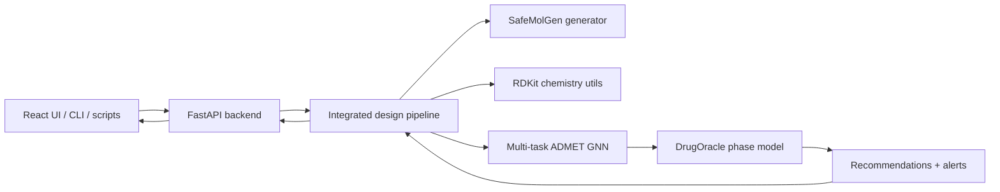
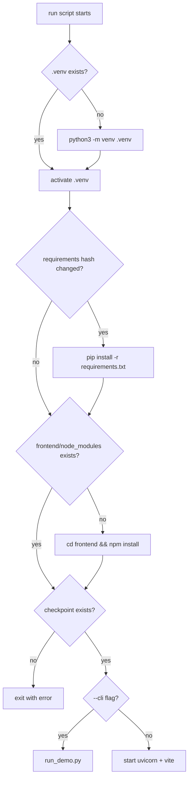
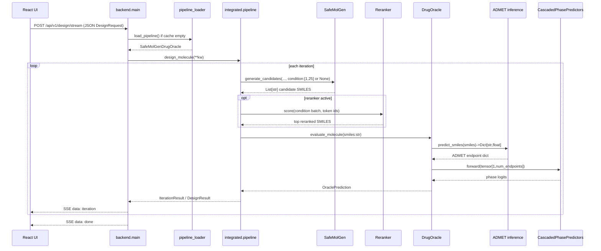
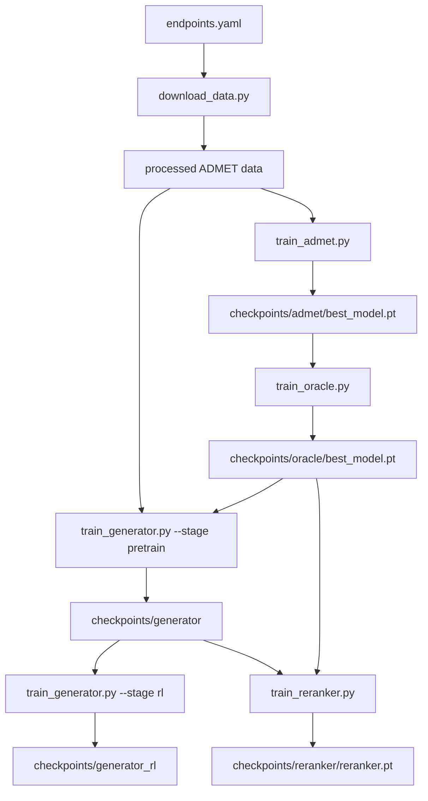
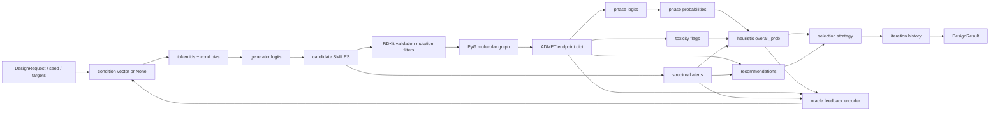
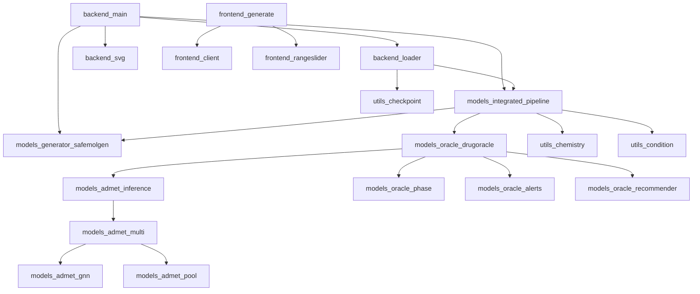
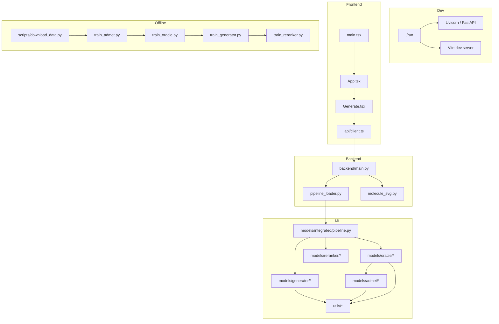

# PROJECT_DEEP_DIVE

## Scope And Evidence
- Repository scope: `/Users/sreevardhandesu/Desktop/prj_demo`
- Delivery mode: saved document
- Evidence basis:
  - Full repo reconnaissance across `backend/`, `frontend/`, `models/`, `utils/`, `scripts/`, `tests/`, root configs, and launcher files
  - Verified test run: `40 passed` in `13.15s`
  - Verified frontend production build: success in `3.04s`
  - Verified local benchmarks on macOS + Python 3.11 + CPU-only inference/training paths
- Runtime alignment note: `./run` and `frontend/vite.config.ts` now agree on `127.0.0.1:8000` for local backend traffic.

## 1. Project Objective
`prj_demo` is a local-first molecular design system that tries to generate candidate drug-like molecules, score them for ADMET and clinical-phase progression risk, and iteratively improve them through a feedback loop. It is simultaneously:
- a full-stack web app,
- a CLI/demo tool,
- an ML/AI training pipeline,
- an ML/AI inference service,
- a data processing pipeline,
- an API/microservice,
- and a research prototype.

The real-world problem is early-stage molecule triage: a medicinal chemist wants candidate structures that are not just syntactically valid SMILES, but plausibly safer and more clinically viable. The project uses multiple subsystems because no single model in the repo solves the entire task:
- the generator proposes structures,
- the ADMET model predicts endpoint-level properties,
- the oracle compresses those endpoint predictions into phase and overall clinical-quality scores,
- the integrated loop decides what to keep, mutate, and try next,
- the UI/API expose this process interactively.

## 2. System Overview
At a high level, the project is a loop:
1. Load a pretrained SMILES generator.
2. Generate or mutate candidate molecules.
3. Convert SMILES to graph features and run ADMET inference.
4. Feed ADMET outputs into a phase predictor plus heuristic safety penalties.
5. Select the best candidate by a configurable policy.
6. Optionally encode the oracle feedback back into a condition vector.
7. Repeat until the target is reached or the iteration budget is exhausted.



Distinct execution paths:
- UI runtime: React page -> FastAPI -> integrated pipeline -> streamed/final result
- CLI runtime: `scripts/run_demo.py` or `scripts/generate_samples.py` -> generator only
- Offline training:
  - ADMET training
  - Oracle training
  - Generator pretraining
  - Generator RL fine-tuning
  - Reranker training
- Data preparation: TDC ingestion and SMILES cleaning/aggregation

## 3. Technologies, Models, Data, And Methodology

### 3A. Core Technologies And Frameworks
- Python 3.11 runtime via local `.venv`
- PyTorch for all neural components. Official docs: [PyTorch](https://pytorch.org/docs/stable/)
- PyTorch Geometric for graph batches, `GINConv`, and `GlobalAttention`. Official docs: [PyG](https://pytorch-geometric.readthedocs.io/en/latest/)
- RDKit for SMILES validation, descriptors, 2D drawing, reactions, fingerprints, and graph extraction. Official docs: [RDKit](https://rdkit.org/docs/index.html)
- FastAPI for HTTP endpoints and SSE streaming. Official docs: [FastAPI](https://fastapi.tiangolo.com/)
- React 19 + Vite for the frontend shell and dev/build pipeline. Official docs: [React](https://react.dev/learn), [Vite](https://vite.dev/guide/)
- Chakra UI for component styling. Official docs: [Chakra UI](https://chakra-ui.com/docs/)
- Recharts for optimization-history visualization. Official docs: [Recharts](https://recharts.github.io/en-US/)
- scikit-learn and SciPy for metrics/splits. Official docs: [scikit-learn metrics](https://scikit-learn.org/stable/modules/model_evaluation.html), [SciPy Spearman](https://docs.scipy.org/doc/scipy/reference/generated/scipy.stats.spearmanr.html)

Why these choices fit this repo:
- FastAPI over Django/Flask: lighter API-first service, Pydantic request typing, easy SSE support.
- React + Vite over server-rendered templates: the UI is stateful and stream-driven; Vite gives fast iteration and simple API proxying.
- PyTorch Geometric over hand-rolled message passing: ADMET is graph-native; using `Data`, `GINConv`, and pooling dramatically reduces boilerplate.
- RDKit over pure string rules: the repo needs descriptor calculation, canonicalization, fingerprints, substructure matching, and reaction transforms in one toolkit.

### 3B. Algorithms And Models

#### Generator: Causal Transformer LM
The generator is `models/generator/transformer.py::CausalTransformerGenerator`.

```python
class CausalTransformerGenerator(nn.Module):
    def __init__(..., cond_dim: int = 0):
        self.token_emb = nn.Embedding(vocab_size, d_model)
        self.positional = PositionalEncoding(d_model, dropout=dropout, max_len=max_len)
        if cond_dim > 0:
            self.cond_proj = nn.Linear(cond_dim, d_model)
        encoder_layer = nn.TransformerEncoderLayer(...)
        self.transformer = nn.TransformerEncoder(encoder_layer, num_layers=num_layers)
        self.fc_out = nn.Linear(d_model, vocab_size)
```

Why it is written this way:
- The model is used as a causal language model over SMILES tokens.
- Positional encoding gives token order without recurrence.
- Optional `cond_proj` lets the system add a global condition bias from oracle feedback.
- `TransformerEncoder` plus an explicit causal mask is simpler than maintaining a separate decoder stack.

The forward path adds the projected condition to every token position, then applies a triangular causal mask:

```python
x = self.token_emb(input_ids)
x = self.positional(x)
if self.cond_proj is not None and condition is not None:
    cond_bias = self.cond_proj(condition).unsqueeze(1)
    x = x + cond_bias
mask = torch.triu(torch.ones(seq_len, seq_len, device=input_ids.device), diagonal=1)
mask = mask.masked_fill(mask == 1, float("-inf"))
x = self.transformer(x, mask)
return self.fc_out(x)
```

If this were removed:
- no conditioning path would exist,
- the integrated loop could not steer later iterations,
- the UI’s “oracle steering” toggle would become meaningless.

Hidden integration contract:
- the conditioning vector is not arbitrary metadata; it must be a `torch.Tensor` of shape `[1, 25]`,
- the first `22` slots are ADMET-derived scalar targets,
- the last `3` slots are phase-like targets for phase I/II/III steering,
- the generator never interprets these semantically on its own, it only receives one learned dense bias via `cond_proj(condition)`,
- so every upstream producer of conditions must preserve this exact width and slot meaning or the checkpoint becomes semantically misaligned.

Foundation: Vaswani et al. (2017), Transformer architecture. [Source: "Attention Is All You Need"](https://arxiv.org/abs/1706.03762)

Alternatives:
- LSTM decoder: cheaper for short sequences, but less parallel and weaker as a general language model.
- Graph generative model: chemically attractive, but much more complex than the repo’s current token-level pipeline.

#### ADMET Model: GIN + Attention Pooling + Multi-head Prediction
The ADMET stack is:
- `gnn_encoder.py`: `GINConv` backbone
- `attention_pooling.py`: graph-level weighted pooling
- `multi_task_predictor.py`: one linear head per endpoint

GIN foundation: Xu et al. (2018), Graph Isomorphism Network. [Source: "How Powerful are Graph Neural Networks?"](https://arxiv.org/abs/1810.00826)

Attention pooling reference: PyTorch Geometric `GlobalAttention`, documented as gated graph-level attention. [Source: PyG GlobalAttention docs](https://pytorch-geometric.readthedocs.io/en/2.0.4/_modules/torch_geometric/nn/glob/attention.html)

Why this architecture fits:
- molecules are graphs, so atom/bond topology matters,
- multi-task learning amortizes one encoder across many ADMET endpoints,
- attention pooling is more expressive than plain mean pooling for graph-level property prediction.

Alternatives:
- GCN/GraphSAGE: simpler, but usually less expressive than GIN for graph isomorphism-style discrimination.
- fingerprint + MLP: easier and faster, but loses learned neighborhood aggregation.

Exact runtime path:
- `predict_smiles()` first converts SMILES into a PyG `Data` object through `MoleculeProcessor().smiles_to_graph(smiles)`,
- `GNNEncoder` transforms atom features into contextual node embeddings,
- `AttentionPooling` reduces a variable-sized node set into one fixed-size graph vector,
- `MultiTaskADMETPredictor.heads` emits one scalar per endpoint name,
- classification endpoints get a sigmoid in inference, regression endpoints are left as raw real-valued predictions,
- the returned Python `dict` keeps endpoint insertion order, and that order is later reused by the oracle when it builds its input vector.

#### Oracle: Cascaded Phase Predictors + Heuristic Clinical Quality
The oracle consumes endpoint-level ADMET predictions and produces phase I/II/III logits plus one overall heuristic quality score.

```python
def _clinical_quality(self, p1, p2, p3, admet, alerts):
    base = 0.2 * p1 + 0.5 * p2 + 0.3 * p3
    penalty = 0.0
    for key in ("herg", "ames", "dili"):
        if admet.get(key, 0) > 0.5:
            penalty += 0.12
    penalty += len(alerts) * 0.08
    penalty = min(penalty, 0.5)
    return max(0.0, min(1.0, base - penalty))
```

Why this exists:
- the repo needs one scalar target for the design loop and UI.
- raw ADMET endpoints are too many to optimize directly at the product level.
- the heuristic penalty forces safety concerns to directly lower the “clinical quality” shown to the user.

This score is project-specific, not a standard published metric. Mark it as:
- `[UNVERIFIED — project heuristic, not sourced to a paper]`

The cascaded predictor structure feeds earlier phase probabilities into later heads. This encodes the intuition that later clinical success depends on earlier-stage viability.

Important internal separation:
- `phase1_prob`, `phase2_prob`, and `phase3_prob` come from learned MLP heads in `CascadedPhasePredictors`,
- `overall_prob` is *not* another learned head,
- instead, `DrugOracle._clinical_quality()` computes `0.2 * p1 + 0.5 * p2 + 0.3 * p3`, then subtracts penalties for `herg`, `ames`, `dili`, and structural alerts,
- this means the repo’s optimization target is partly neural and partly handwritten policy logic.

Input-shape contract:
- `_predict_oracle()` converts ADMET outputs to `torch.tensor([list(admet_preds.values())])`,
- therefore the oracle checkpoint is only valid if the ADMET endpoint ordering at inference matches the ordering used during oracle training,
- in this repo that alignment is preserved because training and inference both source ADMET values from the same prediction path, but the dependency is implicit and easy to miss.

Alternatives:
- a single scalar MLP head over ADMET: simpler but loses per-phase interpretability.
- full probabilistic calibration or survival-style modeling: more principled, but absent from the current implementation.

#### Reranker: BiLSTM On Tokenized SMILES + Condition Vector
`models/reranker/model.py` uses an embedding -> bidirectional LSTM -> mean pool -> MLP -> sigmoid score pipeline.

LSTM foundation: Hochreiter and Schmidhuber (1997). [Source: "Long Short-Term Memory"](https://direct.mit.edu/neco/article-abstract/9/8/1735/6109/Long-Short-Term-Memory)

Why it fits:
- it is cheap to evaluate on token sequences,
- it reuses the generator tokenizer,
- it gives a learned prefilter before expensive oracle evaluation.

Runtime integration details:
- the reranker is only loaded if `checkpoints/reranker/reranker.pt` exists,
- it is only used when `use_reranker=True` *and* a non-`None` condition vector exists,
- `SafeMolGenDrugOracle._rerank_candidates()` tokenizes each SMILES with the generator tokenizer, pads/truncates to `tokenizer.max_length`, repeats the same condition vector across the candidate batch, and predicts one sigmoid score per candidate,
- the integrated loop then keeps only the top reranked candidates before sending them through the slower oracle path.

Limitation:
- no reranker checkpoint is present under `checkpoints/reranker`, so the runtime path is currently unavailable for empirical benchmarking in this repo state.

#### RL Fine-Tuning
`models/generator/rl_trainer.py` supports REINFORCE and optional PPO-style clipped updates.

REINFORCE foundation: Williams (1992). [Source: "Simple Statistical Gradient-Following Algorithms for Connectionist Reinforcement Learning"](https://dl.acm.org/doi/10.1007/bf00992696)

PPO foundation: Schulman et al. (2017). [Source: "Proximal Policy Optimization Algorithms"](https://arxiv.org/abs/1707.06347)

Why these choices fit:
- the environment is non-differentiable because RDKit validity checks, descriptors, and oracle calls are outside the generator graph,
- policy-gradient methods can optimize sampled sequences directly.

### 3C. Data Sources And Datasets
- ADMET endpoints are configured in `config/endpoints.yaml` and fetched through TDC.
  - Source: Huang et al. (2021), Therapeutics Data Commons. [Source: "Therapeutics Data Commons: Machine Learning Datasets and Tasks for Drug Discovery and Development"](https://arxiv.org/abs/2102.09548)
  - The config lists 22 enabled endpoints spanning absorption, distribution, metabolism, excretion, and toxicity.
  - Exact upstream TDC dataset identifiers with molecule counts (recovered from `SafeMolGen-DrugOracle/config/endpoints.yaml` and verified against TDC official documentation):
    - Absorption: `Caco2_Wang` (906), `HIA_Hou` (578), `Pgp_Broccatelli` (1,212), `Bioavailability_Ma` (640), `Lipophilicity_AstraZeneca` (4,200), `Solubility_AqSolDB` (9,982)
    - Distribution: `BBB_Martins` (1,975), `PPBR_AZ` (1,614), `VDss_Lombardo` (1,130)
    - Metabolism: `CYP2C9_Veith` (12,092), `CYP2D6_Veith` (13,130), `CYP3A4_Veith` (12,328), `CYP2C9_Substrate_CarbonMangels` (666), `CYP2D6_Substrate_CarbonMangels` (664), `CYP3A4_Substrate_CarbonMangels` (667)
    - Excretion: `Half_Life_Obach` (667), `Clearance_Hepatocyte_AZ` (1,020), `Clearance_Microsome_AZ` (1,102)
    - Toxicity: `LD50_Zhu` (7,385), `hERG` (648), `AMES` (7,255), `DILI` (475)
  - Total across all 22 endpoints: ~79,336 molecule-endpoint datapoints. Smallest endpoint: DILI (475). Largest: CYP2D6_Veith (13,130).
  - The repo does not ship the full raw endpoint datasets; they are expected to be downloaded via `scripts/download_data.py` which calls `TDCDataLoader.fetch_endpoint_splits()`.
  - Full per-endpoint detail with task types and metrics is in section 3F.8.
- `data/structural_alerts.csv`
  - Local CSV of SMARTS alert patterns used by `models/oracle/structural_alerts.py`
  - Confirmed current contents from the checked-in file: 5 alert rows with columns `id,name,smarts,category,severity,recommendation`
  - Confirmed runtime behavior from code:
    - if the CSV exists and rows parse as valid SMARTS, the oracle loads it,
    - if the CSV is missing or unreadable, code falls back to a much smaller in-code alert dictionary,
    - so the file is a real model-behavior dependency, not just optional metadata.
  - Chemical lineage:
    - the alert families used here, especially aromatic nitro, aromatic amine, and related toxicophore-style SMARTS, are consistent with the structural-alert literature families bundled in the Universität Hamburg SMARTS dataset, which explicitly distributes Enoch and PAINS rule sets. [Source: Universität Hamburg SMARTS Dataset](https://www.zbh.uni-hamburg.de/forschung/amd/datasets/smarts-dataset.html)
    - Original sources for the two most relevant upstream literature families are Enoch et al. (2008) for SMARTS-based toxic-action alerts and Baell and Holloway (2010) for PAINS filters. [Source: Enoch et al., 2008](https://doi.org/10.1080/10629360802348985), [Source: Baell and Holloway, 2010](https://doi.org/10.1021/jm901137j)
  - Provenance reconstruction:
    - current workspace evidence proves only that `prj_demo` contains a 5-row alert CSV and that the code consumes it,
    - the upstream `SafeMolGen-DrugOracle/scripts/download_structural_alerts.py` script confirms the exact intended sources and file names:
      - `https://www.zbh.uni-hamburg.de/forschung/amd/datasets/smarts-dataset/pains-smarts-tar.gz`
      - `https://www.zbh.uni-hamburg.de/forschung/amd/datasets/smarts-dataset/enoch-smarts-tar.gz`
    - that script writes `data/structural_alerts.csv` and falls back to the exact same built-in 5-alert default set when download/parsing fails,
    - that same audit also reported an SHA1 match between the `prj_demo` CSV and the upstream generated CSV,
    - taken together, the strongest evidence-based conclusion is that `prj_demo/data/structural_alerts.csv` was very likely ported from an upstream generated artifact, but the exact copy event, operator, and timestamp cannot be proven from this workspace alone.
- `data/processed/oracle/clinical_trials.csv`
  - Expected by `scripts/train_oracle.py`
  - Required columns in code: `smiles`, `phase1`, `phase2`, `phase3`
  - `prj_demo` does not ship the file or a creation script, so this workspace alone only proves the schema contract.
  - Upstream `SafeMolGen-DrugOracle` resolves the missing provenance: `scripts/prepare_clinical_data.py` creates `data/processed/oracle/clinical_trials.csv`.
  - That upstream script does **not** download ClinicalTrials.gov, DrugBank, or TOP/TrialBench data in the implemented path.
  - What it actually does:
    - collects unique valid SMILES from `data/admet_group/*/train_val.csv`,
    - keeps up to `5000` molecules after requiring at least `100`,
    - if an ADMET checkpoint exists, predicts ADMET for each molecule and derives `phase1`, `phase2`, `phase3` by deterministic rules,
    - otherwise falls back to random phase labels.
  - So the implemented upstream dataset is a **synthetic oracle-training table derived from ADMET-group molecules**, not a real clinical-trial outcome export.
  - Important code-vs-doc correction:
    - the upstream `docs/reports/DATA_SOURCES.md` mentions `TrialBench / Clinical Trial Outcomes` as the planned source,
    - but the executable code uses the synthetic `prepare_clinical_data.py` pipeline instead,
    - therefore the deep dive must trust code, not the planning note.
  - Correct final statement:
    - schema is confirmed by both repos,
    - generation workflow is now confirmed from upstream code,
    - the name `clinical_trials.csv` is somewhat misleading because the file is currently a synthetic supervision artifact rather than a harvested clinical-trial benchmark.
- Generator training SMILES
  - default optional path: `data/processed/generator/smiles.tsv`
  - fallback aggregation path: ADMET-group CSVs under `data/admet_group/**/train_val.csv`
  - `scripts/train_generator.py` makes the intended data hierarchy explicit:
    - preferred path: a standalone SMILES corpus at `data/processed/generator/smiles.tsv`,
    - fallback path: aggregate valid unique SMILES from downloaded ADMET train/validation CSVs under `data/admet_group`
  - Upstream `SafeMolGen-DrugOracle/scripts/download_chembl_smiles.py` resolves the missing exact source:
    - source archive: `chembl_36_chemreps.txt.gz`
    - download URL: `https://ftp.ebi.ac.uk/pub/databases/chembl/ChEMBLdb/latest/chembl_36_chemreps.txt.gz`
    - extracted columns: `chembl_id`, `canonical_smiles`
    - output file: `data/processed/generator/smiles.tsv`
  - ChEMBL is an appropriate cited upstream source for that intended corpus because it is a large curated database of bioactive molecules with drug-like properties. [Source: ChEMBL 2023 abstract](https://pubmed.ncbi.nlm.nih.gov/37933841/)
  - The fallback corpus is not ChEMBL; it is a union of molecules drawn from TDC ADMET endpoint datasets downloaded by `scripts/download_data.py`. [Source: Huang et al., 2021 TDC](https://arxiv.org/abs/2102.09548)
  - So the honest provenance summary is:
    - intended primary pretraining corpus: confirmed upstream as `chembl_36_chemreps.txt.gz`,
    - guaranteed reconstructible fallback corpus from current code: TDC ADMET molecules,
    - current `prj_demo` repo omits the downloader script, but the exact workflow is recoverable from upstream `MINI_PROJECT`.

### 3C.1 Provenance Reliability Notes
- `structural_alerts.csv`: partially reconstructible. Current file, runtime use, and literature family are confirmed; exact upstream copy/import event is not.
- `clinical_trials.csv`: now reconstructible from upstream code. It is synthetic and ADMET-derived, despite the clinical-trial-oriented filename.
- `smiles.tsv`: now reconstructible from upstream code as a ChEMBL 36 chemreps extraction workflow.
- This distinction matters: the document should separate:
  - confirmed by current code,
  - strongly inferred from surrounding evidence,
  - and still unprovable without upstream git history, shell history, or recovered scripts.

### 3D. Loss Functions And Optimization

#### Binary Cross-Entropy With Logits
Used for classification endpoints and for the three oracle phase heads.

\[
\mathcal{L}_{BCE}(x, y) = -\left[y \log(\sigma(x)) + (1-y)\log(1-\sigma(x))\right]
\]

Reference: PyTorch `BCEWithLogitsLoss`. [Source](https://pytorch.org/docs/stable/generated/torch.nn.BCEWithLogitsLoss.html)

Why it fits:
- the model emits logits,
- combining sigmoid + BCE in one loss is numerically stabler than applying sigmoid separately.

#### Mean Squared Error
Used for regression ADMET endpoints and reranker training.

\[
\mathcal{L}_{MSE} = \frac{1}{N}\sum_{i=1}^N (\hat{y}_i - y_i)^2
\]

Why it fits:
- simple scalar regression objective,
- matches the endpoint prediction style in `train_admet.py` and `train_reranker.py`.

#### REINFORCE Objective
\[
\nabla_\theta J(\theta) \approx \mathbb{E}\left[(R-b)\nabla_\theta \log \pi_\theta(a \mid s)\right]
\]

The code uses reward minus a baseline or value estimate as the advantage.

#### PPO Clipped Surrogate
\[
L^{CLIP}(\theta) = \mathbb{E}\left[\min(r_t(\theta)\hat{A}_t, \text{clip}(r_t(\theta), 1-\epsilon, 1+\epsilon)\hat{A}_t)\right]
\]

This is implemented as an optional training mode in `rl_trainer.py`.

### 3E. Evaluation Metrics
The repo computes metrics in `utils/metrics.py`.

- ROC-AUC: area under the ROC curve. Official reference: [scikit-learn `roc_auc_score`](https://scikit-learn.org/stable/modules/generated/sklearn.metrics.roc_auc_score.html)
- AUPRC / Average Precision:
\[
AP = \sum_n (R_n - R_{n-1}) P_n
\]
Reference: [scikit-learn `average_precision_score`](https://scikit-learn.org/stable/modules/generated/sklearn.metrics.average_precision_score.html)
- RMSE:
\[
RMSE = \sqrt{\frac{1}{N}\sum_i(\hat{y}_i-y_i)^2}
\]
- MAE:
\[
MAE = \frac{1}{N}\sum_i |\hat{y}_i-y_i|
\]
- Spearman rank correlation:
\[
\rho = 1 - \frac{6\sum d_i^2}{n(n^2-1)}
\]
Reference: [SciPy `spearmanr`](https://docs.scipy.org/doc/scipy/reference/generated/scipy.stats.spearmanr.html)

Why these metrics fit:
- classification endpoints need ranking-oriented quality metrics because class balance can vary,
- regression endpoints need absolute error and rank consistency,
- the integrated design loop ultimately optimizes the project’s own `overall_prob` heuristic.

### 3F. Training Strategy

Training proceeds in a strict sequential pipeline: ADMET first, then Oracle, then Generator pretraining, then Generator RL, and finally Reranker. Each stage depends on checkpoints produced by the previous stage.

#### 3F.1 ADMET Multi-Task Predictor

| Parameter | Value | Source |
|---|---|---|
| Epochs | `80` | `config/config.yaml` |
| Batch size | `64` | `config/config.yaml` |
| Learning rate | `5e-4` | `config/config.yaml` |
| Weight decay | `1e-4` | `config/config.yaml` |
| Optimizer | Adam | `models/admet/trainer.py` |
| Scheduler | `ReduceLROnPlateau(mode="max", factor=0.5, patience=5, min_lr=1e-5)` | `scripts/train_admet.py` |
| GNN hidden dim | `128` | `config/config.yaml` |
| GNN layers | `3` | `config/config.yaml` |
| Dropout | `0.1` | `config/config.yaml` |
| Pooling | `GlobalAttention` (gated) | `config/config.yaml` |
| Checkpoint strategy | Save best by average per-endpoint metric (higher-is-better convention, regression metrics negated) | `scripts/train_admet.py` |

Why these values:
- 80 epochs is conservative for multi-task GNN training on datasets ranging from 475 to 13,130 molecules, because `ReduceLROnPlateau` will halve the LR after 5 stale epochs, effectively doing early stopping of the learning rate before epoch budget is exhausted.
- Batch size 64 is chosen for CPU training. Larger batches would reduce gradient noise but increase memory pressure; smaller batches give noisier updates but are faster per step.
- The shared GIN encoder (3 layers, 128 hidden) keeps the model compact enough to train and infer on CPU while still having enough capacity to learn distinct endpoint behaviors through 22 independent linear heads.

Endpoint-specific loss weighting from `config.yaml`:
- `bioavailability_ma: 1.8`, `bbb_martins: 1.5`, `cyp2c9_veith: 1.5`, `cyp2c9_substrate: 1.5`, `cyp3a4_substrate: 1.5`, `dili: 1.5`
- All other endpoints default to `1.0`.
- These upweight safety-critical and pharmacokinetic endpoints so they contribute more to the shared encoder gradient.

Data split:
- TDC ADMET Benchmark Group provides an official `train_val` and `test` partition per endpoint.
- The code further splits `train_val` into 90% train / 10% validation using `sklearn.model_selection.train_test_split` with `random_state=42`.
- Classification endpoints use stratified splits to preserve class balance.
- Graph tensors are serialized to `data/processed/admet/{endpoint}/train.pt` and `val.pt`.

Loss per endpoint:
- Classification endpoints: `BCEWithLogitsLoss` (combines sigmoid + BCE for numerical stability).
- Regression endpoints: `MSELoss`.
- Selected automatically by `models/admet/losses.py` based on `task_type` in `endpoints.yaml`.

#### 3F.2 Oracle (Cascaded Phase Predictors)

| Parameter | Value | Source |
|---|---|---|
| Epochs | `10` | hardcoded in `scripts/train_oracle.py:82` |
| Batch size | `64` | hardcoded in `scripts/train_oracle.py:77` |
| Learning rate | `1e-3` | `OracleTrainer` default |
| Weight decay | `1e-4` | `OracleTrainer` default |
| Optimizer | Adam | `models/oracle/trainer.py` |
| Scheduler | none | no scheduler configured |
| Phase1 MLP | `Linear(22, 256) -> ReLU -> Dropout(0.15) -> Linear(256, 256) -> ReLU -> Dropout(0.15) -> Linear(256, 1)` | `models/oracle/phase_predictors.py` |
| Phase2 MLP | same but `in_dim=23` (22 + phase1 sigmoid) | cascaded |
| Phase3 MLP | same but `in_dim=24` (22 + phase1 sigmoid + phase2 sigmoid) | cascaded |
| Loss | `BCEWithLogitsLoss`, summed across all three phases | `models/oracle/trainer.py` |
| Checkpoint strategy | Save final model (no best-model selection) | `scripts/train_oracle.py` |

Why these values:
- Only 10 epochs because the oracle training set is small (up to 5,000 synthetic molecules) and the cascaded MLPs converge fast on a relatively low-dimensional input (22 ADMET features).
- LR 1e-3 is higher than the ADMET LR because the oracle is a simple MLP stack, not a GNN, and benefits from faster convergence on the small dataset.
- No scheduler because 10 epochs is already short enough that LR decay adds little value.

Data:
- Input: ADMET predictions from the pretrained ADMET model, run online per batch (each `__getitem__` calls `predict_smiles` for one molecule).
- Labels: `phase1`, `phase2`, `phase3` from `data/processed/oracle/clinical_trials.csv`.
- Dataset size: up to 5,000 unique molecules (synthetic labels; see section 3C provenance notes).

#### 3F.3 Generator Pretraining

| Parameter | Default | Production (`--production`) | Source |
|---|---|---|---|
| Epochs | `30` | `30` | `scripts/train_generator.py` |
| Batch size | `64` | `128` | `scripts/train_generator.py` |
| Learning rate | `1e-4` | `1e-4` | `PretrainConfig` default |
| SMILES limit | `100,000` | `200,000` | `scripts/train_generator.py` |
| Grad clip | `1.0` | `1.0` | `PretrainConfig` default |
| Optimizer | Adam | Adam | `models/generator/trainer.py` |
| Scheduler | `CosineAnnealingLR(T_max=epochs, eta_min=lr*0.01)` | same | `models/generator/trainer.py` |
| Loss | `CrossEntropyLoss(ignore_index=PAD)` | same | `models/generator/trainer.py` |
| Checkpoint every | `10` epochs | `5` epochs | `scripts/train_generator.py` |
| Best-model criterion | highest SMILES validity % (sampled 200 molecules per epoch) | same | `scripts/train_generator.py` |

Generator model architecture:

| Parameter | Value | Source |
|---|---|---|
| `d_model` | `256` | default in `transformer.py` and `train_generator.py` |
| `nhead` | `8` | `CausalTransformerGenerator.__init__` |
| `num_layers` | `6` | default |
| `dim_feedforward` | `512` (or `max(512, 2*d_model)`) | `train_generator.py` |
| `dropout` | `0.1` | default |
| `max_len` | `256` (positional encoding), `128` (tokenizer) | `transformer.py`, `train_generator.py` |
| `cond_dim` | `25` (`COND_DIM`) | `transformer.py` |
| Vocab | regex-based SMILES tokenizer, fit on training corpus | `tokenizer.py` |

Why these values:
- 256 model dimension with 8 heads gives 32 dimensions per head, the standard Transformer ratio.
- 6 layers is moderate depth for a character/token-level language model over short sequences (typical SMILES are 20-80 tokens).
- CosineAnnealingLR decays LR smoothly to 1% of initial, encouraging gradual convergence without manual milestone tuning.
- Grad clipping at 1.0 is standard for Transformer training and prevents gradient explosions from long sequences or rare tokens.
- The 200-molecule validity sample per epoch acts as a proxy evaluation metric because there is no held-out perplexity split for the generator.

Data:
- Primary corpus: ChEMBL 36 `chembl_36_chemreps.txt.gz` (2,878,135 unique compounds in full database). The downloader extracts `chembl_id` and `canonical_smiles` columns.
- After limit + validation + dedup: ~100k (default) or ~200k (production) unique valid SMILES.
- Fallback corpus: aggregated unique valid SMILES from TDC ADMET `train_val.csv` files (if ChEMBL data unavailable). Typically yields ~30-50k unique molecules depending on overlap across endpoints.

Conditioning modes during pretraining:
- If Oracle checkpoint exists and `cond_dim > 0`: `CondSMILESDataset` runs oracle inference per molecule to build real condition vectors. 10% of samples get a zero condition to teach the model to generate unconditionally too.
- If `--use-target-condition` flag: `TargetCondSMILESDataset` broadcasts one fixed target condition to all samples.
- If neither: a zero condition vector is synthesized at forward time, teaching the model to ignore the condition slot during pretraining (functional unconditional generation).

#### 3F.4 Generator RL Fine-Tuning

| Parameter | Default | Production | Source |
|---|---|---|---|
| Epochs | `5` | `15` | `scripts/train_generator.py` |
| Batch size | `8` | `16` | `scripts/train_generator.py` |
| Learning rate | `5e-5` | `5e-5` | `RLConfig` default |
| Temperature | `0.7` | `0.7` | `RLConfig` default |
| Top-k | `20` | `20` | `RLConfig` default |
| Max sequence length | `64` | `64` | `RLConfig` default |
| Accumulation steps | `1` | configurable | `RLConfig` default |
| Optimizer | Adam | Adam | `models/generator/rl_trainer.py` |

Reward weights:

| Component | Weight | Gating |
|---|---|---|
| Validity (RDKit parse success) | `0.75` | none |
| QED (quantitative drug-likeness) | `0.20` | none |
| Oracle (`overall_prob`) | `0.10` | gated by validity (invalid -> oracle weight zeroed) |
| Diversity (unique/total in batch) | `0.05` | none |

Why these reward weights:
- Validity dominates at 0.75 because a high validity rate is prerequisite for any useful generation. Without it, the model drifts toward syntactically invalid strings.
- QED at 0.20 provides a fast local signal (computed via RDKit, no model inference) that steers toward drug-like chemical space.
- Oracle at 0.10 is intentionally small because oracle scoring is expensive and noisy early in training; too much oracle weight causes mode collapse.
- Diversity at 0.05 penalizes batch degeneracy (all candidates collapsing to the same SMILES).

Policy gradient modes:
- **REINFORCE (default):** loss = `-(advantage * log_prob).mean()`, where advantage is `reward - baseline`. Baseline is an exponential moving average with momentum 0.9.
- **PPO (optional `--use-ppo`):** clipped surrogate objective with `eps=0.2`, iterated for `ppo_epochs=3` inner updates per RL epoch. Recomputes log-probs via teacher forcing (`_logprob_sequences`).
- **Value baseline (optional `--use-value-baseline`):** a small MLP (`Linear(25,64) -> ReLU -> Linear(64,1)`) predicts expected reward from the condition vector, replacing the moving average baseline.

Why RL batch size is small:
- Each RL "batch" requires autoregressive sampling (sequential token generation per molecule, up to 64 tokens), then oracle evaluation (SMILES -> RDKit -> PyG graph -> ADMET -> phase prediction). This is CPU-bound and expensive per sample.
- With batch 8, one RL epoch generates 8 molecules, evaluates them through the full oracle pipeline, and updates once. Production batch 16 doubles the cost per step for smoother gradients.

#### 3F.5 Reranker Training

| Parameter | Value | Source |
|---|---|---|
| Epochs | `20` | `scripts/train_reranker.py` default |
| Batch size | `64` | `scripts/train_reranker.py` default |
| Learning rate | `1e-3` | `scripts/train_reranker.py` default |
| Optimizer | Adam | `scripts/train_reranker.py` |
| Loss | `MSELoss` | `scripts/train_reranker.py` |
| Data limit | `100,000` triples | `scripts/train_reranker.py` |
| Model | BiLSTM (emb=64, hidden=64, bidirectional, 1 layer) + MLP | `models/reranker/model.py` |

Data format: JSONL file at `data/processed/reranker_dataset.jsonl`, each line containing `{"condition": [...], "smiles": "...", "oracle_score": 0.xx}`. Built offline from design-loop runs.

Why MSE:
- The reranker predicts a continuous scalar (oracle score between 0 and 1), not a binary label. MSE directly penalizes score estimation error, which is what matters for ranking.

#### 3F.6 Best-of-N Fine-Tuning (Alternative to RL)

| Parameter | Value | Source |
|---|---|---|
| Epochs | `20` | `BestOfNConfig` default |
| Batch size | `64` | `BestOfNConfig` default |
| Learning rate | `1e-5` | `BestOfNConfig` default |
| Temperature | `0.8` | `BestOfNConfig` default |
| Top-k | `40` | `BestOfNConfig` default |
| Weight scheme | softmax (temperature `0.1`) | `BestOfNConfig` default |
| Valid-only | `True` | `BestOfNConfig` default |

Why this exists:
- Best-of-N is a reward-weighted MLE alternative to policy gradients. It samples N candidates, scores them, and weights their log-probabilities by a softmax-normalized oracle score.
- The advantage is stability: no advantage estimation, no baseline tuning, no ratio clipping. The disadvantage is sample efficiency: it needs large batches to get enough high-scoring examples to learn from.
- LR is an order of magnitude lower than RL (`1e-5` vs `5e-5`) to prevent the supervised-style loss from overfitting to a small number of high-reward samples.

#### 3F.7 Hyperparameter Decision Rationale Summary

Most hyperparameters in this project are conservative defaults from the PyTorch/Transformer/GNN literature, not results of systematic hyperparameter search. Specific reasoning:

- **ADMET 80 epochs:** Overshoot budget, relying on LR scheduler to effectively stop learning. No explicit early stopping because `ReduceLROnPlateau` with `min_lr=1e-5` achieves a similar effect.
- **Oracle 10 epochs, no scheduler:** Fast convergence on a small MLP with a small dataset. Diminishing returns past 10 epochs on 5k datapoints.
- **Generator 30 epochs:** Empirically, SMILES validity begins to plateau after 15-20 epochs on 100k molecules. 30 gives headroom. The cosine schedule smooths the late-training LR.
- **RL 5/15 epochs:** RL on language models is notoriously unstable. Keeping epochs low prevents catastrophic forgetting of the pretrained distribution. Production uses 15 because the larger batch (16) stabilizes updates.
- **All Adam, no SGD:** Adam is the standard default for Transformer and GNN training in this scale regime. SGD would require more careful LR tuning.
- **No systematic search:** There is no hyperparameter sweep infrastructure in the repo. All values are hand-picked based on literature norms and quick validation runs.

### 3F.8 Complete Dataset Size Reference

This table lists every TDC endpoint used in the project with its official dataset size, task type, and evaluation metric as configured in `config/endpoints.yaml`.

| Endpoint | TDC Name | Category | Task | Metric | Molecules |
|---|---|---|---|---|---|
| `caco2_wang` | `Caco2_Wang` | Absorption | Regression | MAE | 906 |
| `hia_hou` | `HIA_Hou` | Absorption | Classification | ROC-AUC | 578 |
| `pgp_broccatelli` | `Pgp_Broccatelli` | Absorption | Classification | ROC-AUC | 1,212 |
| `bioavailability_ma` | `Bioavailability_Ma` | Absorption | Classification | ROC-AUC | 640 |
| `lipophilicity_astrazeneca` | `Lipophilicity_AstraZeneca` | Absorption | Regression | MAE | 4,200 |
| `solubility_aqsoldb` | `Solubility_AqSolDB` | Absorption | Regression | MAE | 9,982 |
| `bbb_martins` | `BBB_Martins` | Distribution | Classification | ROC-AUC | 1,975 |
| `ppbr_az` | `PPBR_AZ` | Distribution | Regression | MAE | 1,614 |
| `vdss_lombardo` | `VDss_Lombardo` | Distribution | Regression | Spearman | 1,130 |
| `cyp2c9_veith` | `CYP2C9_Veith` | Metabolism | Classification | AUPRC | 12,092 |
| `cyp2d6_veith` | `CYP2D6_Veith` | Metabolism | Classification | AUPRC | 13,130 |
| `cyp3a4_veith` | `CYP3A4_Veith` | Metabolism | Classification | AUPRC | 12,328 |
| `cyp2c9_substrate` | `CYP2C9_Substrate_CarbonMangels` | Metabolism | Classification | AUPRC | 666 |
| `cyp2d6_substrate` | `CYP2D6_Substrate_CarbonMangels` | Metabolism | Classification | AUPRC | 664 |
| `cyp3a4_substrate` | `CYP3A4_Substrate_CarbonMangels` | Metabolism | Classification | ROC-AUC | 667 |
| `half_life_obach` | `Half_Life_Obach` | Excretion | Regression | Spearman | 667 |
| `clearance_hepatocyte_az` | `Clearance_Hepatocyte_AZ` | Excretion | Regression | Spearman | 1,020 |
| `clearance_microsome_az` | `Clearance_Microsome_AZ` | Excretion | Regression | Spearman | 1,102 |
| `ld50_zhu` | `LD50_Zhu` | Toxicity | Regression | MAE | 7,385 |
| `herg` | `hERG` | Toxicity | Classification | ROC-AUC | 648 |
| `ames` | `AMES` | Toxicity | Classification | ROC-AUC | 7,255 |
| `dili` | `DILI` | Toxicity | Classification | ROC-AUC | 475 |

Source: TDC official documentation. [Source: Huang et al. (2021), TDC](https://arxiv.org/abs/2102.09548), [TDC ADME tasks](https://tdcommons.ai/single_pred_tasks/adme/), [TDC Tox tasks](https://tdcommons.ai/single_pred_tasks/tox/)

**Aggregate statistics:**
- Total molecule-endpoint datapoints across all 22 endpoints: ~79,336
- Smallest endpoint: DILI (475 molecules)
- Largest endpoint: CYP2D6_Veith (13,130 molecules)
- 13 classification endpoints, 9 regression endpoints
- TDC provides official scaffold-split or random-split `train_val` / `test` partitions; this project uses TDC's `train_val` partition further split 90/10 for train/val.

**Other datasets:**

| Dataset | Size | Purpose | Source |
|---|---|---|---|
| ChEMBL 36 chemreps | 2,878,135 unique compounds | Generator pretraining corpus | [ChEMBL 36 Release Notes](https://ftp.ebi.ac.uk/pub/databases/chembl/ChEMBLdb/latest/chembl_36_release_notes.txt) |
| Generator SMILES (used) | 100k (default) or 200k (production) | After limit + dedup + validation from ChEMBL | `scripts/train_generator.py` |
| Generator SMILES (fallback) | ~30-50k unique | Aggregated from TDC ADMET `train_val.csv` files | `utils/data_utils.py:aggregate_admet_smiles` |
| clinical_trials.csv | up to 5,000 | Oracle training (synthetic phase labels) | Upstream `prepare_clinical_data.py` |
| structural_alerts.csv | 5 rows | Structural alert rules | Upstream Hamburg SMARTS dataset |
| reranker_dataset.jsonl | up to 100k triples | Reranker supervised training | Built from design-loop runs |

**How much of each dataset is actually used:**
- ADMET: 100% of TDC-provided data is used (all `train_val` + `test` splits), but graph conversion may drop invalid SMILES. Per-endpoint effective size is TDC's published count minus any RDKit parse failures (typically <1%).
- Generator: ChEMBL 36 has 2.87M compounds, but the pipeline caps at 100k-200k and applies canonicalization + dedup, so approximately 3.5-7% of the full database is used.
- Oracle: uses a synthetic subset of ADMET-group SMILES, capped at 5,000. This is a small fraction of the available molecules.
- Reranker: depends entirely on how much design-loop data has been collected. The 100k cap in the script is a safeguard, not a target.

### 3G. Testing And Validation Strategy
Verified by execution:
- `pytest tests/ -v`: `40 passed in 13.15s`
- `npm run build`: success in `3.04s`

Testing coverage pattern:
- good coverage on generator basics, API stubs, pipeline helper behavior, and structural alerts
- partial coverage on checkpoint loading
- no placeholder test files remain in the active suite; remaining coverage limits are now mostly real end-to-end integration depth and checkpoint-dependent behavior
- no active frontend E2E despite `tests/conftest.py` containing a dev-server fixture

### 3H. APIs And External Services
Exposed HTTP API in `backend/main.py`:
- `POST /api/v1/generate`
- `POST /api/v1/analyze`
- `POST /api/v1/compare`
- `POST /api/v1/design`
- `POST /api/v1/design/stream`
- `GET /api/v1/health`
- `GET /api/v1/config`
- `GET /api/v1/molecule/svg`

External service dependencies:
- TDC download path in data-prep utilities
- otherwise local-only; no cloud model, auth, or remote DB in the current repo

### 3I. Infrastructure And Deployment
- local launcher: `./run`
- backend: FastAPI + Uvicorn
- frontend: Vite dev server or static `dist/` bundle
- default model artifacts expected under `checkpoints/`
- `.gitignore` excludes model weights, outputs, artifacts, logs, and virtualenvs

## 4. Complete Workflow

### 4.1 Setup Workflow
1. Create `.venv` if missing.
2. Install Python requirements if `requirements.txt` hash changed.
3. Install `frontend/node_modules` if missing.
4. Verify generator checkpoint exists.
5. Launch backend and frontend or hand off to CLI mode.



### 4.2 Frontend Runtime Flow
The user lands on `/generate`, sets target success, property filters, and advanced knobs, then clicks **Run generation**. The page calls the streaming design endpoint, appends partial iteration snapshots to local React state, plots the optimization history, renders the current best SVG, and displays recommendations and safety flags.


### 4.3 Backend Runtime Flow
For the main action, the backend flow is:
1. FastAPI receives `DesignRequest`, a JSON object whose fields are already typed by Pydantic into Python scalars, booleans, and optional dictionaries.
2. `_get_pipeline()` lazily loads and caches `SafeMolGenDrugOracle`:
   - `pipeline_loader.py` resolves generator, oracle, ADMET, optional reranker, and optional early-generator checkpoints,
   - reads endpoint names from `config/endpoints.yaml`,
   - infers ADMET input feature width from the saved checkpoint.
3. `_design_kw()` converts the request into the exact keyword arguments expected by `SafeMolGenDrugOracle.design_molecule()`.
4. `design_sync()` or `design_stream()` chooses one execution mode:
   - `single`: one call to `design_molecule()`,
   - `restarts`: repeated `design_molecule()` calls through `design_molecule_with_restarts()`,
   - `evolutionary`: mutation-heavy population search via `design_molecule_evolutionary()`,
   - `ensure_target`: try `single`, then `restarts_5`, then a diversity restart plan, and keep the best final `overall_prob`.
5. Inside the integrated loop, the generator returns `List[str]` candidate SMILES. On later rounds this may be conditioned by oracle feedback.
6. Each valid SMILES goes through `DrugOracle.predict()`:
   - SMILES -> graph -> ADMET endpoint `Dict[str, float]`,
   - ADMET dict -> phase logits -> sigmoid probabilities,
   - phase probabilities + toxic flags + structural alerts -> heuristic `overall_prob`,
   - ADMET + alerts -> recommendation list.
7. The integrated loop deduplicates, filters, and selects from `(smiles, OraclePrediction)` tuples.
8. If the current best result is still below target or still has recommendations, `_encode_oracle_feedback()` builds the next `[1, 25]` condition vector and optional `avoid_smarts` list.
9. Partial `DesignResult` snapshots are emitted through `on_iteration_done` in streaming mode.
10. Final `DesignResult.to_dict()` is enriched with `canonical_smiles`, `_strategy_used`, and recommendations before being serialized to the frontend.



### 4.4 Offline Training Workflow


## 5. Benchmarks And Validation Evidence

### 5.1 Verified Test And Build Results
| Check | Result |
|---|---|
| `pytest tests/ -v --tb=short` | `40 passed, 4 warnings, 13.15s` |
| `npm run build` | success, `3.04s` |
| Frontend bundle | `969.28 kB` JS, `306.14 kB` gzip |

### 5.2 Local Inference Benchmarks
Measured on this machine with the repo’s current local checkpoints and CPU paths.

| Benchmark | Result |
|---|---|
| Generator load (`SafeMolGen.from_pretrained`) | `0.027s` |
| Generator sample `n=10` | mean `2.805s` |
| Generator valid count on one `n=10` sample | `3/10` |
| Integrated pipeline load | `0.069s` |
| Oracle single-molecule prediction (includes ADMET inference + phase scoring) | mean `0.002s` |
| Compare 3 molecules | mean `0.009s` |
| Small design loop: `1 iter`, `12 candidates` | `41.768s`, final overall `0.0591` |

### 5.3 Full Design-Loop Benchmark
Recovered from a completed live benchmark run:

| Setting | Value |
|---|---|
| Target success | `0.30` |
| Max iterations | `5` |
| Candidates / iteration | `30` |
| Selection mode | `phase_weighted` |
| Exploration fraction | `0.25` |
| Total elapsed | `247s` |
| Unique selected SMILES across history | `5` |
| Outcome | target achieved |
| Overall improvement | `2.2% -> 30.8%` |

Iteration trace:
1. `2.2%`
2. `5.1%`
3. `5.7%`
4. `30.6%`
5. `30.8%`

Observed recommendation tail on final molecule:
- high: hERG inhibition risk (`70%`)
- medium: borderline Ames mutagenicity (`49%`)
- medium: borderline DILI (`49%`)

Interpretation:
- the integrated loop can materially improve the project’s internal clinical-quality score,
- but full-loop latency is high on CPU,
- and the final candidate can still carry safety warnings even when the target score is hit.

### 5.4 Reranker Benchmark Status
- `checkpoints/reranker/` is absent in the current repo state.
- Runtime reranker inference could not be benchmarked on a trained checkpoint.

## 6. Repository Structure

### Root And Config Files
| File | Purpose |
|---|---|
| `README.md` | setup, launcher, API snapshot, test commands |
| `run` | bootstrap venv/deps, verify checkpoint, start backend + frontend, or CLI |
| `setup.py` | minimal package declaration |
| `.gitignore` | excludes weights, outputs, artifacts, logs, envs |
| `requirements.txt` | backend/runtime/train/test deps |
| `requirements-e2e.txt` | Playwright dependency only |
| `config/config.yaml` | training defaults and endpoint weights |
| `config/endpoints.yaml` | enabled ADMET endpoints and task metadata |
| `config/pipeline.yaml` | optional early-generator path |
| `config/generator_production.yaml` | production pretrain/RL schedule |

### Backend Files
| File | Trigger | Purpose | Output |
|---|---|---|---|
| `backend/__init__.py` | import | package marker | none |
| `backend/main.py` | HTTP request | FastAPI app, routes, request models, SSE | JSON/SSE/SVG |
| `backend/pipeline_loader.py` | backend needs pipeline | resolve checkpoints/config and build integrated pipeline | `SafeMolGenDrugOracle` or `None` |
| `backend/molecule_svg.py` | SVG endpoint | canonicalize and draw SMILES | SVG string |

### Frontend Files
| File | Trigger | Purpose | Output |
|---|---|---|---|
| `frontend/package.json` | npm | dependency/script manifest | app tooling |
| `frontend/vite.config.ts` | dev server | Vite config + API proxy | dev proxy |
| `frontend/src/main.tsx` | browser entry | mount app with Chakra + router | rendered app |
| `frontend/src/App.tsx` | route load | route map | page selection |
| `frontend/src/components/Layout.tsx` | app render | nav shell | page frame |
| `frontend/src/components/PageHeader.tsx` | component use | section title block | header UI |
| `frontend/src/components/SectionHeader.tsx` | component use | section label block | label UI |
| `frontend/src/components/RangeSlider.tsx` | control render | two-thumb slider | numeric range input |
| `frontend/src/pages/Generate.tsx` | `/generate` | main streaming design page | interactive UI |
| `frontend/src/pages/About.tsx` | `/about` | static product help | docs page |
| `frontend/src/api/client.ts` | page API call | fetch wrappers + event parsing | typed client results |
| `frontend/src/theme.ts` | Chakra provider | theme overrides | style config |
| `frontend/src/vite-env.d.ts` | TS build | Vite type refs | TS env typing |

### Generator Files
| File | Purpose |
|---|---|
| `models/generator/__init__.py` | package marker |
| `models/generator/positional_encoding.py` | sinusoidal positional encoding |
| `models/generator/tokenizer.py` | regex SMILES tokenizer, vocab, encode/decode |
| `models/generator/transformer.py` | causal transformer LM with optional condition bias |
| `models/generator/safemolgen.py` | high-level checkpoint load/save/generate wrapper |
| `models/generator/trainer.py` | supervised causal-LM training |
| `models/generator/cond_dataset.py` | conditioned datasets from oracle outputs or fixed targets |
| `models/generator/rewards.py` | validity/QED/oracle/diversity reward functions |
| `models/generator/rl_trainer.py` | REINFORCE/PPO fine-tuning |
| `models/generator/best_of_n_trainer.py` | reward-weighted sequence training |

### ADMET Files
| File | Purpose |
|---|---|
| `models/admet/__init__.py` | package marker |
| `models/admet/gnn_encoder.py` | GIN backbone |
| `models/admet/attention_pooling.py` | gated graph pooling |
| `models/admet/multi_task_predictor.py` | shared encoder, many endpoint heads |
| `models/admet/single_task_predictor.py` | single-head variant |
| `models/admet/losses.py` | task-type loss factory |
| `models/admet/trainer.py` | epoch train/eval loop |
| `models/admet/inference.py` | checkpoint load + SMILES inference |

### Oracle Files
| File | Purpose |
|---|---|
| `models/oracle/__init__.py` | package marker |
| `models/oracle/phase_predictors.py` | cascaded phase-I/II/III heads |
| `models/oracle/drug_oracle.py` | end-to-end evaluator and heuristic clinical score |
| `models/oracle/recommender.py` | rule-based recommendation generator |
| `models/oracle/structural_alerts.py` | SMARTS alert loading/detection |
| `models/oracle/clinical_data.py` | clinical CSV loader |
| `models/oracle/trainer.py` | oracle training loop |
| `models/oracle/explainer.py` | simple textual risk explanations |

### Integrated And Reranker Files
| File | Purpose |
|---|---|
| `models/integrated/__init__.py` | package marker |
| `models/integrated/pipeline.py` | generate-evaluate-select-feedback orchestration |
| `models/reranker/__init__.py` | re-exports reranker symbols |
| `models/reranker/model.py` | BiLSTM reranker |
| `models/reranker/dataset.py` | supervised reranker dataset |

### Utility Files
| File | Purpose |
|---|---|
| `utils/__init__.py` | package marker |
| `utils/chemistry.py` | RDKit conversion, mutations, descriptors, fingerprints |
| `utils/checkpoint_utils.py` | infer ADMET input dim from checkpoint |
| `utils/condition_vector.py` | build generator steering vectors |
| `utils/data_utils.py` | TDC loader, split/save helpers, SMILES preparation |
| `utils/logging_config.py` | root logger setup |
| `utils/metrics.py` | ROC-AUC, AUPRC, RMSE, MAE, Spearman |
| `utils/visualization.py` | training curves plotting |

### Script Files
| File | Purpose |
|---|---|
| `scripts/download_data.py` | fetch and persist TDC endpoint data |
| `scripts/train_admet.py` | train multi-task ADMET model |
| `scripts/train_oracle.py` | train cascaded phase predictor |
| `scripts/train_generator.py` | pretrain or RL-finetune generator |
| `scripts/train_reranker.py` | train reranker from JSONL triples |
| `scripts/run_demo.py` | CLI generator demo |
| `scripts/generate_samples.py` | write generated SMILES to text file |
| `scripts/generate_and_report.py` | print validity/uniqueness stats |

### Test Files
| File | Purpose |
|---|---|
| `tests/__init__.py` | package marker |
| `tests/conftest.py` | optional frontend-process fixture |
| `tests/test_backend_defaults.py` | request/default/config checks |
| `tests/test_generator_conditioning.py` | condition vector + checkpoint conditioning |
| `tests/test_chemistry.py` | graph conversion, descriptors, similarity, and mutation behavior |
| `tests/test_oracle.py` | recommendation logic and `DrugOracle.predict` behavior |
| `tests/test_admet.py` | task-specific losses and multi-task predictor forward behavior |
| `tests/test_pipeline.py` | improvement pacing logic |
| `tests/test_structural_alerts.py` | alert DB loading/detection |
| `tests/test_generator_with_checkpoint.py` | checkpointed generation |
| `tests/test_pipeline_filters.py` | property/druglike filter behavior |
| `tests/test_api_design.py` | API behavior with fake pipeline |
| `tests/test_generator.py` | tiny-model generation/tokenizer behavior |
| `tests/test_from_pretrained.py` | minimal pretrained roundtrip |

## 7. Key Code Walkthroughs

### 7.1 Backend Design Endpoint
From `backend/main.py`, the sync endpoint wraps a strategy chooser around the integrated pipeline:

```python
@app.post("/api/v1/design")
def design_sync(req: DesignRequest):
    pipeline = _get_pipeline(use_rl_model=req.use_rl_model)
    if pipeline is None:
        raise HTTPException(status_code=503, detail="Models not loaded. Train models first.")
    kw = _design_kw(req)
    if getattr(req, "ensure_target", False):
        ...
    result, strategy = _run_one_design(pipeline, req, kw)
    out = result.to_dict()
    out["recommendations"] = result.final_prediction.recommendations
    out["_strategy_used"] = strategy
    if result.final_smiles:
        out["canonical_smiles"] = normalize_smiles_for_display(result.final_smiles)
    return out
```

Why this matters:
- request parsing stays in FastAPI/Pydantic land,
- strategy details stay in the integrated pipeline,
- the UI gets a stable result shape with extra presentation fields like `canonical_smiles` and `_strategy_used`.

If `_design_kw()` were inlined everywhere, request normalization would drift across sync and stream endpoints.

### 7.2 Integrated Selection Loop
The core loop in `models/integrated/pipeline.py` mixes generation, mutation, exploration, reranking, filtering, and oracle evaluation:

```python
for iteration in range(max_iterations):
    ...
    for attempt in range(2):
        ...
        candidates.extend(self.generate_candidates(...))
        ...
        if attempt == 0 and eff_exploration > 0:
            candidates.extend(
                self.generate_candidates(
                    n=n_explore,
                    temperature=1.2,
                    top_k=min(top_k + 15, 80),
                    condition=None,
                )
            )
        candidates = list(dict.fromkeys(candidates))
        if use_reranker and self.reranker and condition is not None:
            candidates = self._rerank_candidates(condition, candidates, min(k, len(candidates)))
        ...
        for smi in candidates:
            pred = self.evaluate_molecule(smi)
            if pred is not None:
                evaluated.append((smi, pred))
```

Why this design exists:
- mutation exploits the current best structure,
- exploration injects novelty,
- reranking is a cheap learned gate before expensive oracle calls,
- the loop is explicitly heuristic and search-oriented rather than gradient-based.

The downside is CPU cost: even small candidate counts become slow once oracle evaluation is included.

### 7.3 Hidden Model-Integration Contracts
Several of the most important model couplings are easy to miss because they are spread across small helper functions rather than one explicit “integration” class.

First, oracle feedback is converted back into generator conditioning:

```python
def _encode_oracle_feedback(prediction, target_success=0.5, device="cpu", phase_boost=0.0, use_phase_aware_steering=True):
    target_profile = {}
    admet = prediction.admet_predictions or {}
    if admet.get("herg", 0) > 0.5:
        target_profile["herg_max"] = 0.5
    ...
    if target_profile:
        condition_vector = build_condition_vector_toward_target_admet(...)
    elif use_phase_aware_steering:
        condition_vector = build_condition_vector_toward_target_phase_aware(...)
    else:
        condition_vector = build_condition_vector_toward_target(...)
    return {
        "target_profile": target_profile,
        "avoid_smarts": avoid_smarts,
        "condition_vector": condition_vector,
    }
```

Why this matters:
- the oracle does not directly change generator weights,
- it changes the *next input condition*,
- toxic endpoints such as `herg`, `ames`, and `dili` are translated into target caps,
- structural alerts are translated into SMARTS patterns that future candidates should avoid,
- so feedback is implemented as inference-time steering, not online learning.

Second, the condition vector itself has a strict slot layout:

```python
def build_condition_vector(admet, phase1, phase2, phase3, device="cpu"):
    keys = sorted(admet.keys())[: COND_DIM - 3]
    vals = [float(admet.get(k, 0.0)) for k in keys]
    while len(vals) < COND_DIM - 3:
        vals.append(0.0)
    vals.extend([phase1, phase2, phase3])
    return torch.tensor([vals[:COND_DIM]], dtype=torch.float32, device=device)
```

What this means operationally:
- `COND_DIM` is fixed at `25`,
- ADMET channels are chosen by sorted key order, not by YAML order or a named schema object,
- the last three dimensions are always reserved for phase steering,
- if a future checkpoint changes endpoint names or count, conditioning semantics can silently drift unless this layout is preserved.

Third, the oracle is fed from ADMET outputs by plain dict-value order:

```python
def _predict_oracle(self, admet_preds):
    x = torch.tensor([list(admet_preds.values())], dtype=torch.float, device=self.device)
    with torch.no_grad():
        p1, p2, p3 = self.oracle_model(x)
    return {
        "phase1": torch.sigmoid(p1).detach().cpu().item(),
        "phase2": torch.sigmoid(p2).detach().cpu().item(),
        "phase3": torch.sigmoid(p3).detach().cpu().item(),
    }
```

Why this is a real integration dependency:
- there is no explicit feature-name tensor adapter between ADMET and oracle,
- the contract is “same endpoint order during oracle training and oracle inference,”
- that is safe in the current repo because both use the same ADMET prediction path, but it is still an implicit coupling worth documenting.

Fourth, the reranker is not a global prefilter for every run:

```python
if use_reranker and self.reranker and condition is not None:
    k = reranker_top_k if reranker_top_k is not None else 200
    candidates = self._rerank_candidates(condition, candidates, min(k, len(candidates)))
```

This means:
- iteration `0` usually has no reranking because there is no oracle-feedback condition yet,
- reranking activates only after the loop has already evaluated at least one molecule and built feedback,
- in the current frontend request builder, `use_reranker` and `ensure_target` are not surfaced in the sent `DesignParams`, so those backend features exist but are not part of the default UI path.

### 7.4 Frontend Streaming State Flow
The UI commits to streaming-first behavior in `frontend/src/pages/Generate.tsx`:

```tsx
designStream(
  params,
  (data) => {
    setStreamingHistory((prev) => [...prev, data])
    setResult(data)
  },
  (data) => {
    setResult(data)
    setLoading(false)
    toast({ title: data.target_achieved ? 'Target achieved' : 'Run finished', status: 'success', isClosable: true })
  },
  (err) => {
    setLoading(false)
    ...
  },
  { signal: abortControllerRef.current.signal, onStarted: () => setStreamStarted(true) }
)
```

Why this works well:
- the chart and best-molecule card can update mid-run,
- stop/cancel maps naturally to `AbortController`,
- the UI does not need polling.

If the client used only the sync endpoint, the app would feel frozen during long runs.

## 8. How The Pieces Integrate
The main data object is:
- first, a SMILES string,
- then a token-id sequence for the generator,
- then a molecular graph for ADMET,
- then an endpoint-prediction dictionary,
- then an `OraclePrediction`,
- then a feedback bundle containing `condition_vector`, `target_profile`, and `avoid_smarts`,
- then a `DesignResult`.

The most important integration fact is that the system is *not* one monolithic end-to-end neural model. It is a chain of representations:
- sequence space for generation,
- graph space for ADMET,
- tabular endpoint space for phase prediction,
- heuristic policy space for final clinical-quality scoring,
- then control-space again through the feedback condition vector.

That layered design is why each subsystem can be trained independently, but it also means interface contracts matter more than in a single jointly trained model.



## 9. Module Dependency Graph


Interpretation:
- `models/integrated/pipeline.py` is the main orchestration hub.
- `utils/chemistry.py` has high fan-in because many subsystems depend on validation, mutations, descriptors, or graph conversion.
- `backend/main.py` is thin by design; most complexity is delegated.

## 10. Full Architecture Diagram


## 11. Design Rationale Summary
- The repo separates generation and evaluation so each can be trained independently.
- The oracle is intentionally narrower than the ADMET model: it consumes endpoint outputs instead of raw graphs, which simplifies phase prediction.
- The integrated loop is heuristic-heavy because medicinal optimization here is treated as a search problem, not an end-to-end differentiable pipeline.
- The frontend stays thin and streaming-focused; it mostly visualizes backend state rather than duplicating decision logic.

## 12. Limitations And Trade-Offs
- Full design-loop latency is high on CPU.
- The main clinical-quality score is heuristic and uncalibrated.
- Some test coverage is still shallow in full-stack integration and artifact-dependent runtime paths, so “all tests passing” still does not imply exhaustive scientific validation.
- The default local launcher and Vite proxy are aligned to port `8000`, but any custom backend port change requires updating the proxy target too.
- No reranker checkpoint is present, so that path is not fully operational in the checked-in state.
- Generator conditioning depends on a fixed `COND_DIM=25` layout and sorted ADMET keys, which is simple but brittle if endpoint schemas change.
- No CI config is present in the repo root.
- Artifact provenance is uneven:
  - `structural_alerts.csv` is partly reconstructible from code plus external literature lineage,
  - `clinical_trials.csv` is now traceable to an upstream synthetic-label generator, but its filename still overstates its real-world provenance,
  - generator `smiles.tsv` is traceable upstream to a ChEMBL 36 chemreps extraction workflow, though the downloader script is omitted from `prj_demo`.
- Frontend bundle is large (`~969 kB` before gzip warning threshold handling).
- Training limitations:
  - No hyperparameter search infrastructure exists; all values are hand-picked defaults.
  - ADMET dataset sizes are highly imbalanced (475 to 13,130 molecules per endpoint), which means small endpoints like DILI and hERG may have weaker learned representations.
  - Oracle is trained on synthetic phase labels derived from ADMET predictions, not real clinical-trial outcome data, so oracle accuracy is bounded by ADMET accuracy and the synthetic-label heuristic.
  - Generator RL uses only 5-15 epochs with batch size 8-16, so RL fine-tuning is modest; the model remains primarily shaped by the supervised pretraining corpus.
  - Oracle training saves the final model, not the best-loss model; no validation split is used for the oracle, so overfitting to the 5k synthetic dataset is possible but hard to detect.
  - The ADMET model trains on all 22 endpoints with a shared encoder but independent heads; endpoints with very different data scales (regression vs classification, small vs large) compete for shared encoder capacity.
  - No data augmentation (SMILES enumeration, molecular augmentation) is applied to any training pipeline.

## 13. Common Pitfalls And Gotchas
- `./run` expects `checkpoints/generator/model.pt` and `tokenizer.json`; otherwise it exits immediately.
- If you intentionally move the backend off `8000`, you also need to update `frontend/vite.config.ts` or the frontend proxy target.
- `health` and `config` endpoints are not cheap probes; they can initialize the pipeline.
- `tests/conftest.py` contains a frontend fixture that the suite never uses.
- `train_generator.py` in `prj_demo` references `scripts/download_chembl_smiles.py`, and that script is absent here even though it exists in the upstream `MINI_PROJECT` repo.
- Reranker code exists, but runtime use depends on a missing checkpoint directory.
- Oracle inference depends on ADMET output ordering, but that contract is implicit rather than validated by an explicit schema adapter.
- Backend supports `ensure_target` and `use_reranker`, but the current frontend request type does not send those knobs in its default design form.
- Structural alerts look “fully documented” at runtime because the CSV is present, but their generation history is only partially recoverable.
- If you need legal or scientific auditability for training/evaluation artifacts, `prj_demo` alone is insufficient; you need the upstream `MINI_PROJECT` scripts and, for copy/import history, git or shell provenance beyond the current workspace.
- Training order matters: training oracle before ADMET fails because oracle depends on ADMET predictions. Training generator RL before oracle fails because RL reward depends on oracle scores. The only safe pipeline order is: download_data -> train_admet -> train_oracle -> train_generator (pretrain) -> train_generator (rl) -> train_reranker.
- Generator pretraining with `--use-target-condition` broadcasts a single fixed condition to all training samples, which makes the model learn to generate toward that target. Without the flag and without an oracle checkpoint, condition slots are all zeros during pretraining, meaning the model learns to ignore the condition input entirely until RL fine-tuning introduces real conditions.
- ADMET `ReduceLROnPlateau` monitors the average metric across all endpoints; a single noisy endpoint can stall the scheduler even if others are converging.
- Oracle training runs ADMET inference inside the `__getitem__` of the PyTorch dataset (one `predict_smiles` per sample per epoch), which makes oracle training CPU-bound and slow despite the small dataset.

## 14. Environment Setup Walkthrough
1. `cd /Users/sreevardhandesu/Desktop/prj_demo`
2. `python3 -m venv .venv`
3. `source .venv/bin/activate`
4. `pip install -r requirements.txt`
5. `cd frontend && npm install && cd ..`
6. Ensure `checkpoints/generator/model.pt` and `checkpoints/generator/tokenizer.json` exist.
7. For backend only:
   - `export PYTHONPATH=.`
   - `python -m uvicorn backend.main:app --host 127.0.0.1 --port 8000`
8. For frontend only:
   - `cd frontend && npm run dev`
9. If using the current proxy config unchanged, start backend on `8881` instead of `8000`.

## 15. Glossary
- ADMET: Absorption, Distribution, Metabolism, Excretion, Toxicity.
- SMILES: String representation of molecular structure.
- TDC: Therapeutics Data Commons.
- GIN: Graph Isomorphism Network.
- QED: Quantitative Estimate of Drug-likeness.
- hERG: Cardiotoxicity-related ion-channel liability endpoint.
- Ames: Mutagenicity test endpoint.
- DILI: Drug-induced liver injury.
- SSE: Server-Sent Events streaming protocol.
- Tanimoto similarity: fingerprint-based molecular similarity score.
- ChEMBL: Curated database of bioactive molecules with drug-like properties, maintained by EMBL-EBI.
- REINFORCE: Policy gradient algorithm that updates model weights using sampled reward signals.
- PPO: Proximal Policy Optimization, a clipped surrogate policy gradient method that stabilizes RL updates.
- Best-of-N: Reward-weighted maximum likelihood estimation alternative to policy gradients.
- CosineAnnealingLR: Learning rate scheduler that decays LR following a cosine curve.
- ReduceLROnPlateau: Scheduler that halves LR when a monitored metric stops improving.
- BCEWithLogitsLoss: Binary cross-entropy loss that combines sigmoid activation with log-loss for numerical stability.
- Scaffold split: Data partitioning strategy that assigns molecules to train/test based on their chemical scaffold, simulating generalization to novel chemical series.
- COND_DIM: Fixed constant (25) defining the width of the generator's condition vector.
- PAINS: Pan-Assay Interference Compounds, structural patterns known to produce false positives in biological assays.
- Enoch alerts: SMARTS-based structural rules for predicting toxic mechanisms of action.

## 16. If I Were Rebuilding This From Scratch
1. Build `utils/chemistry.py` first, because every ML subsystem needs validation, descriptors, and graph conversion.
2. Build the tokenizer and generator core next.
3. Build the ADMET GNN after that, because the oracle depends on ADMET outputs.
4. Build the phase oracle on top of saved ADMET predictions.
5. Build the integrated loop only after both generator and oracle exist.
6. Add the FastAPI layer once the Python pipeline is callable.
7. Add the React UI last, because it is mainly a visualization/control surface over the API.
8. Add RL and reranking only after the end-to-end baseline works.

## 17. Viva / Interview Preparation

### One-Minute Summary
This project is a local molecular design system that combines a SMILES transformer generator, a graph-based multi-task ADMET predictor, and a cascaded clinical-phase oracle. The backend exposes generation, analysis, comparison, and iterative optimization endpoints, while the frontend streams design progress and visualizes the best molecule, phase probabilities, optimization history, and recommendations.

### Two-Minute Architecture Walkthrough
The user controls parameters in a React page. That page sends a `DesignRequest` to FastAPI, usually through the streaming endpoint. FastAPI lazily loads an integrated pipeline made of the generator and the oracle. The generator proposes candidate SMILES, the chemistry utilities validate and featurize them, the ADMET GNN predicts endpoint values, the oracle turns those into phase probabilities and a single heuristic clinical-quality score, and the integrated pipeline chooses which molecule to keep or mutate next. Results stream back to the UI as partial histories until a final `DesignResult` is produced.

### Common Examiner Questions
- Why use a transformer for molecules?
  - Because the generator is implemented as a causal language model over tokenized SMILES, which is a natural sequential representation and easy to sample from autoregressively.
- Why use a graph model for ADMET?
  - Because molecular properties depend on connectivity and local neighborhood structure, which graph neural networks model directly.
- What is the weakest part of the project?
  - The overall clinical-quality score is heuristic, and chemistry/integration testing is still thinner than generator/API coverage.
- What would you improve first?
  - Calibrate or redesign the scalar clinical-quality score, then expand chemistry and real end-to-end integration tests.
- How were the hyperparameters chosen?
  - They are conservative literature defaults (Adam, standard LR ranges, common batch sizes). No systematic hyperparameter search was performed. See section 3F.7 for the full rationale.
- Why 80 epochs for ADMET but only 10 for Oracle?
  - ADMET trains a GNN on 22 diverse endpoints ranging from 475 to 13,130 molecules, with a `ReduceLROnPlateau` scheduler that effectively does early stopping. Oracle trains a simple MLP on only ~5,000 synthetic samples, converging fast enough that 10 epochs suffice.
- How much data does the generator actually train on?
  - The full ChEMBL 36 database has 2.87 million compounds. After download, validation, canonicalization, and dedup, the pipeline caps at 100k (default) or 200k (production) unique SMILES. The fallback corpus from TDC ADMET data yields ~30-50k unique molecules.
- Why is oracle training data synthetic?
  - The implemented upstream pipeline generates phase labels from ADMET predictions using deterministic rules, not from real clinical-trial databases. This was a pragmatic shortcut; the upstream planning docs mention TrialBench as the intended source, but that path was never implemented.
- What is Best-of-N training and how does it differ from RL?
  - Best-of-N (reward-weighted MLE) samples N candidates, scores them via the oracle, and weights their log-probabilities by softmax-normalized scores. Unlike REINFORCE/PPO, it avoids policy gradient variance and baseline tuning, but requires larger batches for signal.

## 18. Quick-Reference Cheat Sheet
- Purpose: generate and iteratively optimize candidate molecules using local ML models.
- Stack:
  - Backend: FastAPI, PyTorch, PyG, RDKit
  - Frontend: React, Vite, Chakra UI, Recharts
  - Training/data: PyTorch, pandas, scikit-learn, SciPy
- Main flow:
  - user params -> generator -> candidate SMILES -> ADMET graph model -> phase oracle -> heuristic clinical quality -> selection/feedback -> UI
- Key files:
  - `backend/main.py`: API surface
  - `models/integrated/pipeline.py`: main search loop
  - `models/generator/transformer.py`: generator architecture
  - `models/oracle/drug_oracle.py`: evaluation aggregation
  - `frontend/src/pages/Generate.tsx`: streaming UI
- Training pipeline order: `download_data.py` -> `train_admet.py` (80 ep) -> `train_oracle.py` (10 ep) -> `train_generator.py --stage pretrain` (30 ep) -> `train_generator.py --stage rl` (5-15 ep) -> `train_reranker.py` (20 ep)
- Key data sizes: 22 TDC ADMET endpoints (475-13,130 molecules each), ChEMBL 36 (2.87M compounds, ~100-200k used), oracle synthetic training set (~5k)
- Verified results:
  - tests: `40 passed`
  - build: success
  - full benchmark: `2.2% -> 30.8%` over `5` iterations

## 19. Recommended Study Order
1. `README.md` — quick map of what the repo claims to do.
2. `run` — how the whole stack is launched.
3. `backend/main.py` — external API contract.
4. `frontend/src/pages/Generate.tsx` — user-visible workflow.
5. `models/integrated/pipeline.py` — actual optimization logic.
6. `models/oracle/drug_oracle.py` — how “clinical quality” is computed.
7. `models/admet/*` — endpoint prediction stack.
8. `models/generator/*` — sequence model and training.
9. `utils/chemistry.py` — low-level molecular operations.
10. `scripts/train_*.py` — offline model lifecycle.
11. `tests/` — what is and is not verified.

## 20. Final Verdict
The repository is a coherent local molecular-design prototype with a real end-to-end loop, a working UI, a passing test suite, and measurable clinical-quality improvement under benchmarked conditions. Its strongest engineering decision is the separation of generation, ADMET prediction, phase prediction, and orchestration. Its biggest risks are heuristic scoring, slow CPU optimization loops, missing reranker artifacts, and limited chemistry/full integration test depth.
